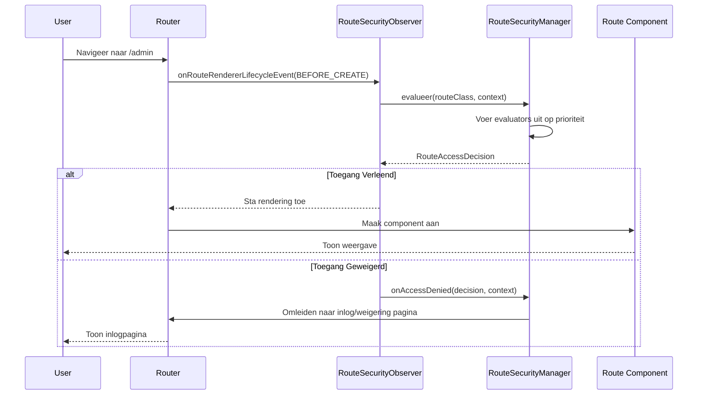

Beveiligingshandhaving in webforJ gebeurt automatisch tijdens navigatie. Wanneer een gebruiker op een link klikt of naar een route navigeert, onderschept het beveiligingssysteem de navigatie, evalueert het toegangsregels en staat het ofwel de navigatie toe om door te gaan of wordt de gebruiker omgeleid naar een geschikte pagina. Deze onderschepping is onzichtbaar voor gebruikers en vereist geen handmatige beveiligingscontroles in uw componentcode.

Het begrijpen van hoe navigatieonderschepping werkt, helpt u bij het oplossen van beveiligingsproblemen en het bouwen van aangepaste navigatielogica die integreert met het beveiligingssysteem.

## De `RouteSecurityObserver` {#the-routesecurityobserver}

De `RouteSecurityObserver` is een navigatie-observer die aansluit bij de levenscyclus van de router. Het luistert naar navigatie-events en evalueert beveiligingsregels voordat een component wordt gerenderd.

De observer wordt in de levenscyclus van de router tijdens de opstart van de app aan de weergave van de router gekoppeld:

```java
// Creëer de observer met uw beveiligingsbeheerder
RouteSecurityObserver observer = new RouteSecurityObserver(securityManager);

// Koppel het aan de weergave van de router
Router router = Router.getCurrent();
if (router != null) {
  router.getRenderer().addObserver(observer);
}
```

Eenmaal aangekoppeld, onderschept de observer elke navigatie-aanroep. De observer bevindt zich tussen navigatieaanvragen en componentweergave. Wanneer de navigatie begint, vraagt hij de beveiligingsmanager om de toegang te evalueren. Alleen als de toegang is verleend, wordt de component gerenderd.

## Navigatieonderscheppingsstroom {#navigation-interception-flow}

Wanneer een gebruiker naar een route navigeert, gebeurt de volgende volgorde:


```mermaid
sequenceDiagram
  participant User
  participant Router
  participant Observer as RouteSecurityObserver
  participant Manager as RouteSecurityManager
  participant Component as Route Component

  User->>Router: Navigeer naar /admin
  Router->>Observer: onRouteRendererLifecycleEvent(BEFORE_CREATE)
  Observer->>Manager: evalueer(routeClass, context)
  Manager->>Manager: Voer evaluators uit op prioriteit
  Manager-->>Observer: RouteAccessDecision

  alt Toegang Verleend
    Observer-->>Router: Sta rendering toe
    Router->>Component: Maak component aan
    Component-->>User: Toon weergave
  else Toegang Geweigerd
    Observer->>Manager: onAccessDenied(decision, context)
    Manager->>Router: Omleiden naar inlog/weigering pagina
    Router-->>User: Toon inlogpagina
  end
```

Deze stroom toont aan dat beveiligingsevaluatie plaatsvindt voordat er ook maar enige gevoelige routecode wordt uitgevoerd. Als de toegang wordt geweigerd, wordt de component nooit geïnstantieerd, waardoor ongeautoriseerde gebruikers worden tegengehouden bij het triggeren van bedrijfslogica of het toegang krijgen tot beschermde gegevens.

## Onderscheppingspunten {#interception-points}

De observer onderschept navigatie op een specifiek punt in de levenscyclus van de routering:

**Voor rendering** De `onRouteRendererLifecycleEvent()`-methode van de observer wordt aangeroepen met de `LifecycleEvent.BEFORE_CREATE` gebeurtenis nadat de route is opgelost, maar voordat de component is aangemaakt. Dit is het kritieke beveiligingscontrolepunt.

Op dit punt weet de router welke routeklasse zal worden gerenderd, maar de route is nog niet geïnstantieerd. De observer kan beveiligingsannotaties op de klasse evalueren zonder route logica uit te voeren.

Als de toegang wordt geweigerd, voorkomt de observer rendering en activeert hij een omleiding. De originele route wordt nooit geïnstantieerd.

## Het evaluatieproces {#the-evaluation-process}

Wanneer de observer navigatie onderschept, delegeert hij de evaluatie aan de beveiligingsmanager. De observer haalt de routeklasse uit de navigatiecontext en vraagt de manager om de toegang te evalueren. Als de beslissing toegang verleent, verloopt de navigatie normaal. Als de beslissing toegang weigert, stopt de observer de voortzetting om rendering te voorkomen en laat hij de manager de weigering afhandelen.

De manager coördineert de evaluatie door:

1. Te controleren of beveiliging is ingeschakeld in de configuratie
2. De huidige beveiligingscontext (gebruikersinformatie) te verkrijgen
3. De evaluatorenketen in prioriteitsvolgorde uit te voeren
4. De uiteindelijke toegangsbeslissing terug te geven

De observer handelt naar de beslissing: als verleend, gaat de navigatie door; als geweigerd, stopt de observer de voortzetting en laat hij de manager de weigering afhandelen.

## Hoe toegangsbeslissingen worden genomen {#how-access-decisions-are-made}

De beveiligingsmanager creëert een evaluatorenketen en voert elke evaluator in prioriteitsvolgorde uit. Evaluatoren kunnen drie soorten beslissingen nemen:

- **Verleen toegang:** De evaluator keurt de navigatie goed, en de route wordt gerenderd. Er worden geen verdere evaluatoren geraadpleegd. De evaluator retourneert een beslissing die aangeeft dat toegang wordt verleend.

- **Weiger toegang:** De evaluator blokkeert de navigatie. De observer stopt de rendering en activeert een omleiding. De evaluator retourneert een weigering beslissing, eventueel met een reden bericht. Weigering kan het gevolg zijn van gebrek aan authenticatie (inloggen vereist) of gebrek aan autorisatie (onvoldoende machtigingen).

- **Delegeer naar de volgende evaluator:** De evaluator neemt geen beslissing en geeft de controle door aan de volgende evaluator in de keten. De evaluator roept de evalueermethode van de keten aan, die doorgaat naar de volgende evaluator in prioriteitsvolgorde.

De meeste evaluatoren behandelen alleen routes met specifieke annotaties. Bijvoorbeeld, `RolesAllowedEvaluator` evalueert alleen routes die zijn geannoteerd met `@RolesAllowed`. Als de annotatie niet aanwezig is, delegeert het naar de volgende evaluator.

## Omgaan met toegang weigering {#handling-access-denial}

Wanneer de toegang wordt geweigerd, handelt de `onAccessDenied()`-methode van de manager de weigering af op basis van het type weigering:

- **Authenticatie vereist:** De gebruiker is niet ingelogd. Omleiden naar de inlogpagina die is geconfigureerd in `RouteSecurityConfiguration.getAuthenticationLocation()`.

- **Toegang geweigerd:** De gebruiker is ingelogd, maar heeft geen machtigingen. Omleiden naar de toegang geweigerd pagina die is geconfigureerd in `RouteSecurityConfiguration.getDenyLocation()`.

Voordat wordt omgeleid, slaat de manager de oorspronkelijk opgevraagde locatie op in de HTTP-sessie. Na succesvolle inlog kan deze locatie worden opgehaald met de `consumePreAuthenticationLocation()`-methode van de manager, die de opgeslagen locatie retourneert en deze uit de sessie verwijdert. Als er een locatie was opgeslagen, kan de app daar naartoe navigeren; anders wordt er genavigeerd naar een standaardpagina.

## Wanneer beveiliging is uitgeschakeld {#when-security-is-disabled}

Als `RouteSecurityConfiguration.isEnabled()` `false` retourneert, omzeilt de manager alle evaluatie en verleent onmiddellijk toegang tot elke route. De evaluatorenketen wordt nooit uitgevoerd en er worden geen beveiligingscontroles uitgevoerd.

Dit is nuttig tijdens de ontwikkeling of voor applicaties die geen beveiliging vereisen. U kunt de beveiliging in- en uitschakelen zonder annotaties te verwijderen of de observer af te melden.

## Integratie met de navigatielevenscyclus {#integration-with-navigation-lifecycle}

De beveiligingsobserver is geïntegreerd met de bredere [navigatielevenscyclus](/docs/routing/navigation-lifecycle/overview), waar meerdere observers kunnen inhaken op navigatie-evenementen. Beveiligingsevaluatie vindt vroeg in deze levenscyclus plaats, voordat navigatieblokkering of componentlevenscycusevenementen plaatsvinden.

Als u aangepaste navigatie-observers implementeert, wees er dan van bewust dat beveiligingsevaluatie eerst plaatsvindt. Als de toegang wordt geweigerd, wordt de `onRouteRendererLifecycleEvent()` van uw observer niet aangeroepen met `BEFORE_CREATE` omdat de navigatie wordt gestopt.
