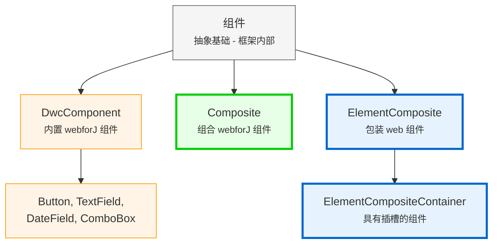

<DocChip chip='since' label='23.05' />
<JavadocLink type="foundation" location="com/webforj/component/Component" top='true'/> 

在构建 webforJ 的自定义组件之前，了解塑造组件工作的基础架构非常重要。本文解释了组件层次结构、组件身份、生命周期概念，以及关注点接口如何提供组件功能。

## 理解组件层次结构

webforJ 将组件组织成两组层次结构：您绝对不应该扩展的框架内部类，以及专门为构建自定义组件而设计的类。此部分解释了为什么 webforJ 选择组合而非继承，以及层次结构的每一层提供了什么。

### 为什么选择组合而不是扩展？

在 webforJ 中，内置组件如 [`Button`](../components/button) 和 [`TextField`](../components/fields/textfield) 是最终类——您不能扩展它们：

```java
// 这在 webforJ 中将不起作用
public class MyButton extends Button {
    // Button 是最终的 - 不能被扩展 
}
```

webforJ 使用 **组合而不是继承**。您创建一个扩展 `Composite` 的类，在其中组合组件。`Composite` 作为一个容器，包装一个单独的组件（称为绑定组件），并允许您添加自己的组件和行为。

```java
public class SearchBar extends Composite<FlexLayout> {
    private TextField searchField;
    private Button searchButton;
    
    public SearchBar() {
        searchField = new TextField("Search");
        searchButton = new Button("Go");
        
        getBoundComponent()
            .setDirection(FlexDirection.ROW)
            .add(searchField, searchButton);
    }
}
```

### 为什么您不能扩展内置组件

webforJ 组件被标记为最终，以保持底层客户端 web 组件的完整性。扩展 webforJ 组件类将授予对底层 web 组件的控制，这可能导致意外后果，并破坏组件行为的一致性和可预测性。

有关详细说明，请参见架构文档中的 [最终类和扩展限制](https://docs.webforj.com/docs/architecture/controls-components#final-classes-and-extension-restrictions)。

### 组件层次结构



**开发者使用的类（使用这些）：**
- **Composite**
- **ElementComposite**
- **ElementCompositeContainer**

**内部框架类（绝对不要直接扩展）：**
- **Component**
- **DwcComponent**

:::warning[切勿直接扩展 `Component` 或 `DwcComponent`]
绝对不要直接扩展 `Component` 或 `DwcComponent`。所有内置组件都是最终的。始终使用与 `Composite` 或 `ElementComposite` 的组合模式。

尝试扩展 `DwcComponent` 将抛出运行时异常。
:::

## 关注点接口：为您的组件添加功能

关注点接口是提供特定功能的 Java 接口。每个接口添加一组相关的方法。例如，`HasSize` 添加控制宽度和高度的方法，而 `HasFocus` 添加管理焦点状态的方法。

当您在组件上实现关注点接口时，您可以访问这些功能，而无需编写任何实现代码。该接口提供了可以自动工作的默认实现。

实现关注点接口使您的自定义组件拥有与内置 webforJ 组件相同的 API：

```java
// 实现 HasSize 自动获取宽度/高度方法
public class SizedCard extends Composite<Div> implements HasSize<SizedCard> {
    
    public SizedCard() {
        getBoundComponent().setText("卡片内容");
    }
    
    // 不需要实现这些 - 您可以免费获取：
    // setWidth(), setHeight(), setSize()
}

// 像任何 webforJ 组件一样使用它
SizedCard card = new SizedCard();
card.setWidth("300px")
    .setHeight("200px");
```

组合自动将这些调用转发到底层 `Div`。无需额外代码。

**常见关注点接口：**
- `HasSize` - `setWidth()`, `setHeight()`, `setSize()`
- `HasFocus` - `focus()`, `setFocusable()`, 焦点事件
- `HasClassName` - `addClassName()`, `removeClassName()`
- `HasStyle` - `setStyle()`, 内联 CSS 管理
- `HasVisibility` - `setVisible()`, 显示/隐藏功能
- `HasText` - `setText()`, 文本内容管理
- `HasAttribute` - `setAttribute()`, HTML 属性管理

:::warning
如果底层组件不支持接口功能，您将获得运行时异常。在这种情况下，请提供您自己的实现。
:::

有关可用关注点接口的完整列表，请参见 [webforJ JavaDoc](https://javadoc.io/doc/com.webforj/webforj-foundation/latest/com/webforj/concern/package-summary.html)。

## 组件生命周期概述

webforJ 自动管理组件生命周期。框架处理组件的创建、附加和销毁，无需手动干预。

**生命周期钩子** 在您需要时可用：
- `onDidCreate()` - 在组件附加到 DOM 后调用
- `onDidDestroy()` - 在组件被销毁时调用

这些钩子是 **可选的**。在需要时使用它们：
- 清理资源（停止定时器，关闭连接）
- 初始化需要 DOM 附加的组件
- 与客户端 JavaScript 集成

对于大多数简单情况，您可以直接在构造函数中初始化组件。使用生命周期钩子如 `onDidCreate()` 在必要时推迟工作。
