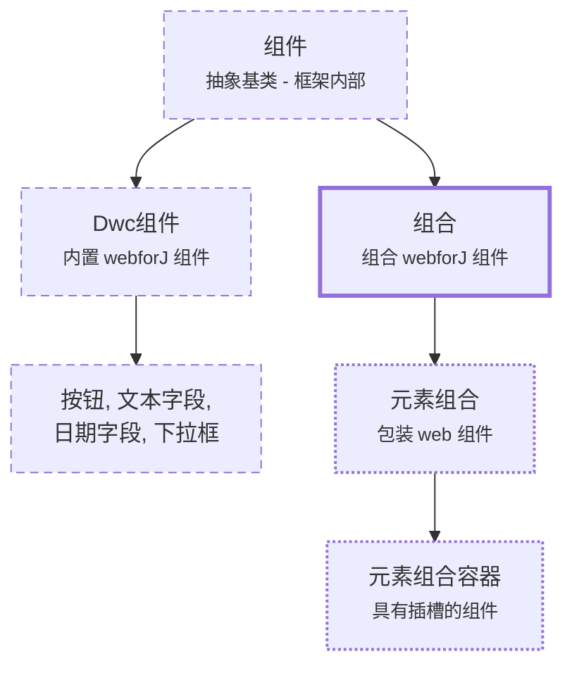

<JavadocLink type="foundation" location="com/webforj/component/Component" top='true'/> 

在构建 webforJ 的自定义组件之前，理解其基础架构对于组件的运作至关重要。本文解释了组件层次结构、组件身份、生命周期概念，以及关注接口如何提供组件能力。

## 理解组件层次结构 {#understanding-the-component-hierarchy}

webforJ 将组件组织成两个组的层次结构：您永远不应扩展的框架内部类，以及专门为构建自定义组件而设计的类。本节解释了为什么 webforJ 使用组合而非继承，以及层次结构的每个级别提供了什么。

### 为什么选择组合而不是继承？ {#why-composition-instead-of-extension}

在 webforJ 中，内置组件如 [`Button`](../components/button) 和 [`TextField`](../components/fields/textfield) 是最终的类——您不能扩展它们：

```java
// 这在 webforJ 中不起作用
public class MyButton extends Button {
  // Button 是最终的 - 不能被扩展 
}
```

webforJ 使用 **组合优于继承**。您并不是扩展现有组件，而是创建一个扩展 `Composite` 的类，并在其中组合组件。`Composite` 充当一个容器，包装单个组件（称为被绑定组件），并让您可以向其中添加自己的组件和行为。

```java
public class SearchBar extends Composite<FlexLayout> {
  private final FlexLayout self = getBoundComponent();
  private TextField searchField;
  private Button searchButton;
  
  public SearchBar() {
    searchField = new TextField("搜索");
    searchButton = new Button("去");
    
    self.setDirection(FlexDirection.ROW)
      .add(searchField, searchButton);
  }
}
```

### 为什么您不能扩展内置组件 {#why-you-cant-extend-built-in-components}

webforJ 组件被标记为最终的，以维护底层客户端 Web 组件的完整性。扩展 webforJ 组件类将授予对底层 Web 组件的控制，这可能导致意外后果，破坏组件行为的一致性和可预测性。

有关详细说明，请参见架构文档中的 [最终类和扩展限制](https://docs.webforj.com/docs/architecture/controls-components#final-classes-and-extension-restrictions)。

### 组件层次结构 {#the-component-hierarchy}

<div style={{textAlign: 'center'}}>

```mermaid
graph TD
  A[组件<br/><small>抽象基类 - 框架内部</small>]
  
  A --> B[Dwc组件<br/><small>内置 webforJ 组件</small>]
  A --> C[组合<br/><small>组合 webforJ 组件</small>]
  
  B --> E[按钮, 文本字段,<br/>日期字段, 下拉框]
  
  C --> D[元素组合<br/><small>包装 web 组件</small>]
  D --> F[元素组合容器<br/><small>具有插槽的组件</small>]

  classDef internal stroke-dasharray:6 4,stroke-width:1px
  classDef primary stroke-width:3px
  classDef secondary stroke-width:2px,stroke-dasharray:2 2
  class A,B,E internal
  class C primary
  class D,F secondary
```
</div>

供开发人员使用的类（使用这些）：
- `Composite`
- `ElementComposite`
- `ElementCompositeContainer`

内部框架类（切勿直接扩展）：
- `Component`
- `DwcComponent`

:::warning[切勿直接扩展 `Component` 或 `DwcComponent`]
切勿直接扩展 `Component` 或 `DwcComponent`。所有内置组件都是最终的。始终使用 `Composite` 或 `ElementComposite` 的组合模式。

试图扩展 `DwcComponent` 将抛出运行时异常。
:::

## 关注接口 {#concern-interfaces}

关注接口是提供特定能力给您的组件的 Java 接口。每个接口添加一组相关的方法。例如，`HasSize` 添加控制宽度和高度的方法，而 `HasFocus` 添加管理焦点状态的方法。

当您在组件上实现关注接口时，您可以访问这些能力，而无需编写任何实现代码。该接口提供默认实现，会自动工作。

实现关注接口使您的自定义组件具备与内置 webforJ 组件相同的 API：

```java
// 实现 HasSize 自动获取宽度/高度方法
public class SizedCard extends Composite<Div> implements HasSize<SizedCard> {
  private final Div self = getBoundComponent();
  
  public SizedCard() {
    self.setText("卡片内容");
  }
  
  // 无需实现这些 - 您可以免费获得：
  // setWidth(), setHeight(), setSize()
}

// 像任何 webforJ 组件一样使用它
SizedCard card = new SizedCard();
card.setWidth("300px")
  .setHeight("200px");
```

组合会自动将这些调用转发到底层的 `Div`。无需额外代码。

### 外观 {#concern-interfaces-appearance}

这些接口控制组件的视觉表现，包括其尺寸、可见性、样式和主题。

| 接口 | 描述 |
|---|---|
| `HasSize` | 控制宽度和高度，包括最小和最大约束。扩展 `HasWidth`、`HasHeight` 及其最小/最大变体。 |
| `HasVisibility` | 显示或隐藏组件，而不从布局中移除它。 |
| `HasClassName` | 管理组件根元素上的 CSS 类名。 |
| `HasStyle` | 应用和移除内联 CSS 样式。 |
| `HasHorizontalAlignment` | 控制内容在组件内的水平对齐方式。 |
| `HasExpanse` | 使用标准的扩展令牌（`XSMALL` 到 `XLARGE`）设置组件的尺寸变体。 |
| `HasTheme` | 应用主题变体，如 `DEFAULT`、`PRIMARY` 或 `DANGER`。 |
| `HasPrefixAndSuffix` | 向组件内部的前缀或后缀插槽添加组件。 |

### 内容 {#concern-interfaces-content}

这些接口管理组件所显示的内容，包括文本、HTML、标签、提示及其他描述性内容。

| 接口 | 描述 |
|---|---|
| `HasText` | 设置和获取组件的纯文本内容。 |
| `HasHtml` | 设置和获取组件的内部 HTML。 |
| `HasLabel` | 添加与组件关联的描述性标签，用于可访问性。 |
| `HasHelperText` | 在组件下方显示次要提示文本。 |
| `HasPlaceholder` | 设置当组件没有值时显示的占位符文本。 |
| `HasTooltip` | 附加在鼠标悬停时显示的工具提示。 |

### 状态 {#concern-interfaces-state}

这些接口控制组件的交互状态，包括是否启用、是否可编辑、是否必填或是否在加载时获得焦点。

| 接口 | 描述 |
|---|---|
| `HasEnablement` | 启用或禁用组件。 |
| `HasReadOnly` | 将组件置于只读状态，能够查看但无法更改值。 |
| `HasRequired` | 将组件标记为必填，通常用于表单验证。 |
| `HasAutoFocus` | 页面加载时自动将焦点移动到组件。 |

### 焦点 {#concern-interfaces-focus}

这些接口管理组件如何接收和响应键盘焦点。

| 接口 | 描述 |
|---|---|
| `HasFocus` | 管理焦点状态以及组件是否可以获得焦点。 |
| `HasFocusStatus` | 检查组件当前是否具有焦点。需要往返客户端。 |
| `HasHighlightOnFocus` | 控制当组件获得焦点时其内容是否被突出显示，以及如何突出显示（`KEY`、`MOUSE`、`KEY_MOUSE`、`ALL` 等）。 |

### 输入约束 {#concern-interfaces-input-constraints}

这些接口定义组件接受的值，包括当前值、允许的范围、长度限制、格式掩码和地区特定行为。

| 接口 | 描述 |
|---|---|
| `HasValue` | 获取和设置组件的当前值。 |
| `HasMin` | 设置允许的最小值。 |
| `HasMax` | 设置允许的最大值。 |
| `HasStep` | 设置数值或范围输入的步长增量。 |
| `HasPattern` | 应用正则表达式模式以限制接受的输入。 |
| `HasMinLength` | 设置组件值所需的最小字符数。 |
| `HasMaxLength` | 设置组件值所允许的最大字符数。 |
| `HasMask` | 应用格式掩码到输入。被掩码字段组件使用。 |
| `HasTypingMode` | 控制输入字符是插入还是覆盖现有字符（`INSERT` 或 `OVERWRITE`）。被掩码字段和 `TextArea` 使用。 |
| `HasRestoreValue` | 定义当用户按下 Escape 或调用 `restoreValue()` 时组件重置的值。被掩码字段使用。 |
| `HasLocale` | 存储每个组件的地区，以用于地区敏感格式。被掩码日期和时间字段使用。 |
| `HasPredictedText` | 设置预测或自动完成的文本值。被 `TextArea` 用于支持内联建议。 |

### 验证 {#concern-interfaces-validation}

这些接口添加客户端验证行为，包括标记组件无效、显示错误消息，以及控制验证何时运行。

| 接口 | 描述 |
|---|---|
| `HasClientValidation` | 标记组件为无效，设置错误消息，并附加客户端验证器。 |
| `HasClientAutoValidation` | 控制组件在用户输入时是否自动验证。 |
| `HasClientAutoValidationOnLoad` | 控制组件首次加载时是否验证。 |
| `HasClientValidationStyle` | 控制验证消息的显示方式：`INLINE`（在组件下方）或 `POPOVER`。 |

### DOM 访问 {#concern-interfaces-dom-access}

这些接口提供对组件底层 HTML 元素和客户端属性的低级访问。

| 接口 | 描述 |
|---|---|
| `HasAttribute` | 读取和写入组件元素上的任意 HTML 属性。 |
| `HasProperty` | 直接在客户端元素上读取和写入 DWC 组件属性。 |

### i18n {#concern-interfaces-i18n}

该接口为需要显示本地化文本的组件提供翻译支持。

| 接口 | 描述 |
|---|---|
| `HasTranslation` | 提供 `t()` 助手方法，用于解析翻译键到使用应用当前地区的本地化字符串。 |

:::warning
如果底层组件不支持接口能力，则会出现运行时异常。在这种情况下，请提供您自己的实现。
:::

有关可用关注接口的完整列表，请参见 [webforJ JavaDoc](https://javadoc.io/doc/com.webforj/webforj-foundation/latest/com/webforj/concern/package-summary.html)。

## 组件生命周期概述 {#component-lifecycle-overview}

webforJ 自动管理组件生命周期。该框架处理组件的创建、附加和销毁，而无需手动干预。

**生命周期钩子** 在您需要时可用：
- `onDidCreate(T container)` - 在组件附加到 DOM 后调用
- `onDidDestroy()` - 在组件销毁时调用

这些钩子是 **可选的**。在您需要时使用它们：
- 清理资源（停止间隔，关闭连接）
- 初始化需要 DOM 附加的组件
- 与客户端 JavaScript 集成

对于大多数简单情况，您可以在构造函数中直接初始化组件。在必要时使用 `onDidCreate()` 等生命周期钩子来延迟工作。
