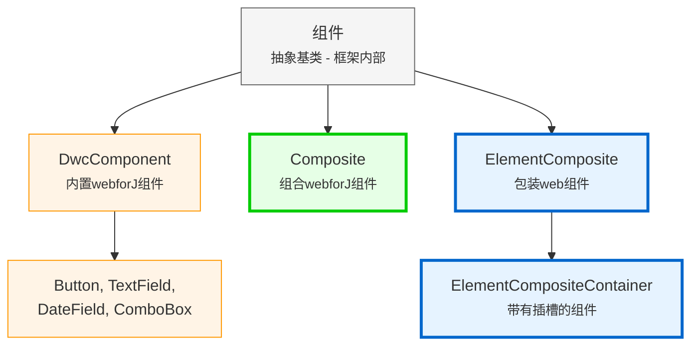

<JavadocLink type="foundation" location="com/webforj/component/Component" top='true'/> 

在构建自定义组件之前，了解构成组件工作方式的基础架构是很重要的。本文解释了组件层次结构、组件身份、生命周期概念以及关注接口如何提供组件功能。

## 理解组件层次结构 {#understanding-the-component-hierarchy}

webforJ将组件组织成两个组的层次结构：内部框架类（您永远不应扩展）和专为构建自定义组件而设计的类。本节解释了webforJ为什么使用组合而不是继承，以及层次结构的每一层提供了什么。

### 为什么选择组合而不是扩展？ {#why-composition-instead-of-extension}

在webforJ中，内置组件如[`Button`](../components/button)和[`TextField`](../components/fields/textfield)是最终类——您不能扩展它们：

```java
// 这在webforJ中不起作用
public class MyButton extends Button {
    // Button是最终的 - 不能被扩展 
}
```

webforJ使用**组合而不是继承**。您创建一个扩展`Composite`的类，并组合组件。`Composite`作为一个容器，包装一个单一组件（称为绑定组件），并允许您添加自己的组件和行为。

```java
public class SearchBar extends Composite<FlexLayout> {
    private final FlexLayout self = getBoundComponent();
    private TextField searchField;
    private Button searchButton;
    
    public SearchBar() {
        searchField = new TextField("搜索");
        searchButton = new Button("开始");
        
        self.setDirection(FlexDirection.ROW)
            .add(searchField, searchButton);
    }
}
```

### 为什么您不能扩展内置组件 {#why-you-cant-extend-built-in-components}

webforJ组件被标记为最终，以维护底层客户端Web组件的完整性。扩展webforJ组件类将授予对底层Web组件的控制，这可能导致意想不到的后果，并破坏组件行为的一致性和可预测性。

有关详细说明，请参阅架构文档中的[最终类和扩展限制](https://docs.webforj.com/docs/architecture/controls-components#final-classes-and-extension-restrictions)。

### 组件层次结构 {#the-component-hierarchy}


```mermaid
graph TD
    A[组件<br/><small>抽象基类 - 框架内部</small>]
    
    A --> B[DwcComponent<br/><small>内置webforJ组件</small>]
    A --> C[Composite<br/><small>组合webforJ组件</small>]
    A --> D[ElementComposite<br/><small>包装web组件</small>]
    
    B --> E[Button, TextField,<br/>DateField, ComboBox]
    
    D --> F[ElementCompositeContainer<br/><small>带有插槽的组件</small>]
    
    style A fill:#f5f5f5,stroke:#666
    style B fill:#fff4e6,stroke:#ff9800
    style C fill:#e6ffe6,stroke:#00cc00
    style D fill:#e6f3ff,stroke:#0066cc
    style E fill:#fff4e6,stroke:#ff9800
    style F fill:#e6f3ff,stroke:#0066cc
    
    classDef userClass stroke-width:3px
    class C,D,F userClass
```

**供开发者使用的类：**
- **Composite**
- **ElementComposite**
- **ElementCompositeContainer**

**内部框架类（永远不要直接扩展）：**
- **Component**
- **DwcComponent**

:::warning[切勿直接扩展`Component`或`DwcComponent`]
切勿直接扩展`Component`或`DwcComponent`。所有内置组件都是最终的。始终使用组合模式与`Composite`或`ElementComposite`。

尝试扩展`DwcComponent`将引发运行时异常。
:::

## 关注接口 {#concern-interfaces}

关注接口是提供特定功能的Java接口。每个接口添加一组相关方法。例如，`HasSize`添加用于控制宽度和高度的方法，而`HasFocus`添加用于管理焦点状态的方法。

当您在组件上实现一个关注接口时，您可以访问这些功能而无需编写任何实现代码。接口提供自动工作的默认实现。

实现关注接口使自定义组件拥有与内置webforJ组件相同的API：

```java
// 实现HasSize以自动获取宽度/高度方法
public class SizedCard extends Composite<Div> implements HasSize<SizedCard> {
    private final Div self = getBoundComponent();
    
    public SizedCard() {
        self.setText("卡片内容");
    }
    
    // 无需实现这些 - 您可以免费使用：
    // setWidth(), setHeight(), setSize()
}

// 像使用任何webforJ组件一样使用它
SizedCard card = new SizedCard();
card.setWidth("300px")
    .setHeight("200px");
```

复合组件会自动将这些调用转发到底层`Div`。无需额外代码。

**常见关注接口：**
- `HasSize` - `setWidth()`、`setHeight()`、`setSize()`
- `HasFocus` - `focus()`、`setFocusable()`、焦点事件
- `HasClassName` - `addClassName()`、`removeClassName()`
- `HasStyle` - `setStyle()`、内联CSS管理
- `HasVisibility` - `setVisible()`、显示/隐藏功能
- `HasText` - `setText()`、文本内容管理
- `HasAttribute` - `setAttribute()`、HTML属性管理

:::warning
如果底层组件不支持接口功能，您将会遇到运行时异常。在这种情况下，请提供自己的实现。
:::

有关可用关注接口的完整列表，请参阅[webforJ JavaDoc](https://javadoc.io/doc/com.webforj/webforj-foundation/latest/com/webforj/concern/package-summary.html)。

## 组件生命周期概述 {#component-lifecycle-overview}

webforJ自动管理组件生命周期。框架处理组件的创建、附加和销毁，无需手动干预。

**生命周期钩子**在您需要时可用：
- `onDidCreate()` - 在组件附加到DOM后调用
- `onDidDestroy()` - 在组件被销毁时调用

这些钩子是**可选的**。在需要时使用它们：
- 清理资源（停止定时器，关闭连接）
- 初始化需要DOM附加的组件
- 与客户端JavaScript集成

对于大多数简单情况，您可以在构造函数中直接初始化组件。使用生命周期钩子，如`onDidCreate()`，在必要时推迟工作。
