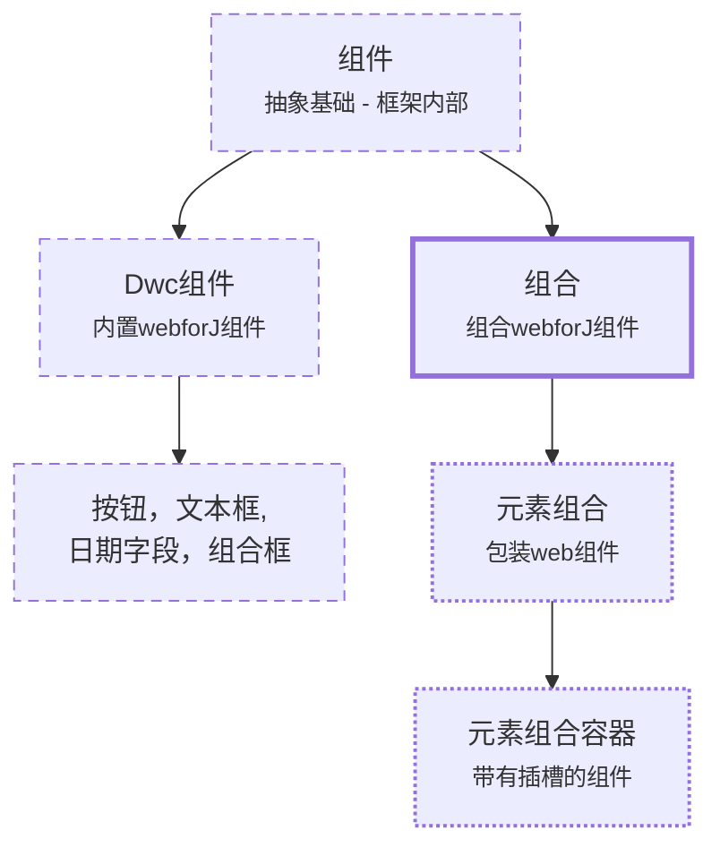

<JavadocLink type="foundation" location="com/webforj/component/Component" top='true'/> 

在构建自定义组件之前，了解构成组件工作方式的基础架构非常重要。本文解释了组件层次结构、组件身份、生命周期概念，以及关注接口如何提供组件功能。

## 理解组件层次结构 {#understanding-the-component-hierarchy}

webforJ将组件组织成两个组的层次结构：框架内部类（您绝对不应扩展的类）和专门为构建自定义组件而设计的类。本节解释了为什么webforJ使用组合而不是继承，以及层次结构的每一层提供了什么。

### 为什么选择组合而不是扩展？ {#why-composition-instead-of-extension}

在webforJ中，内置组件如[`Button`](../components/button)和[`TextField`](../components/fields/textfield)都是最终类——您不能扩展它们：

```java
// 这在webforJ中不起作用
public class MyButton extends Button {
  // Button是最终类 - 不能被扩展 
}
```

webforJ使用**组合而不是继承**。您可以创建一个扩展`Composite`的类，并在其中组合组件，而不是扩展现有组件。`Composite`作为一个容器，包装一个单一组件（称为绑定组件），并让您向其添加自己的组件和行为。

```java
public class SearchBar extends Composite<FlexLayout> {
  private final FlexLayout self = getBoundComponent();
  private TextField searchField;
  private Button searchButton;
  
  public SearchBar() {
    searchField = new TextField("搜索");
    searchButton = new Button("前往");
    
    self.setDirection(FlexDirection.ROW)
      .add(searchField, searchButton);
  }
}
```

### 为什么不能扩展内置组件 {#why-you-cant-extend-built-in-components}

webforJ组件被标记为最终类，以维护底层客户端Web组件的完整性。扩展webforJ组件类将授予对底层Web组件的控制，这可能导致意外后果并破坏组件行为的一致性和可预测性。

有关详细说明，请参见架构文档中的[最终类和扩展限制](https://docs.webforj.com/docs/architecture/controls-components#final-classes-and-extension-restrictions)。

### 组件层次结构 {#the-component-hierarchy}

<div style={{textAlign: 'center'}}>

```mermaid
graph TD
  A[组件<br/><small>抽象基础 - 框架内部</small>]
  
  A --> B[Dwc组件<br/><small>内置webforJ组件</small>]
  A --> C[组合<br/><small>组合webforJ组件</small>]
  
  B --> E[按钮，文本框,<br/>日期字段，组合框]
  
  C --> D[元素组合<br/><small>包装web组件</small>]
  D --> F[元素组合容器<br/><small>带有插槽的组件</small>]

  classDef internal stroke-dasharray:6 4,stroke-width:1px
  classDef primary stroke-width:3px
  classDef secondary stroke-width:2px,stroke-dasharray:2 2
  class A,B,E internal
  class C primary
  class D,F secondary
```
</div>

开发者类（使用这些）：
- `Composite`
- `ElementComposite`
- `ElementCompositeContainer`

内部框架类（绝不要直接扩展）：
- `Component`
- `DwcComponent`

:::warning[切勿扩展`Component`或`DwcComponent`]
绝不要直接扩展`Component`或`DwcComponent`。所有内置组件都是最终的。始终使用带有`Composite`或`ElementComposite`的组合模式。

尝试扩展`DwcComponent`将抛出运行时异常。
:::

## 关注接口 {#concern-interfaces}

关注接口是Java接口，提供特定功能给您的组件。每个接口添加一组相关方法。例如，`HasSize`添加用于控制宽度和高度的方法，而`HasFocus`添加用于管理焦点状态的方法。

当您在组件上实现关注接口时，您将无需编写任何实现代码即可获得这些功能。接口提供的默认实现会自动工作。

实现关注接口为您的自定义组件提供与内置webforJ组件相同的API：

```java
// 实现HasSize以自动获得宽度/高度方法
public class SizedCard extends Composite<Div> implements HasSize<SizedCard> {
  private final Div self = getBoundComponent();
  
  public SizedCard() {
    self.setText("卡片内容");
  }
  
  // 无需实现这些 - 您自动获得它们：
  // setWidth(), setHeight(), setSize()
}

// 像任何webforJ组件一样使用它
SizedCard card = new SizedCard();
card.setWidth("300px")
  .setHeight("200px");
```

组合会自动将这些调用转发到底层的`Div`。不需要额外代码。

### 外观 {#concern-interfaces-appearance}

这些接口控制组件的视觉表现，包括其尺寸、可见性、样式和主题。

| 接口 | 描述 |
|---|---|
| `HasSize` | 控制宽度和高度，包括最小和最大约束。扩展`HasWidth`、`HasHeight`及其最小/最大变体。 |
| `HasVisibility` | 显示或隐藏组件而不从布局中移除。 |
| `HasClassName` | 管理组件根元素上的CSS类名。 |
| `HasStyle` | 应用和移除内联CSS样式。 |
| `HasHorizontalAlignment` | 控制内容如何在组件内水平对齐。 |
| `HasExpanse` | 使用标准扩展标记设置组件的大小变体（`XSMALL`到`XLARGE`）。 |
| `HasTheme` | 应用主题变体，如`DEFAULT`、`PRIMARY`或`DANGER`。 |
| `HasPrefixAndSuffix` | 向组件的前缀或后缀插槽添加组件。 |

### 内容 {#concern-interfaces-content}

这些接口管理组件显示的内容，包括文本、HTML、标签、提示和其他描述性内容。

| 接口 | 描述 |
|---|---|
| `HasText` | 设置和检索组件的纯文本内容。 |
| `HasHtml` | 设置和检索组件的内部HTML。 |
| `HasLabel` | 添加与组件相关的描述标签，用于可访问性。 |
| `HasHelperText` | 在组件下方显示次要提示文本。 |
| `HasPlaceholder` | 设置在组件没有值时显示的占位符文本。 |
| `HasTooltip` | 附加一个在悬停时出现的工具提示。 |

### 状态 {#concern-interfaces-state}

这些接口控制组件的交互状态，包括它是否启用、可编辑、必填或加载时聚焦。

| 接口 | 描述 |
|---|---|
| `HasEnablement` | 启用或禁用组件。 |
| `HasReadOnly` | 将组件置于只读状态，其中值可见但无法更改。 |
| `HasRequired` | 将组件标记为必填，通常用于表单验证。 |
| `HasAutoFocus` | 在页面加载时自动将焦点移动到组件。 |

### 聚焦 {#concern-interfaces-focus}

这些接口管理组件如何接收和响应键盘焦点。

| 接口 | 描述 |
|---|---|
| `HasFocus` | 管理焦点状态以及组件是否能接收焦点。 |
| `HasFocusStatus` | 检查组件当前是否具有焦点。需要一次往返到客户端。 |
| `HasHighlightOnFocus` | 控制组件内容在获得焦点时是否突出显示，以及如何突出显示（`KEY`、`MOUSE`、`KEY_MOUSE`、`ALL`等）。 |

### 输入约束 {#concern-interfaces-input-constraints}

这些接口定义组件接受什么值，包括当前值、允许的范围、长度限制、格式掩码和特定区域的行为。

| 接口 | 描述 |
|---|---|
| `HasValue` | 获取和设置组件的当前值。 |
| `HasMin` | 设置允许的最小值。 |
| `HasMax` | 设置允许的最大值。 |
| `HasStep` | 设置数字或范围输入的步长增量。 |
| `HasPattern` | 应用正则表达式模式以限制接受的输入。 |
| `HasMinLength` | 设置组件值中所需的最小字符数。 |
| `HasMaxLength` | 设置组件值中允许的最大字符数。 |
| `HasMask` | 将格式掩码应用于输入。由掩码字段组件使用。 |
| `HasTypingMode` | 控制输入的字符是插入还是覆盖现有字符（`INSERT`或`OVERWRITE`）。由掩码字段和`TextArea`使用。 |
| `HasRestoreValue` | 定义用户按Escape键或调用`restoreValue()`时组件重置到的值。由掩码字段使用。 |
| `HasLocale` | 存储每个组件的区域设置以进行区域敏感格式化。由掩码日期和时间字段使用。 |
| `HasPredictedText` | 设置预测或自动完成文本值。由`TextArea`用于支持内联建议。 |

### 验证 {#concern-interfaces-validation}

这些接口添加客户端验证行为，包括标记组件无效、显示错误消息和控制验证运行时间。

| 接口 | 描述 |
|---|---|
| `HasClientValidation` | 标记组件为无效，设置错误消息，并附加客户端验证器。 |
| `HasClientAutoValidation` | 控制组件在用户输入时是否自动进行验证。 |
| `HasClientAutoValidationOnLoad` | 控制组件首次加载时是否进行验证。 |
| `HasClientValidationStyle` | 控制验证消息的显示方式：`INLINE`（位于组件下方）或`POPOVER`。 |

### DOM访问 {#concern-interfaces-dom-access}

这些接口提供对组件底层HTML元素和客户端属性的低级访问。

| 接口 | 描述 |
|---|---|
| `HasAttribute` | 读取和写入组件元素上的任意HTML属性。 |
| `HasProperty` | 直接在客户端元素上读取和写入DWC组件属性。 |

### 国际化 {#concern-interfaces-i18n}

该接口为需要显示本地化文本的组件提供翻译支持。

| 接口 | 描述 |
|---|---|
| `HasTranslation` | 提供`t()`辅助方法，用于使用应用当前区域设置将翻译键解析为本地化字符串。 |

:::warning
如果底层组件不支持接口功能，您将获得运行时异常。在这种情况下，请提供您自己的实现。
:::

有关可用关注接口的完整列表，请参见[webforJ JavaDoc](https://javadoc.io/doc/com.webforj/webforj-foundation/latest/com/webforj/concern/package-summary.html)。

## 组件标识符 {#component-identifiers}

webforJ组件具有三种不同类型的标识符，服务于不同的目的：

- **服务器端组件ID** (`getComponentId()`) - 由框架自动分配，用于内部组件跟踪。当您需要查询特定组件或实现自定义组件注册表时，请使用此ID。
- **客户端组件ID** (`getClientComponentId()`) - 提供对底层Web组件的JavaScript访问。当您需要调用本机Web组件方法或与客户端库集成时，请使用此ID。
- **HTML `id`属性** (`setAttribute("id", "...")`) - 标准DOM标识符。用于CSS定位、测试自动化选择器，以及将表单标签链接到输入。

了解这些区别有助于您选择适合用例的正确标识符。

### 服务器端组件ID {#server-side-component-id}

每个组件在创建时会自动分配一个服务器端标识符。该标识符由框架内部用于跟踪组件。您可以使用`getComponentId()`获取它：

```java
Button button = new Button("点击我");
String serverId = button.getComponentId();
```

服务器端ID在您需要查询特定组件时或实现自定义组件跟踪逻辑时非常有用。

### 客户端组件ID {#client-side-component-id}

客户端组件ID提供对底层Web组件的JavaScript访问。这使您可以在需要时直接与客户端组件交互：

```java
Button btn = new Button("点击我");
btn.onClick(e -> {
  OptionDialog.showMessageDialog("按钮被点击", "发生了一个事件");
});

btn.whenAttached().thenAccept(e -> {
  Page.getCurrent().executeJs("objects.get('" + btn.getClientComponentId() + "').click()");
});
```

使用`getClientComponentId()`与JavaScript中的`objects.get()`结合访问Web组件实例。

:::important
客户端组件ID不是DOM元素的HTML `id`属性。有关测试或CSS定位的HTML ID设置，请参见[使用组件](using-components)。
:::

## 组件生命周期概述 {#component-lifecycle-overview}

webforJ自动管理组件的生命周期。该框架处理组件的创建、附加和销毁，而无需手动干预。

**生命周期钩子**在需要时可用：
- `onDidCreate(T container)` - 在组件附加到DOM后调用
- `onDidDestroy()` - 在组件被销毁时调用

这些钩子是**可选的**。在您需要时使用它们：
- 清理资源（停止间隔、关闭连接）
- 初始化需要DOM附加的组件
- 与客户端JavaScript集成

对于大多数简单情况，您可以在构造函数中直接初始化组件。使用生命周期钩子如`onDidCreate()`在必要时延迟工作。
