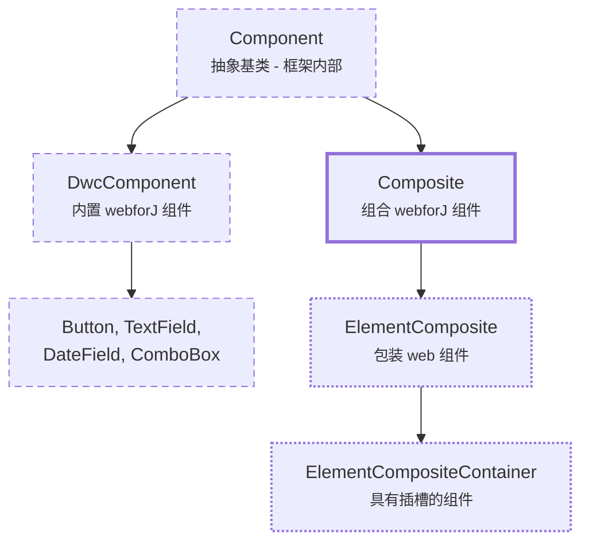

<JavadocLink type="foundation" location="com/webforj/component/Component" top='true'/>

在构建 webforJ 中的自定义组件之前，了解构成组件工作原理的基础架构非常重要。本文解释了组件层次结构、组件身份、生命周期概念，以及关注接口如何提供组件能力。

## 理解组件层次结构 {#understanding-the-component-hierarchy}

webforJ 将组件组织成一个具有两个组的层次结构：你永远不应该扩展的框架内部类，以及专为构建自定义组件而设计的类。本节解释了为什么 webforJ 使用组合而非继承以及层次结构的每个层级提供了什么。

### 为什么选择组合而不是扩展？ {#why-composition-instead-of-extension}

在 webforJ 中，内置组件如 [`Button`](../components/button) 和 [`TextField`](../components/fields/textfield) 是最终类——你不能对其进行扩展：

```java
// 这在 webforJ 中不起作用
public class MyButton extends Button {
  // Button 是最终的 - 不能被扩展
}
```

webforJ 使用 **组合而不是继承**。你可以创建一个扩展 `Composite` 的类，并在内部组合组件。`Composite` 充当一个容器，包装一个单一组件（称为绑定组件），并允许你添加自己的组件和行为。

```java
public class SearchBar extends Composite<FlexLayout> {
  private final FlexLayout self = getBoundComponent();
  private TextField searchField;
  private Button searchButton;

  public SearchBar() {
    searchField = new TextField("搜索");
    searchButton = new Button("去");

    self.setDirection(FlexDirection.ROW)
      .add(searchField, searchButton);
  }
}
```

### 为什么你不能扩展内置组件 {#why-you-cant-extend-built-in-components}

webforJ 组件被标记为最终类，以维护底层客户端网页组件的完整性。扩展 webforJ 组件类将授予对底层网页组件的控制，这可能导致意想不到的后果，并破坏组件行为的一致性和可预测性。

有关详细的解释，请参见架构文档中的 [最终类和扩展限制](https://docs.webforj.com/docs/architecture/controls-components#final-classes-and-extension-restrictions)。

### 组件层次结构 {#the-component-hierarchy}

<div style={{textAlign: 'center'}}>

```mermaid
graph TD
  A[Component<br/><small>抽象基类 - 框架内部</small>]

  A --> B[DwcComponent<br/><small>内置 webforJ 组件</small>]
  A --> C[Composite<br/><small>组合 webforJ 组件</small>]

  B --> E[Button, TextField,<br/>DateField, ComboBox]

  C --> D[ElementComposite<br/><small>包装 web 组件</small>]
  D --> F[ElementCompositeContainer<br/><small>具有插槽的组件</small>]

  classDef internal stroke-dasharray:6 4,stroke-width:1px
  classDef primary stroke-width:3px
  classDef secondary stroke-width:2px,stroke-dasharray:2 2
  class A,B,E internal
  class C primary
  class D,F secondary
```
</div>

开发者类（使用这些）：
- `Composite`
- `ElementComposite`
- `ElementCompositeContainer`

内部框架类（绝对不要直接扩展）：
- `Component`
- `DwcComponent`

:::warning[绝不要直接扩展 `Component` 或 `DwcComponent`]
永远不要直接扩展 `Component` 或 `DwcComponent`。所有内置组件都是最终的。始终使用与 `Composite` 或 `ElementComposite` 的组合模式。

尝试扩展 `DwcComponent` 会抛出运行时异常。
:::

## 关注接口 {#concern-interfaces}

关注接口是提供特定能力的 Java 接口。每个接口添加一组相关的方法。例如，`HasSize` 添加控制宽度和高度的方法，而 `HasFocus` 添加管理焦点状态的方法。

当你在组件上实现一个关注接口时，你无需编写任何实现代码即可访问这些能力。该接口提供默认实现，可以自动工作。

实现关注接口使你的自定义组件拥有与内置 webforJ 组件相同的 API：

```java
// 实现 HasSize 以自动获取宽度/高度方法
public class SizedCard extends Composite<Div> implements HasSize<SizedCard> {
  private final Div self = getBoundComponent();

  public SizedCard() {
    self.setText("卡片内容");
  }

  // 无需实现这些 - 你可以免费获得：
  // setWidth(), setHeight(), setSize()
}

// 像任何 webforJ 组件一样使用它
SizedCard card = new SizedCard();
card.setWidth("300px")
  .setHeight("200px");
```

该复合组件会自动将这些调用转发给底层的 `Div`。无需额外代码。

### 外观 {#concern-interfaces-appearance}

这些接口控制组件的视觉呈现，包括其尺寸、可见性、样式和主题。

| 接口 | 描述 |
|---|---|
| `HasSize` | 控制宽度和高度，包括最小和最大限制。扩展 `HasWidth`、`HasHeight` 及其最小/最大变体。 |
| `HasVisibility` | 显示或隐藏组件而不从布局中移除它。 |
| `HasClassName` | 管理组件根元素上的 CSS 类名。 |
| `HasStyle` | 应用和移除行内 CSS 样式。 |
| `HasHorizontalAlignment` | 控制内容在组件内的水平对齐方式。 |
| `HasExpanse` | 使用标准扩展标记（`XSMALL` 到 `XLARGE`）设置组件的大小变体。 |
| `HasTheme` | 应用主题变体，如 `DEFAULT`、`PRIMARY` 或 `DANGER`。 |
| `HasPrefixAndSuffix` | 向组件内部的前缀或后缀插槽添加组件。 |

### 内容 {#concern-interfaces-content}

这些接口管理组件显示的内容，包括文本、HTML、标签、提示和其他描述性内容。

| 接口 | 描述 |
|---|---|
| `HasText` | 设置和检索组件的纯文本内容。 |
| `HasHtml` | 设置和检索组件的内部 HTML。 |
| `HasLabel` | 添加一个与组件关联的描述性标签，用于辅助功能。 |
| `HasHelperText` | 在组件下方显示次要提示文本。 |
| `HasPlaceholder` | 设置在组件没有值时显示的占位符文本。 |
| `HasTooltip` | 附加一个在悬停时出现的工具提示。 |

### 状态 {#concern-interfaces-state}

这些接口控制组件的交互状态，包括是否启用、可编辑、必填或在加载时获得焦点。

| 接口 | 描述 |
|---|---|
| `HasEnablement` | 启用或禁用组件。 |
| `HasReadOnly` | 将组件置于只读状态，其中值可见但无法更改。 |
| `HasRequired` | 将组件标记为必填，通常用于表单验证。 |
| `HasAutoFocus` | 当页面加载时，自动将焦点移到该组件上。 |

### 焦点 {#concern-interfaces-focus}

这些接口管理组件如何接收和响应键盘焦点。

| 接口 | 描述 |
|---|---|
| `HasFocus` | 管理焦点状态以及组件是否可以接收焦点。 |
| `HasFocusStatus` | 检查组件当前是否有焦点。需要往返到客户端。 |
| `HasHighlightOnFocus` | 控制组件内容在获得焦点时是否高亮显示，以及如何高亮显示（`KEY`、`MOUSE`、`KEY_MOUSE`、`ALL` 等）。 |

### 输入约束 {#concern-interfaces-input-constraints}

这些接口定义组件接受的值，包括当前值、允许的范围、长度限制、格式掩码和区域特定行为。

| 接口 | 描述 |
|---|---|
| `HasValue` | 获取和设置组件的当前值。 |
| `HasMin` | 设置允许的最小值。 |
| `HasMax` | 设置允许的最大值。 |
| `HasStep` | 设置数字或范围输入的步长增量。 |
| `HasPattern` | 应用正则表达式模式以限制接受的输入。 |
| `HasMinLength` | 设置组件值中所需的最小字符数。 |
| `HasMaxLength` | 设置组件值中允许的最大字符数。 |
| `HasMask` | 对输入应用格式掩码。由掩码字段组件使用。 |
| `HasTypingMode` | 控制输入字符是插入或覆盖现有字符（`INSERT` 或 `OVERWRITE`）。由掩码字段和 `TextArea` 使用。 |
| `HasRestoreValue` | 定义用户按 Escape 键或调用 `restoreValue()` 时组件重置为的值。由掩码字段使用。 |
| `HasLocale` | 为区域敏感格式存储每个组件的区域设置。由掩码日期和时间字段使用。 |
| `HasPredictedText` | 设置预测的或自动完成的文本值。由 `TextArea` 使用以支持内联建议。 |

### 验证 {#concern-interfaces-validation}

这些接口添加客户端验证行为，包括标记组件为无效、显示错误消息以及控制验证何时运行。

| 接口 | 描述 |
|---|---|
| `HasClientValidation` | 将组件标记为无效，设置错误消息并附加客户端验证器。 |
| `HasClientAutoValidation` | 控制组件是否在用户输入时自动验证。 |
| `HasClientAutoValidationOnLoad` | 控制组件在首次加载时是否验证。 |
| `HasClientValidationStyle` | 控制验证消息的显示方式：`INLINE`（在组件下方）或 `POPOVER`。 |

### DOM 访问 {#concern-interfaces-dom-access}

这些接口提供对组件底层 HTML 元素和客户端属性的低级访问。

| 接口 | 描述 |
|---|---|
| `HasAttribute` | 读取和写入组件元素上的任意 HTML 属性。 |
| `HasProperty` | 直接在客户端元素上读取和写入 DWC 组件属性。 |

### i18n {#concern-interfaces-i18n}

该接口为需要显示本地化文本的组件提供翻译支持。

| 接口 | 描述 |
|---|---|
| `HasTranslation` | 提供 `t()` 辅助方法，用于使用应用程序当前的区域设置解析翻译键为本地化字符串。 |

:::warning
如果底层组件不支持接口能力，你会收到运行时异常。在这种情况下提供你自己的实现。
:::

有关可用关注接口的完整列表，请参见 [webforJ JavaDoc](https://javadoc.io/doc/com.webforj/webforj-foundation/latest/com/webforj/concern/package-summary.html)。

## 组件标识符 {#component-identifiers}

webforJ 组件具有三种不同类型的标识符，服务于不同的目的：

- **服务器端组件 ID** (`getComponentId()`) - 由框架自动分配，用于内部组件跟踪。需要查询特定组件或实现自定义组件注册表时使用。
- **客户端组件 ID** (`getClientComponentId()`) - 从 JavaScript 访问底层网页组件。需要调用本机网页组件方法或与客户端库集成时使用。
- **HTML `id` 属性** (`setAttribute("id", "...")`) - 标准 DOM 标识符。用于 CSS 定位、测试自动化选择器以及将表单标签链接到输入。

了解这些差异有助于你为用例选择正确的标识符。

### 服务器端组件 ID {#server-side-component-id}

每个组件在创建时自动分配一个服务器端标识符。该标识符被框架用于内部跟踪组件。通过 `getComponentId()` 获取：

```java
Button button = new Button("点击我");
String serverId = button.getComponentId();
```

当你需要在容器中查询特定组件或实现自定义组件跟踪逻辑时，服务器端 ID 很有用。

### 客户端组件 ID {#client-side-component-id}

客户端组件 ID 提供从 JavaScript 访问底层网页组件的能力。这允许你在需要时直接与客户端组件交互：

```java
Button btn = new Button("点击我");
btn.onClick(e -> {
  OptionDialog.showMessageDialog("按钮被点击", "发生了一个事件");
});

btn.whenAttached().thenAccept(e -> {
  Page.getCurrent().executeJs("objects.get('" + btn.getClientComponentId() + "').click()");
});
```

使用 `getClientComponentId()` 和 JavaScript 中的 `objects.get()` 访问网页组件实例。

:::important
客户端组件 ID 并不是 DOM 元素的 HTML `id` 属性。有关设置 HTML ID 以便测试或 CSS 定位的信息，请参见 [使用组件](using-components)。
:::

## 组件生命周期概述 {#component-lifecycle-overview}

webforJ 自动管理组件的生命周期。框架处理组件创建、附加和销毁，而无需手动干预。

**生命周期钩子** 在你需要时可用：
- `onDidCreate(T container)` - 在组件附加到 DOM 后调用
- `onDidDestroy()` - 在组件被销毁时调用

这些钩子是 **可选的**。当你需要时使用它们：
- 清理资源（停止间隔、关闭连接）
- 初始化需要 DOM 附加的组件
- 与客户端 JavaScript 集成

对于大多数简单情况，你可以直接在构造函数中初始化组件。在必要时使用生命周期钩子如 `onDidCreate()` 来推迟工作。
