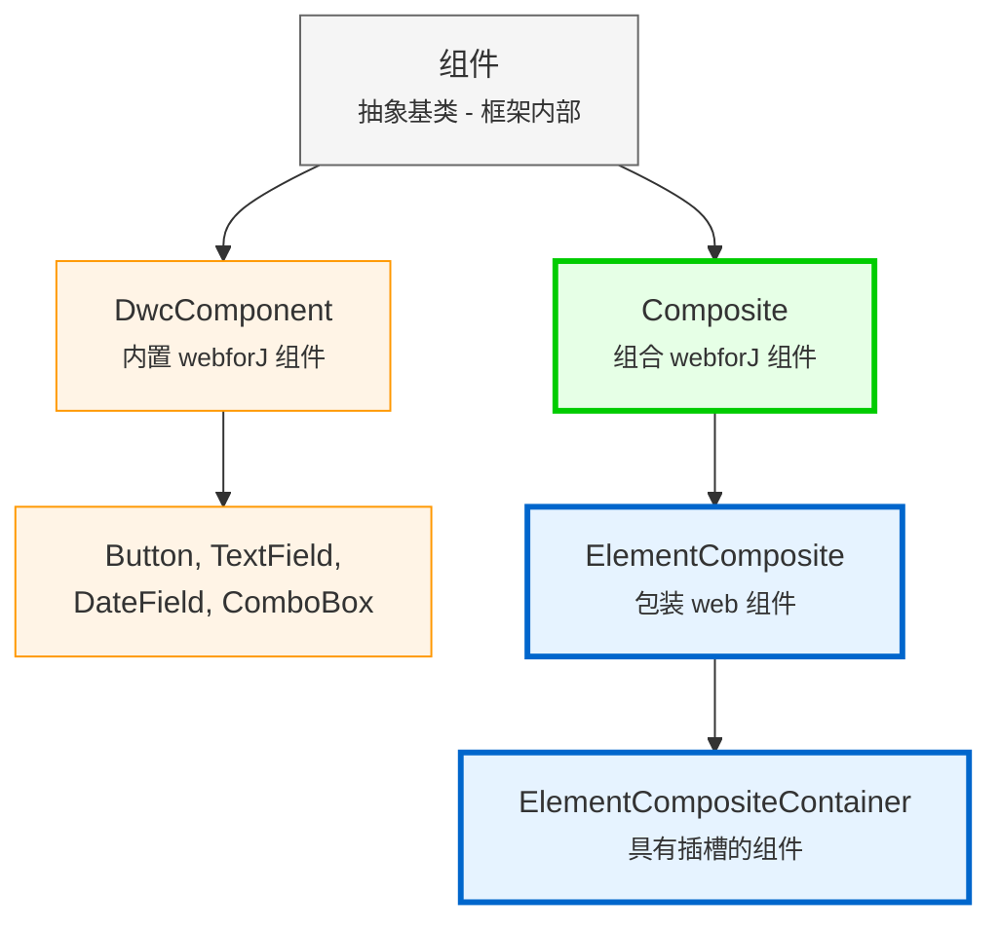

<JavadocLink type="foundation" location="com/webforj/component/Component" top='true'/> 

在构建 webforJ 自定义组件之前，了解构建组件工作原理的基础架构是很重要的。本文解释了组件层次结构、组件身份、生命周期概念，以及关注接口如何提供组件功能。

## 了解组件层次结构 {#understanding-the-component-hierarchy}

webforJ 将组件组织成两组层次结构：框架内部类（您永远不应扩展的类）和专门为构建自定义组件而设计的类。本节解释了 webforJ 为什么选择组合而不是继承，以及层次结构的每个级别提供了什么。

### 为什么选择组合而不是扩展？ {#why-composition-instead-of-extension}

在 webforJ 中，内置组件如 [`Button`](../components/button) 和 [`TextField`](../components/fields/textfield) 是最终类——您无法扩展它们：

```java
// 这在 webforJ 中不起作用
public class MyButton extends Button {
  // Button 是最终类 - 不能被扩展 
}
```

webforJ 使用 **组合而不是继承**。您不需要扩展现有组件，而是创建一个扩展 `Composite` 的类，并将组件合并在其中。`Composite` 作为一个容器，包裹一个单一的组件（称为绑定组件），并允许您向其中添加自己的组件和行为。

```java
public class SearchBar extends Composite<FlexLayout> {
  private final FlexLayout self = getBoundComponent();
  private TextField searchField;
  private Button searchButton;
  
  public SearchBar() {
    searchField = new TextField("搜索");
    searchButton = new Button("前往");
    
    self.setDirection(FlexDirection.ROW)
      .add(searchField, searchButton);
  }
}
```

### 为什么无法扩展内置组件 {#why-you-cant-extend-built-in-components}

webforJ 组件被标记为最终类，以维护底层客户端 Web 组件的完整性。扩展 webforJ 组件类将授予对底层 Web 组件的控制权，这可能导致意外后果，并破坏组件行为的一致性和可预测性。

有关详细解释，请参见架构文档中的 [最终类和扩展限制](https://docs.webforj.com/docs/architecture/controls-components#final-classes-and-extension-restrictions)。

### 组件层次结构 {#the-component-hierarchy}

<div style={{textAlign: 'center'}}>

```mermaid
graph TD
  A[组件<br/><small>抽象基类 - 框架内部</small>]
  
  A --> B[DwcComponent<br/><small>内置 webforJ 组件</small>]
  A --> C[Composite<br/><small>组合 webforJ 组件</small>]
  
  B --> E[Button, TextField,<br/>DateField, ComboBox]
  
  C --> D[ElementComposite<br/><small>包装 web 组件</small>]
  D --> F[ElementCompositeContainer<br/><small>具有插槽的组件</small>]
  
  style A fill:#f5f5f5,stroke:#666
  style B fill:#fff4e6,stroke:#ff9800
  style C fill:#e6ffe6,stroke:#00cc00
  style D fill:#e6f3ff,stroke:#0066cc
  style E fill:#fff4e6,stroke:#ff9800
  style F fill:#e6f3ff,stroke:#0066cc
  
  classDef userClass stroke-width:3px
  class C,D,F userClass
```
</div>

供开发人员使用的类：
- `Composite`
- `ElementComposite`
- `ElementCompositeContainer`

内部框架类（切勿直接扩展）：
- `Component`
- `DwcComponent`

:::warning[切勿直接扩展 `Component` 或 `DwcComponent`]
切勿直接扩展 `Component` 或 `DwcComponent`。所有内置组件都是最终类。始终使用 `Composite` 或 `ElementComposite` 的组合模式。

尝试扩展 `DwcComponent` 将引发运行时异常。
:::

## 关注接口 {#concern-interfaces}

关注接口是提供特定功能给您组件的 Java 接口。每个接口添加一组相关的方法。例如，`HasSize` 添加用于控制宽度和高度的方法，而 `HasFocus` 添加用于管理焦点状态的方法。

当您在组件上实现一个关注接口时，您可以访问这些功能而无需编写任何实现代码。接口提供了自动工作的默认实现。

实现关注接口使您的自定义组件拥有与内置 webforJ 组件相同的 API：

```java
// 实现 HasSize 以自动获得宽度/高度方法
public class SizedCard extends Composite<Div> implements HasSize<SizedCard> {
  private final Div self = getBoundComponent();
  
  public SizedCard() {
    self.setText("卡片内容");
  }
  
  // 无需实现这些 - 您可以免费获取：
  // setWidth(), setHeight(), setSize()
}

// 像任何 webforJ 组件一样使用它
SizedCard card = new SizedCard();
card.setWidth("300px")
  .setHeight("200px");
```

组合自动将这些调用转发到底层的 `Div`。无需额外代码。

**常见关注接口：**
- `HasSize` - `setWidth()`, `setHeight()`, `setSize()`
- `HasFocus` - `focus()`, `setFocusable()`, 焦点事件
- `HasClassName` - `addClassName()`, `removeClassName()`
- `HasStyle` - `setStyle()`, 行内 CSS 管理
- `HasVisibility` - `setVisible()`, 显示/隐藏能力
- `HasText` - `setText()`, 文本内容管理
- `HasAttribute` - `setAttribute()`, HTML 属性管理

:::warning
如果底层组件不支持接口功能，您将获得运行时异常。在这种情况下，请提供您自己的实现。
:::

有关可用关注接口的完整列表，请参见 [webforJ JavaDoc](https://javadoc.io/doc/com.webforj/webforj-foundation/latest/com/webforj/concern/package-summary.html)。

## 组件生命周期概述 {#component-lifecycle-overview}

webforJ 自动管理组件生命周期。框架处理组件的创建、附加和销毁，而无需手动干预。

**生命周期钩子**在需要时可用：
- `onDidCreate()` - 在组件附加到 DOM 后调用
- `onDidDestroy()` - 在组件被销毁时调用

这些钩子是 **可选** 的。根据需要使用它们：
- 清理资源（停止定时器，关闭连接）
- 初始化需要 DOM 附加的组件
- 与客户端 JavaScript 集成

对于大多数简单情况，您可以直接在构造函数中初始化组件。使用 `onDidCreate()` 等生命周期钩子在必要时延迟工作。
