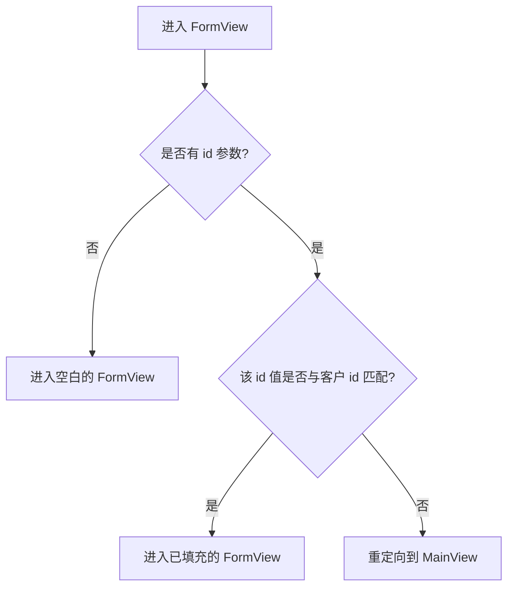

应用程序来自 [Routing and Composites](/docs/introduction/tutorial/routing-and-composites)，只能向数据库添加新客户。使用以下概念，您将为用户提供编辑现有客户数据的能力：

- 路由模式
- 通过 URL 传递参数值
- 生命周期观察者

完成此步骤后将创建 [4-observers-and-route-parameters](https://github.com/webforj/webforj-tutorial/tree/main/4-observers-and-route-parameters) 的一个版本。

## 运行应用程序 {#running-the-app}

在开发应用程序时，您可以使用 [4-observers-and-route-parameters](https://github.com/webforj/webforj-tutorial/tree/main/4-observers-and-route-parameters) 作为比较。要查看应用程序的实际运行：

1. 导航到包含 `pom.xml` 文件的顶级目录，如果您正在按照 GitHub 上的版本进行操作，该目录为 `4-observers-and-route-parameters`。

2. 使用以下 Maven 命令在本地运行 Spring Boot 应用程序：
    ```bash
    mvn
    ```

运行应用程序会自动在 `http://localhost:8080` 打开一个新的浏览器窗口。

## 使用客户的 `id` {#using-the-customers-id}

要使用 `FormView` 编辑现有客户，您需要一种方法来告诉它要编辑哪个客户。
可以通过向 `FormView` 提供一个初始参数来实现，该参数表示客户 ID。
在 [Working with Data](/docs/introduction/tutorial/working-with-data) 中，您创建了一个 `Customer` 实体，该实体在客户添加到数据库时分配一个唯一的 `Long` 型值作为 `id`。

```java
 @Id
 @GeneratedValue(strategy = GenerationType.IDENTITY)
  private Long id;
```

在这一步中，您将对 `FormView` 进行更改，以便在任何内容加载之前使用 `id` 作为初始参数。然后，您将让 `FormView` 评估 `id` 来确定表单是用于添加新客户还是更新现有客户。最后，您将修改 `MainView` 以便在导航到 `FormView` 时发送一个 `id` 值。

## 向 `FormView` 添加路由模式 {#adding-a-route-pattern}

在上一步中，将 `FormView` 的路由设为 `@Route(customer)` 将该类本地映射到 `http://localhost:8080/customer`。添加路由模式允许您将 `id` 作为初始参数添加到 `FormView`。

[路由模式](/docs/routing/route-patterns) 让您可以在 URL 中添加参数、使其可选，并对有效模式设置约束。使用 `@Route` 注解，以下内容使 `id` 成为 `FormView` 的可选路由参数：

- **`/:id`** 为路由提供了命名参数 `id`，因此访问 `http://localhost:8080/customer/6` 时会加载带有 `id` 参数为 `6` 的 `FormView`。

- **`?`** 使 `id` 参数可选。默认情况下，参数是必需的，但使 `id` 可选允许您在尚未具有 `id` 的新客户下使用 `FormView` 。

- **`<[0-9]+>`** 将 `id` 限制为正数。在尖括号 `<>` 中，您可以向参数添加作为正则表达式的约束。如果 `id` 不符合约束，例如 `http://localhost:8080/customer/john-smith`，则会将用户发送到 404 页面。

要将可选路由参数添加到 `FormView`，请将 `@Route` 注解更改为以下内容：

```java
@Route("customer/:id?<[0-9]+>")
```

## 路由到 `FormView` {#routing-to-formview}

`FormView` 现在接受一个可选的 `id` 参数，并且仅当 `id` 是一个正整数时才会加载。

但是，当用户手动输入一个不存在客户的 URL 时，比如 `http://localhost:8080/customer/5000`，`FormView` 仍然可以加载。在进入 `FormView` 之前添加一个生命周期观察者，让您的应用程序确定如何处理传入的 `id` 值。

### 条件路由 {#conditional-routing}

生命周期观察者允许组件在特定阶段对生命周期事件做出反应。[生命周期观察者](/docs/routing/navigation-lifecycle/observers) 文章列出了可用的观察者，但此步骤仅使用 `WillEnterObserver`。

`WillEnterObserver` 的时机发生在组件路由完成之前。
使用此观察者可以让您评估传入的 `id`。如果 `id` 与现有客户不匹配，您可以将用户重定向回 `MainView` 以查找要编辑的有效客户。

在讨论 `WillEnterObserver` 的代码之前，以下流程图列出了在路由到 `FormView` 时应为可能的结果：



### 使用 `WillEnterObserver` {#using-the-willenterobserver}

使用在组件完全加载之前触发的生命周期观察者 `WillEnterObserver`，可以添加条件以确定应用程序是否应继续进入 `FormView`，或者是否需要将用户重定向到 `MainView`。

每个生命周期观察者是一个接口，因此在 `FormView` 的声明中实现 `WillEnterObserver`：

```java
public class FormView extends Composite<Div> implements WillEnterObserver {
```

`WillEnterObserver` 观察者具有 `onWillEnter()` 方法，该方法在路由到组件之前被 webforJ 调用。此方法有两个参数：`WillEnterEvent` 和 `ParametersBag`。

`WillEnterEvent` 使用 `accept()` 方法确定是否继续路由到组件，或者使用 `reject()` 方法停止路由。在拒绝当前路由后，您需要将用户重定向到其他地方。

`ParametersBag` 包含来自 URL 的路由参数。您将在下一节中使用 `ParametersBag` 来创建 `onWillEnter()` 的条件逻辑，使用 `id` 参数。

以下 `onWillEnter()` 是一个只有两个结果的示例：

```java
@Override
public void onWillEnter(WillEnterEvent event, ParametersBag parameters) {

  //添加条件逻辑
  if (<condition>) {

    //允许继续路由到 FormView
    event.accept();

  } else {

    //停止路由到 FormView
    event.reject();

    //将用户发送到 MainView
    navigateToMain();
  }
}
```

### 使用 `ParametersBag` {#using-the-parametersbag}

如前一节简要提到的，`ParametersBag` 包含来自 URL 的路由参数。每个生命周期观察者都可以访问此对象，并在应用程序中使用它可以获取 `id` 值。

`ParametersBag` 对象提供多个查询方法，以特定对象类型检索参数。例如 `getInt()` 可以以 `Integer` 的形式获取参数。

但是，由于某些参数是可选的，`getInt()` 实际返回的是 `Optional<Integer>`。在 `Optional<Integer>` 上使用 `ifPresentOrElse()` 方法可以使用 `Integer` 设置变量。

当没有 `id` 时，用户可以继续进入 `FormView` 以添加新客户。

```java
@Override
public void onWillEnter(WillEnterEvent event, ParametersBag parameters) {

  //确定要获取哪个参数，并检查其存在与否
  parameters.getInt("id").ifPresentOrElse(id -> {

    //将 id 用作变量
    customerId = Long.valueOf(id);

  //当没有 id 存在时，继续进入新的客户的 FormView
  }, () -> event.accept());
        
}
```

### `id` 是否有效? {#is-the-id-valid}

到目前为止，上一节中的 `WillEnterObserver` 仅在没有 `id` 存在时接受路由。观察者需要在继续进入 `FormView` 之前进行另外一次验证：验证 `id` 是否与现有客户匹配。

现在 `FormView` 可以使用 `CustomerService` 通过 `doesCustomerExist()` 方法确认客户的存在。如果没有匹配，应用程序可以拒绝当前路由并重定向用户到 `MainView`，使用 `navigateToMain()`。

当提供有效的 `id` 时，应用程序可以使用 `accept()` 继续路由到 `FormView`。创建一个 `fillForm()` 方法，将 `customer` 变量分配给数据库中具有相应 `id` 的客户并设置字段的值：

```java
public void fillForm(Long customerId) {
  customer = customerService.getCustomerByKey(customerId);
  firstName.setValue(customer.getFirstName());
  lastName.setValue(customer.getLastName());
  company.setValue(customer.getCompany());
  country.selectKey(customer.getCountry());
}
```

像添加新客户时一样，使用工作副本允许用户在 UI 中编辑客户数据，而无需直接编辑存储库。

### 完成的 `onWillEnter()` {#completed-onwillenter}

最后两节详细介绍了如何处理进入 `FormView` 的每个结果，使用 `ParametersBag` 和 `CustomerService`。

以下是 `FormView` 的完成 `onWillEnter()`，使用 `ParametersBag` 来拒绝或接受传入的路由，并调用其他方法来填充表单或将用户发送到 `MainView`：

```java
@Override
public void onWillEnter(WillEnterEvent event, ParametersBag parameters) {

  //确定要获取哪个参数，并检查其存在与否
  parameters.getInt("id").ifPresentOrElse(id -> {
    customerId = Long.valueOf(id);
    //检查是否存在此 id 的客户
    if (customerService.doesCustomerExist(customerId)) {
        //该客户存在，因此继续进入 FormView，并使用 id 初始化字段
        event.accept();
        fillForm(customerId);
      } else {
        //该客户不存在，因此重定向到 MainView
        event.reject();
        navigateToMain();
      }

  //没有 id 存在，因此继续进入 FormView 以添加新客户
  }, () -> event.accept());
        
}
```

## 添加或编辑客户 {#adding-or-editing-a-customer}

该应用程序的前一个版本仅在用户提交表单时添加新客户。现在用户可以编辑现有客户，`submitCustomer()` 方法必须在更新数据库之前验证客户是否已存在。

最初在 `FormView` 中为客户 `id` 分配一个变量是不必要的，因为新客户在提交到数据库时会分配一个唯一的 `id`。但是，如果您在 `FormView` 中将 `customerId` 声明为具有未使用的 `id` 值的初始变量，则对于新客户保持不变，而在 `onWillEnter()` 中则会被现有客户覆盖。

这使您能够使用 `doesCustomerExist()` 验证是添加新客户还是更新现有客户。

```java
private Long customerId = 0L;

//...

private void submitCustomer() {
  if (customerService.doesCustomerExist(customerId)) {
    customerService.updateCustomer(customer);
  } else {
    customerService.createCustomer(customer);
  }
  navigateToMain();
}
```

## 完成的 `FormView` {#completed-formview}

以下是 `FormView` 的外观，现在它可以处理编辑现有客户的功能：

<ExpandableCode title="FormView.java" language="java" startLine={1} endLine={15}>
  {`@Route("customer/:id?<[0-9]+>")
  @FrameTitle("客户表单")
  public class FormView extends Composite<Div> implements WillEnterObserver {
    private final CustomerService customerService;
    private Customer customer = new Customer();
    private Long customerId = 0L;
    private Div self = getBoundComponent();
    private TextField firstName = new TextField("名字", e -> customer.setFirstName(e.getValue()));
    private TextField lastName = new TextField("姓氏", e -> customer.setLastName(e.getValue()));
    private TextField company = new TextField("公司", e -> customer.setCompany(e.getValue()));
    private ChoiceBox country = new ChoiceBox("国家",
        e -> customer.setCountry((Customer.Country) e.getSelectedItem().getKey()));
    private Button submit = new Button("提交", ButtonTheme.PRIMARY, e -> submitCustomer());
    private Button cancel = new Button("取消", ButtonTheme.OUTLINED_PRIMARY, e -> navigateToMain());
    private ColumnsLayout layout = new ColumnsLayout(
        firstName, lastName,
        company, country,
        submit, cancel);

    public FormView(CustomerService customerService) {
      this.customerService = customerService;
      fillCountries();
      setColumnsLayout();
      self.setMaxWidth(600)
          .addClassName("card")
          .add(layout);
      submit.setStyle("margin-top", "var(--dwc-space-l)");
      cancel.setStyle("margin-top", "var(--dwc-space-l)");
    }

    private void setColumnsLayout() {
      List<Breakpoint> breakpoints = List.of(
          new Breakpoint(600, 2));
      layout.setSpacing("var(--dwc-space-l)")
          .setBreakpoints(breakpoints);
    }

    private void fillCountries() {
      ArrayList<ListItem> listCountries = new ArrayList<>();
      for (Country countryItem : Customer.Country.values()) {
        listCountries.add(new ListItem(countryItem, countryItem.toString()));
      }
      country.insert(listCountries);
      country.selectIndex(0);
    }

    private void submitCustomer() {
      if (customerService.doesCustomerExist(customerId)) {
        customerService.updateCustomer(customer);
      } else {
        customerService.createCustomer(customer);
      }
      navigateToMain();
    }

    private void navigateToMain() {
      Router.getCurrent().navigate(MainView.class);
    }

    @Override
    public void onWillEnter(WillEnterEvent event, ParametersBag parameters) {
      parameters.getInt("id").ifPresentOrElse(id -> {
        customerId = Long.valueOf(id);
        if (customerService.doesCustomerExist(customerId)) {
          event.accept();
          fillForm(customerId);
        } else {
          event.reject();
          navigateToMain();
        }

      }, () -> event.accept());
    }

    public void fillForm(Long customerId) {
      customer = customerService.getCustomerByKey(customerId);
      firstName.setValue(customer.getFirstName());
      lastName.setValue(customer.getLastName());
      company.setValue(customer.getCompany());
      country.selectKey(customer.getCountry());
    }
  }
`}
</ExpandableCode>

## 从 `MainView` 导航到 `FormView` 以编辑客户 {#navigating-from-mainview-to-formview-to-edit-customers}

在这一步中，您使用现有的 `ParametersBag` 来确定 `id` 的值。创建一个新的 `ParametersBag` 可以让您直接在类之间导航，带有您选择的参数。使用 `Table` 中的数据是一种有效的选择，可以将用户发送到 `FormView`，并携带客户 `id`。

与按钮类似，将导航绑定到用户所选操作，让他们决定何时进入 `FormView`。向 `Table` 添加事件监听器可以让您使用 `ParametersBag` 发送用户到 `FormView`：

```java
table.addItemClickListener(this::editCustomer);

private void editCustomer(TableItemClickEvent<Customer> e) {
  Router.getCurrent().navigate(FormView.class,
      ParametersBag.of("id=" + e.getItemKey()));
  }
```

但是，`Table` 项目的键默认为自动生成。您可以使用 `setKeyProvider()` 方法显式地使每个键与客户的 `id` 相对应：

```java
table.setKeyProvider(Customer::getId);
```

在 `MainView` 中，向 `buildTable()` 添加 `addItemClickListener()` 和 `setKeyProvider()` 方法，然后添加一个方法，将用户发送到 `FormView`，在 `ParametersBag` 中提供一个 `id` 值，具体取决于用户在表格中的点击位置：

```java title="MainView.java" {30-31,34-37}
@Route("/")
@FrameTitle("客户表格")
public class MainView extends Composite<Div> {
  private final CustomerService customerService;
  private Div self = getBoundComponent();
  private Table<Customer> table = new Table<>();
  private Button addCustomer = new Button("添加客户", ButtonTheme.PRIMARY,
      e -> Router.getCurrent().navigate(FormView.class));

  public MainView(CustomerService customerService) {
    this.customerService = customerService;
    addCustomer.setWidth(200);
    buildTable();
    self.setWidth("fit-content")
        .addClassName("card")
        .add(table, addCustomer);
  }

  private void buildTable() {
    table.setSize("1000px", "294px");
    table.setMaxWidth("90vw");
    table.addColumn("firstName", Customer::getFirstName).setLabel("名字");
    table.addColumn("lastName", Customer::getLastName).setLabel("姓氏");
    table.addColumn("company", Customer::getCompany).setLabel("公司");
    table.addColumn("country", Customer::getCountry).setLabel("国家");
    table.setColumnsToAutoFit();
    table.setColumnsToResizable(false);
    table.getColumns().forEach(column -> column.setSortable(true));
    table.setRepository(customerService.getRepositoryAdapter());
    table.setKeyProvider(Customer::getId);
    table.addItemClickListener(this::editCustomer);
  }

  private void editCustomer(TableItemClickEvent<Customer> e) {
    Router.getCurrent().navigate(FormView.class,
        ParametersBag.of("id=" + e.getItemKey()));
  }
}
```

## 下一步 {#next-step}

现在用户可以直接编辑客户数据，您的应用程序应在将更改提交到存储库之前验证这些更改。在 [Validating and Binding Data](/docs/introduction/tutorial/validating-and-binding-data) 中，您将创建验证规则并直接将数据模型与 UI 关联，使组件在数据无效时显示错误消息。
