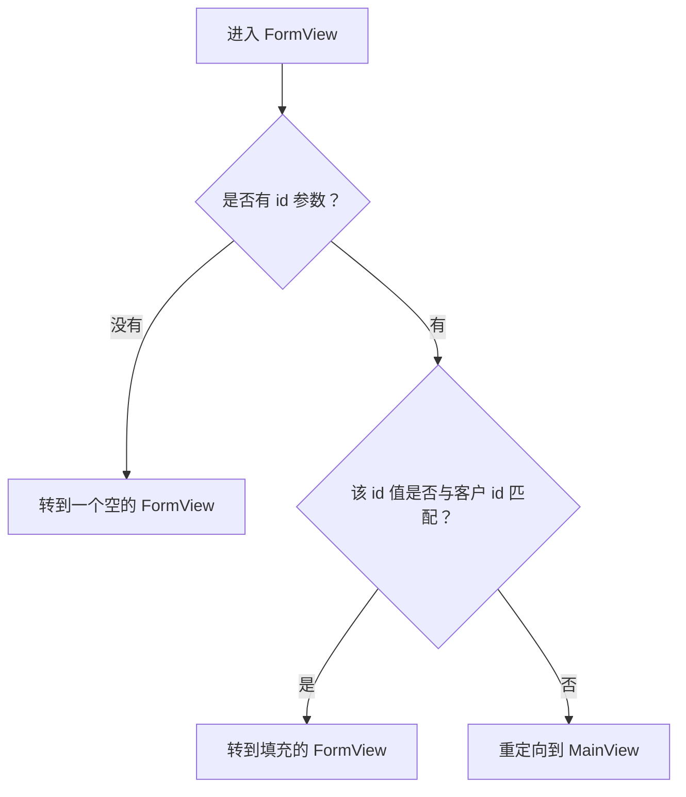

该应用程序来自 [Routing and Composites](/docs/introduction/tutorial/routing-and-composites)，仅能向数据库添加新客户。通过以下概念，您将使用户能够编辑现有客户的数据：

- 路由模式
- 通过 URL 传递参数值
- 生命周期观察者

完成此步骤后，您将创建一个版本的 [4-observers-and-route-parameters](https://github.com/webforj/webforj-tutorial/tree/main/4-observers-and-route-parameters)。

## 运行应用程序 {#running-the-app}

在开发应用程序时，您可以将 [4-observers-and-route-parameters](https://github.com/webforj/webforj-tutorial/tree/main/4-observers-and-route-parameters) 作为比较。要查看应用程序的运行情况：

1. 导航到包含 `pom.xml` 文件的顶级目录，如果您正在跟随 GitHub 上的版本，这是 `4-observers-and-route-parameters`。

2. 使用以下 Maven 命令在本地运行 Spring Boot 应用程序：
    ```bash
    mvn
    ```

运行应用程序会自动打开一个浏览器窗口，地址为 `http://localhost:8080`。

## 使用客户的 `id` {#using-the-customers-id}

要使用 `FormView` 编辑现有客户，您需要一种方式来告诉它要编辑哪位客户。您可以通过提供一个表示客户 ID 的初始参数给 `FormView` 来实现。在 [Working with Data](/docs/introduction/tutorial/working-with-data) 中，您创建了一个 `Customer` 实体，当客户被添加到数据库时，分配一个唯一的数字 `Long` 值作为 `id`。

```java
 @Id
 @GeneratedValue(strategy = GenerationType.IDENTITY)
  private Long id;
```

在此步骤中，您将对 `FormView` 进行修改，使其在任何内容加载之前使用 `id` 作为初始参数。然后，您将让 `FormView` 评估 `id` 以确定表单是添加新客户还是更新现有客户。最后，您将修改 `MainView`，以便在导航到 `FormView` 时发送 `id` 值。

## 向 `FormView` 添加路由模式 {#adding-a-route-pattern}

在上一步中，将 `FormView` 的路由设置为 `@Route(customer)` 将类本地映射到 `http://localhost:8080/customer`。添加路由模式让您可以将 `id` 作为初始参数添加到 `FormView`。

[路由模式](/docs/routing/route-patterns)让您能够在 URL 中添加一个参数，使其可选，并设置有效模式的约束。使用 `@Route` 注解，下面的内容使 `id` 成为 `FormView` 的可选路由参数：

- **`/:id`** 为路由提供一个命名参数 `id`，因此访问 `http://localhost:8080/customer/6` 会加载 `FormView`，其 `id` 参数为 `6`。

- **`?`** 使 `id` 参数可选。默认情况下，参数是必需的，但使 `id` 可选可以让您使用 `FormView` 添加尚未拥有 `id` 的新客户。

- **`<[0-9]+>`** 限制 `id` 为正数。在尖括号 `<>` 中，您可以将参数的约束作为正则表达式添加。如果 `id` 不符合约束，例如 `http://localhost:8080/customer/john-smith`，则会将用户发送到 404 页面。

要将可选路由参数添加到 `FormView`，将 `@Route` 注解更改为：

```java
@Route("customer/:id?<[0-9]+>")
```

## 路由到 `FormView` {#routing-to-formview}

`FormView` 现在接受一个可选的 `id` 参数，并且只有在 `id` 是一个完整的正数时才会加载。

然而，当用户手动输入一个不存在的客户的 URL，例如 `http://localhost:8080/customer/5000`，`FormView` 仍然可以加载。添加生命周期观察者在进入 `FormView` 之前可以让您的应用程序决定如何处理传入的 `id` 值。

### 条件路由 {#conditional-routing}

生命周期观察者允许组件在特定阶段响应生命周期事件。 [生命周期观察者](/docs/routing/navigation-lifecycle/observers) 文章列出了可用的观察者，但此步骤只使用 `WillEnterObserver`。

`WillEnterObserver` 的时机发生在组件路由完成之前。使用此观察者允许您评估传入的 `id`。如果 `id` 不匹配现有客户，您可以将用户重定向回 `MainView`，以找到有效的客户进行编辑。

在讨论 `WillEnterObserver` 的代码之前，以下流程图说明了路由到 `FormView` 时应该可能的结果：


```mermaid
flowchart TD
    A[进入 FormView] --> B{是否有 id 参数？}
    B -->|没有| C[转到一个空的 FormView]
    B -->|有| D{该 id 值是否与客户 id 匹配？}
    D -->|是| E[转到填充的 FormView]
    D -->|否| F[重定向到 MainView]
```

### 使用 `WillEnterObserver` {#using-the-willenterobserver}

使用在组件完全加载之前触发的生命周期观察者 `WillEnterObserver` 允许您添加条件以确定应用程序是否应继续进入 `FormView`，或者是否需要将用户重定向到 `MainView`。

每个生命周期观察者都是一个接口，因此将 `WillEnterObserver` 实现在 `FormView` 的声明中：

```java
public class FormView extends Composite<Div> implements WillEnterObserver {
```

`WillEnterObserver` 观察者具有 `onWillEnter()` 方法，该方法在路由到组件之前由 webforJ 调用。该方法有两个参数：`WillEnterEvent` 和 `ParametersBag`。

`WillEnterEvent` 确定是否继续路由到组件，使用 `accept()` 方法，或使用 `reject()` 方法停止路由。在拒绝当前路由后，您需要将用户重定向到其他地方。

`ParametersBag` 包含来自 URL 的路由参数。您将在下一部分使用 `ParametersBag` 来创建 `onWillEnter()` 的条件逻辑，使用 `id` 参数。

以下是只有两个结果的 `onWillEnter()` 的示例：

```java
@Override
public void onWillEnter(WillEnterEvent event, ParametersBag parameters) {

  //添加条件逻辑
  if (<condition>) {

    //允许路由继续到 FormView
    event.accept();

  } else {

    //停止路由到 FormView
    event.reject();

    //将用户发送到 MainView
    navigateToMain();
  }
}
```

### 使用 `ParametersBag` {#using-the-parametersbag}

如前一部分简要提到的，`ParametersBag` 包含来自 URL 的路由参数。每个生命周期观察者都有访问此对象的权限，使用它可以让您获取 `id` 值。

`ParametersBag` 对象提供多个查询方法，以特定对象类型检索参数。例如，`getInt()` 可以将您获取的参数作为 `Integer`。

但是，由于某些参数是可选的，`getInt()` 实际返回的是 `Optional<Integer>`。在 `Optional<Integer>` 上使用 `ifPresentOrElse()` 方法允许您使用 `Integer` 设置变量。

当没有 `id` 时，用户可以继续访问 `FormView` 以添加新客户。

```java
@Override
public void onWillEnter(WillEnterEvent event, ParametersBag parameters) {

  //确定要获取哪个参数，并检查它是否存在
  parameters.getInt("id").ifPresentOrElse(id -> {

    //使用 id 作为变量
    customerId = Long.valueOf(id);

  //当未提供 id 时，继续进入 FormView 以添加新客户
  }, () -> event.accept());

}
```

### `id` 是否有效？ {#is-the-id-valid}

目前，上一部分中的 `WillEnterObserver` 仅在未提供 `id` 时接受路由。观察者需要在继续进入 `FormView` 之前执行一项验证：验证 `id` 是否与现有客户匹配。

现在 `FormView` 可以使用 `CustomerService` 通过 `doesCustomerExist()` 方法确认客户的存在。如果没有匹配项，应用程序可以拒绝当前路由并使用 `navigateToMain()` 将用户重定向到 `MainView`。

在给定有效的 `id` 时，应用程序可以使用 `accept()` 继续路由到 `FormView`。创建一个 `fillForm()` 方法，将 `customer` 变量分配给数据库中具有相应 `id` 的客户并设置字段的值：

```java
public void fillForm(Long customerId) {
  customer = customerService.getCustomerByKey(customerId);
  firstName.setValue(customer.getFirstName());
  lastName.setValue(customer.getLastName());
  company.setValue(customer.getCompany());
  country.selectKey(customer.getCountry());
}
```

与添加新客户类似，使用工作副本允许用户在 UI 中编辑客户数据，而无需直接编辑存储库。

### 完成的 `onWillEnter()` {#completed-onwillenter}

最后两部分详细介绍了如何使用 `ParametersBag` 和 `CustomerService` 处理 `FormView` 的每个路由结果。

以下是完整的 `FormView` 的 `onWillEnter()`，它使用 `ParametersBag` 来拒绝或接受传入路由，并调用其他方法来填充表单或将用户发送到 `MainView`：

```java
@Override
public void onWillEnter(WillEnterEvent event, ParametersBag parameters) {

  //确定要获取哪个参数，并检查它是否存在
  parameters.getInt("id").ifPresentOrElse(id -> {
    customerId = Long.valueOf(id);
    //检查是否有此 id 的客户
    if (customerService.doesCustomerExist(customerId)) {
        //该客户存在，因此继续进入 FormView，并使用 id 初始化字段
        event.accept();
        fillForm(customerId);
      } else {
        //该客户不存在，因此重定向到 MainView
        event.reject();
        navigateToMain();
      }

  //未提供 id，因此继续进入 FormView 以添加新客户
  }, () -> event.accept());

}
```

## 添加或编辑客户 {#adding-or-editing-a-customer}

此应用程序的先前版本仅在用户提交表单时添加新客户。现在用户可以编辑现有客户，`submitCustomer()` 方法必须在更新数据库之前验证客户是否已存在。

最初，在 `FormView` 中分配客户 `id` 的变量是没有必要的，因为新客户在提交到数据库时会被分配一个唯一的 `id`。但是，如果您在 `FormView` 中声明 `customerId` 作为一个初始变量，并且其 `id` 值未被使用，则在新客户处保持不变，并在现有客户时在 `onWillEnter()` 中重写。

这使您可以使用 `doesCustomerExist()` 来验证是添加新客户还是更新现有客户。

```java
private Long customerId = 0L;

//...

private void submitCustomer() {
  if (customerService.doesCustomerExist(customerId)) {
    customerService.updateCustomer(customer);
  } else {
    customerService.createCustomer(customer);
  }
  navigateToMain();
}
```

## 完成的 `FormView` {#completed-formview}

以下是 `FormView` 的样子，现在它可以处理编辑现有客户：

```java
@Route("customer/:id?<[0-9]+>")
@FrameTitle("客户表单")
public class FormView extends Composite<Div> implements WillEnterObserver {
  private final CustomerService customerService;
  private Customer customer = new Customer();
  private Long customerId = 0L;
  private Div self = getBoundComponent();
  private TextField firstName = new TextField("名字", e -> customer.setFirstName(e.getValue()));
  private TextField lastName = new TextField("姓氏", e -> customer.setLastName(e.getValue()));
  private TextField company = new TextField("公司", e -> customer.setCompany(e.getValue()));
  private ChoiceBox country = new ChoiceBox("国家",
      e -> customer.setCountry((Customer.Country) e.getSelectedItem().getKey()));
  private Button submit = new Button("提交", ButtonTheme.PRIMARY, e -> submitCustomer());
  private Button cancel = new Button("取消", ButtonTheme.OUTLINED_PRIMARY, e -> navigateToMain());
  private ColumnsLayout layout = new ColumnsLayout(
      firstName, lastName,
      company, country,
      submit, cancel);

  public FormView(CustomerService customerService) {
    this.customerService = customerService;
    fillCountries();
    setColumnsLayout();
    self.setMaxWidth(600)
        .addClassName("card")
        .add(layout);
    submit.setStyle("margin-top", "var(--dwc-space-l)");
    cancel.setStyle("margin-top", "var(--dwc-space-l)");
  }

  private void setColumnsLayout() {
    List<Breakpoint> breakpoints = List.of(
        new Breakpoint(600, 2));
    layout.setSpacing("var(--dwc-space-l)")
        .setBreakpoints(breakpoints);
  }

  private void fillCountries() {
    ArrayList<ListItem> listCountries = new ArrayList<>();
    for (Country countryItem : Customer.Country.values()) {
      listCountries.add(new ListItem(countryItem, countryItem.toString()));
    }
    country.insert(listCountries);
    country.selectIndex(0);
  }

  private void submitCustomer() {
    if (customerService.doesCustomerExist(customerId)) {
      customerService.updateCustomer(customer);
    } else {
      customerService.createCustomer(customer);
    }
    navigateToMain();
  }

  private void navigateToMain() {
    Router.getCurrent().navigate(MainView.class);
  }

  @Override
  public void onWillEnter(WillEnterEvent event, ParametersBag parameters) {
    parameters.getInt("id").ifPresentOrElse(id -> {
      customerId = Long.valueOf(id);
      if (customerService.doesCustomerExist(customerId)) {
        event.accept();
        fillForm(customerId);
      } else {
        event.reject();
        navigateToMain();
      }

    }, () -> event.accept());
  }

  public void fillForm(Long customerId) {
    customer = customerService.getCustomerByKey(customerId);
    firstName.setValue(customer.getFirstName());
    lastName.setValue(customer.getLastName());
    company.setValue(customer.getCompany());
    country.selectKey(customer.getCountry());
  }
}
```

## 从 `MainView` 导航到 `FormView` 以编辑客户 {#navigating-from-mainview-to-formview-to-edit-customers}

在此步骤早些时候，您使用现有的 `ParametersBag` 来确定 `id` 的值。创建一个新的 `ParametersBag` 允许您直接在类之间导航，并选择所需的参数。使用 `Table` 中的数据是一种可行的选择，可以将用户发送到 `FormView`，并携带客户 `id`。

类似于按钮，将导航绑定到用户选择的操作可以让他们决定何时进入 `FormView`。向 `Table` 添加事件侦听器可以让您使用 `ParametersBag` 将用户发送到 `FormView`：

```java
table.addItemClickListener(this::editCustomer);

private void editCustomer(TableItemClickEvent<Customer> e) {
  Router.getCurrent().navigate(FormView.class,
      ParametersBag.of("id=" + e.getItemKey()));
  }
```

然而，`Table` 项目的键默认是自动生成的。您可以通过使用 `setKeyProvider()` 方法，显式地使每个键与客户的 `id` 相关联：

```java
table.setKeyProvider(Customer::getId);
```

在 `MainView` 中，向 `buildTable()` 添加 `addItemClickListener()` 和 `setKeyProvider()` 方法，然后添加该方法以根据用户在表格中的点击位置，将用户发送到 `FormView`，并在 `ParametersBag` 中提供 `id` 的值：

```java title="MainView.java" {30-31,34-37}
@Route("/")
@FrameTitle("客户表格")
public class MainView extends Composite<Div> {
  private final CustomerService customerService;
  private Div self = getBoundComponent();
  private Table<Customer> table = new Table<>();
  private Button addCustomer = new Button("添加客户", ButtonTheme.PRIMARY,
      e -> Router.getCurrent().navigate(FormView.class));

  public MainView(CustomerService customerService) {
    this.customerService = customerService;
    addCustomer.setWidth(200);
    buildTable();
    self.setWidth("fit-content")
        .addClassName("card")
        .add(table, addCustomer);
  }

  private void buildTable() {
    table.setSize("1000px", "294px");
    table.setMaxWidth("90vw");
    table.addColumn("firstName", Customer::getFirstName).setLabel("名字");
    table.addColumn("lastName", Customer::getLastName).setLabel("姓氏");
    table.addColumn("company", Customer::getCompany).setLabel("公司");
    table.addColumn("country", Customer::getCountry).setLabel("国家");
    table.setColumnsToAutoFit();
    table.setColumnsToResizable(false);
    table.getColumns().forEach(column -> column.setSortable(true));
    table.setRepository(customerService.getRepositoryAdapter());
    table.setKeyProvider(Customer::getId);
    table.addItemClickListener(this::editCustomer);
  }

  private void editCustomer(TableItemClickEvent<Customer> e) {
    Router.getCurrent().navigate(FormView.class,
        ParametersBag.of("id=" + e.getItemKey()));
  }
}
```

## 下一步 {#next-step}

现在用户可以直接编辑客户数据，您的应用程序应该在将更改提交到存储库之前验证这些更改。在 [Validating and Binding Data](/docs/introduction/tutorial/validating-and-binding-data) 中，您将创建验证规则，并直接将数据模型与 UI 关联，从而使组件在数据无效时显示错误消息。
