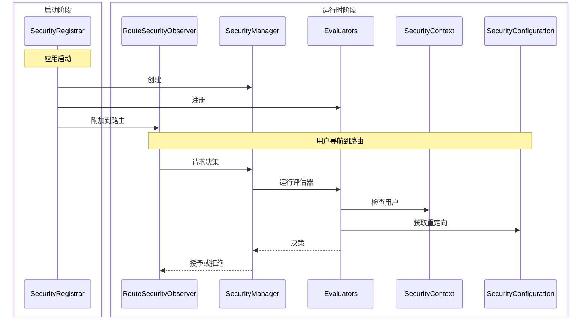

本指南讲解如何构建一个完整的自定义安全实现，使用基于会话的身份验证。您将学习四个核心接口如何通过从头开始实现它们相互协作。

:::tip[大多数应用程序应使用 Spring Security]
[Spring Security 集成](/docs/security/getting-started) 会自动配置此处显示的所有内容。仅在您有特定需求或未使用 Spring Boot 时构建自定义安全。
:::

## 您将构建的内容 {#what-youll-build}

一个包含四个类的工作安全系统：

- **SecurityConfiguration** - 定义安全行为和重定向位置
- **SecurityContext** - 通过 HTTP 会话跟踪谁已登录
- **SecurityManager** - 协调安全检查并提供登录/注销功能
- **SecurityRegistrar** - 在应用启动时将所有内容连接在一起

此示例使用基于会话的存储，但您也可以使用数据库查询、LDAP 或其他身份验证后端来实现相同的接口。

## 各组件如何协作 {#how-the-pieces-work-together}



**流程：**
1. **`SecurityRegistrar`** 在启动时运行，创建管理器，注册评估器，并附加观察者
2. **`SecurityManager`** 协调所有操作 - 提供上下文和配置给评估器
3. **`SecurityContext`** 通过读取 HTTP 会话来回答“谁已登录？”
4. **`SecurityConfiguration`** 回答“重定向到哪里？”用于登录和访问被拒绝页面
5. **`Evaluators`** 使用上下文和配置做出访问决策

## 第一步：定义安全配置 {#step-1-define-security-configuration}

配置告诉安全系统如何执行和在哪里重定向用户：

```java title="SecurityConfiguration.java"
package com.securityplain.security;

import com.webforj.router.history.Location;
import com.webforj.router.security.RouteSecurityConfiguration;
import java.util.Optional;

/**
 * 应用程序的安全配置。
 *
 * <p>
 * 定义在需要身份验证或访问被拒绝时重定向用户的位置。
 * </p>
 */
public class SecurityConfiguration implements RouteSecurityConfiguration {

  @Override
  public boolean isEnabled() {
    return true;
  }

  @Override
  public boolean isSecureByDefault() {
    return false;
  }

  @Override
  public Optional<Location> getAuthenticationLocation() {
    return Optional.of(new Location("/login"));
  }

  @Override
  public Optional<Location> getDenyLocation() {
    return Optional.of(new Location("/access-denied"));
  }
}
```

- `isEnabled() = true` - 安全处于活动状态
- `isSecureByDefault() = false` - 路由为公共路由，除非有注释（使用 `true` 可默认要求所有路由身份验证）
- `/login` - 未认证用户的去处
- `/access-denied` - 有权限但未认证用户的去处

## 第二步：实现安全上下文 {#step-2-implement-security-context}

上下文跟踪谁已登录。此实现使用 HTTP 会话存储用户信息：

<!-- vale off -->

<ExpandableCode title="SecurityContext.java" language="java">
{`package com.securityplain.security;

import com.webforj.Environment;
import com.webforj.router.security.RouteSecurityContext;
import java.util.HashMap;
import java.util.Map;
import java.util.Optional;
import java.util.Set;

/**
 * 简单的基于会话的安全上下文。
 *
 * <p>
 * 在 HTTP 会话中存储用户主体和角色。这是一个最小实现，供教学使用。
 * </p>
 */
public class SecurityContext implements RouteSecurityContext {
  private static final String SESSION_USER_KEY = "security.user";
  private static final String SESSION_ROLES_KEY = "security.roles";
  private static final String SESSION_ATTRS_KEY = "security.attributes";

  /**
   * {@inheritDoc}
   */
  @Override
  public boolean isAuthenticated() {
    return getPrincipal().isPresent();
  }

  /**
   * {@inheritDoc}
   */
  @Override
  public Optional<Object> getPrincipal() {
    return getSessionAttribute(SESSION_USER_KEY);
  }

  /**
   * {@inheritDoc}
   */
  @Override
  public boolean hasRole(String role) {
    Optional<Object> rolesObj = getSessionAttribute(SESSION_ROLES_KEY);
    if (rolesObj.isPresent() && rolesObj.get() instanceof Set) {
      @SuppressWarnings("unchecked")
      Set<String> roles = (Set<String>) rolesObj.get();
      return roles.contains(role);
    }
    return false;
  }

  /**
   * {@inheritDoc}
   */
  @Override
  public boolean hasAuthority(String authority) {
    // 在这个简单实现中，权限与角色相同
    return hasRole(authority);
  }

  /**
   * {@inheritDoc}
   */
  @Override
  public Optional<Object> getAttribute(String name) {
    Optional<Object> attrsObj = getSessionAttribute(SESSION_ATTRS_KEY);
    if (attrsObj.isPresent() && attrsObj.get() instanceof Map) {
      @SuppressWarnings("unchecked")
      Map<String, Object> attrs = (Map<String, Object>) attrsObj.get();
      return Optional.ofNullable(attrs.get(name));
    }
    return Optional.empty();
  }

  /**
   * {@inheritDoc}
   */
  @Override
  public void setAttribute(String name, Object value) {
    Environment.ifPresent(env -> {
      env.getSessionAccessor().ifPresent(accessor -> {
        accessor.access(session -> {
          @SuppressWarnings("unchecked")
          Map<String, Object> attrs =
              (Map<String, Object>) session.getAttribute(SESSION_ATTRS_KEY);
          if (attrs == null) {
            attrs = new HashMap<>();
            session.setAttribute(SESSION_ATTRS_KEY, attrs);
          }
          attrs.put(name, value);
        });
      });
    });
  }

  private Optional<Object> getSessionAttribute(String key) {
    final Object[] result = new Object[1];
    Environment.ifPresent(env -> {
      env.getSessionAccessor().ifPresent(accessor -> {
        accessor.access(session -> {
          result[0] = session.getAttribute(key);
        });
      });
    });
    return Optional.ofNullable(result[0]);
  }
}`}
</ExpandableCode>

<!-- vale on -->

**工作原理：**

- `isAuthenticated()` 检查会话中是否存在用户主体
- `getPrincipal()` 从会话存储中检索用户名
- `hasRole()` 检查用户的角色集合是否包含指定的角色
- `getAttribute()` / `setAttribute()` 管理自定义安全属性
- `Environment.getSessionAccessor()` 提供线程安全的会话访问

## 第三步：创建安全管理器 {#step-3-create-security-manager}

管理器协调安全决策。它扩展了 `AbstractRouteSecurityManager`，后者处理评估器链和访问拒绝：

<!-- vale off -->

<ExpandableCode title="SecurityManager.java" language="java">
{`package com.securityplain.security;

import com.webforj.environment.ObjectTable;
import com.webforj.environment.SessionObjectTable;
import com.webforj.router.Router;
import com.webforj.router.security.AbstractRouteSecurityManager;
import com.webforj.router.security.RouteAccessDecision;
import com.webforj.router.security.RouteSecurityConfiguration;
import com.webforj.router.security.RouteSecurityContext;

import java.util.Set;

/**
 * 简单的安全管理器实现。
 *
 * <p>
 * 提供静态方法以进行登录/注销并管理安全上下文。
 * </p>
 */
public class SecurityManager extends AbstractRouteSecurityManager {
  private static final String SESSION_USER_KEY = "security.user";
  private static final String SESSION_ROLES_KEY = "security.roles";

  /**
   * {@inheritDoc}
   */
  @Override
  public RouteSecurityConfiguration getConfiguration() {
    return new SecurityConfiguration();
  }

  /**
   * {@inheritDoc}
   */
  @Override
  public RouteSecurityContext getSecurityContext() {
    return new SecurityContext();
  }

  /**
   * 使用角色登录用户。
   *
   * @param username 用户名
   * @param password 密码
   */
  public RouteAccessDecision login(String username, String password) {
    if ("user".equals(username) && "password".equals(password)) {
      Set<String> roles = Set.of("USER");
      persistUser(username, roles);
      return RouteAccessDecision.grant();
    } else if ("admin".equals(username) && "admin".equals(password)) {
      Set<String> roles = Set.of("USER", "ADMIN");
      persistUser(username, roles);
      return RouteAccessDecision.grant();
    }

    return RouteAccessDecision.deny("无效的用户名或密码");
  }

  /**
   * 注销当前用户并重定向到登录页面。
   */
  public void logout() {
    SessionObjectTable.clear(SESSION_USER_KEY);
    SessionObjectTable.clear(SESSION_ROLES_KEY);

    Router router = Router.getCurrent();
    if (router != null) {
      getConfiguration().getAuthenticationLocation().ifPresent(location -> router.navigate(location));
    }
  }

  /**
   * 获取当前管理器实例。
   *
   * @return 当前管理器实例
   */
  public static SecurityManager getCurrent() {
    String key = SecurityManager.class.getName();
    if (ObjectTable.contains(key)) {
      return (SecurityManager) ObjectTable.get(key);
    }

    SecurityManager instance = new SecurityManager();
    ObjectTable.put(key, instance);

    return instance;
  }

  void saveCurrent(SecurityManager manager) {
    String key = SecurityManager.class.getName();
    ObjectTable.put(key, manager);
  }

  private void persistUser(String username, Set<String> roles) {
    SessionObjectTable.put(SESSION_USER_KEY, username);
    SessionObjectTable.put(SESSION_ROLES_KEY, roles);
  }
}`}
</ExpandableCode>

<!-- vale on -->

**工作原理：**

- 扩展 `AbstractRouteSecurityManager` 以继承评估器链逻辑
- 提供 `getConfiguration()` 和 `getSecurityContext()` 的实现
- 增加 `login()` 以验证用户并将凭据存储在会话中
- 增加 `logout()` 以清除会话并重定向到登录页面
- 使用 [`SessionObjectTable`](/docs/advanced/object-string-tables#sessionobjecttable) 进行简单的会话存储
- 将自身存储在 [`ObjectTable`](/docs/advanced/object-string-tables#objecttable) 中，以便于全局访问

## 第四步：在启动时连接所有组件 {#step-4-wire-everything-at-startup}

注册器在应用启动时连接所有组件：

```java title="SecurityRegistrar.java"
package com.securityplain.security;

import com.webforj.App;
import com.webforj.AppLifecycleListener;
import com.webforj.annotation.AppListenerPriority;
import com.webforj.router.Router;
import com.webforj.router.security.RouteSecurityObserver;
import com.webforj.router.security.evaluator.AnonymousAccessEvaluator;
import com.webforj.router.security.evaluator.DenyAllEvaluator;
import com.webforj.router.security.evaluator.PermitAllEvaluator;
import com.webforj.router.security.evaluator.RolesAllowedEvaluator;

/**
 * 在应用启动时注册路由安全组件。
 *
 * <p>
 * 与路由设置安全管理器和评估器。
 * </p>
 */
@AppListenerPriority(1)
public class SecurityRegistrar implements AppLifecycleListener {

  /**
   * {@inheritDoc}
   */
  @Override
  public void onWillRun(App app) {
    // 创建安全管理器
    SecurityManager securityManager = new SecurityManager();
    securityManager.saveCurrent(securityManager);

    // 按优先级注册内置评估器
    securityManager.registerEvaluator(new DenyAllEvaluator(), 0);
    securityManager.registerEvaluator(new AnonymousAccessEvaluator(), 1);
    securityManager.registerEvaluator(new PermitAllEvaluator(), 2);
    securityManager.registerEvaluator(new RolesAllowedEvaluator(), 3);

    // 创建安全观察者并附加到路由
    RouteSecurityObserver securityObserver = new RouteSecurityObserver(securityManager);
    Router router = Router.getCurrent();
    if (router != null) {
      router.getRenderer().addObserver(securityObserver);
    }
  }
}
```

**注册监听器：**

在 `src/main/resources/META-INF/services/com.webforj.AppLifecycleListener` 中创建：

```text
com.securityplain.security.SecurityRegistrar
```

这将注册您的 [`AppLifecycleListener`](/docs/advanced/lifecycle-listeners)，以便在应用启动时运行。

**工作原理：**

- 运行较早（`@AppListenerPriority(1)`），以在路由加载之前设置安全
- 创建安全管理器并全局存储
- 按优先级顺序注册内置评估器（较小的数字先运行）
- 创建会拦截导航的观察者
- 将观察者附加到路由，以便自动进行安全检查

在此运行之后，所有导航的安全性将处于活动状态。

## 使用您的实现 {#using-your-implementation}

### 创建登录视图 {#create-a-login-view}

以下视图使用 [`Login`](/docs/components/login) 组件。

```java title="LoginView.java"
package com.securityplain.views;

import com.securityplain.security.SecurityManager;
import com.webforj.component.Composite;
import com.webforj.component.login.Login;
import com.webforj.router.Router;
import com.webforj.router.annotation.FrameTitle;
import com.webforj.router.annotation.Route;
import com.webforj.router.history.Location;
import com.webforj.router.security.annotation.AnonymousAccess;

@Route("/login")
@FrameTitle("登录")
@AnonymousAccess
public class LoginView extends Composite<Login> {
  private Login self = getBoundComponent();

  public LoginView() {
    self.onSubmit(e -> {
      var result = SecurityManager.getCurrent().login(
        e.getUsername(), e.getPassword()
      );
      
      if (result.isGranted()) {
        Router.getCurrent().navigate(new Location("/"));
      } else {
        self.setError(true);
        self.setEnabled(true);
      }
    });

    self.whenAttached().thenAccept(c -> self.open());
  }
}
```
