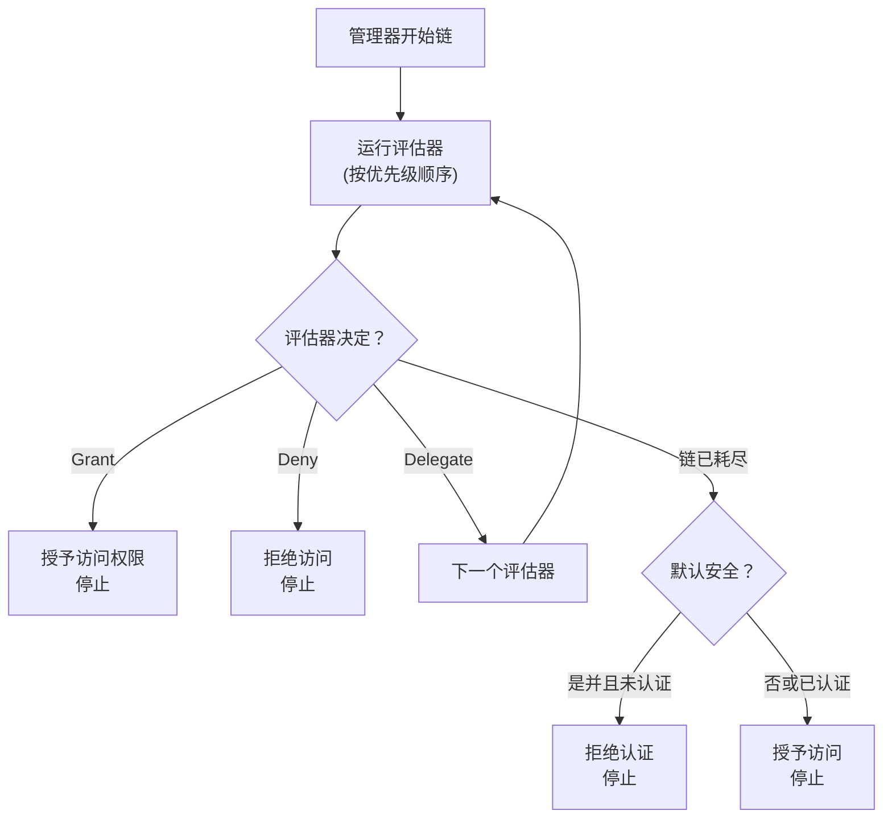

评估器链是 webforJ 安全系统的核心。它是一个优先级排序的评估器序列，检查路由并使用责任链设计模式做出访问决策。理解链的工作原理有助于您创建自定义评估器并排查意外的访问拒绝。

## 责任链模式 {#the-chain-of-responsibility-pattern}

评估器链使用责任链模式，其中序列中的每个评估器可以选择处理导航请求或将其传递给下一个评估器。这创建了一个系统，在多个专业化评估器之间分配安全逻辑，而不是集中在单一的整体检查器中。

当路由需要评估时，安全管理器会创建一个链并从第一个评估器开始。该评估器检查路由并做出以下三个选择之一：

1. **授予访问权限：** 评估器批准路由并立即返回。不会运行其他评估器。
2. **拒绝访问：** 评估器阻止路由并立即返回。不会运行其他评估器。
3. **委托：** 评估器不做出决定并调用 `chain.evaluate()` 将控制权传递给下一个评估器。

这种模式使评估器可以专注于特定情况。每个评估器实现 `supports(Class<?> routeClass)` 以指示其处理哪些路由。例如，`AnonymousAccessEvaluator` 仅在标记为 `@AnonymousAccess` 的路由上运行，管理器不会在其他路由上调用它。

## 链的构建方式 {#how-the-chain-is-built}

安全管理器维护注册评估器的列表，每个评估器都有一个相关的优先级。当路由需要评估时，管理器按优先级对评估器进行排序（先较低的数字），并创建一个链。

评估器通过管理器的 `registerEvaluator()` 方法注册：

```java
// 注册内置评估器
securityManager.registerEvaluator(new DenyAllEvaluator(), 0);
securityManager.registerEvaluator(new AnonymousAccessEvaluator(), 1);
securityManager.registerEvaluator(new PermitAllEvaluator(), 2);
securityManager.registerEvaluator(new RolesAllowedEvaluator(), 3);

// 注册自定义评估器
securityManager.registerEvaluator(new SubscriptionEvaluator(), 10);
```

优先级决定评估顺序。较低的优先级首先运行，给它们提供了做出访问决策的第一机会。这对安全很重要，因为它允许关键评估器在宽松的评估器可以授予访问之前阻止访问。

该链是无状态的，并为每个导航请求新创建，以确保一个导航的评估不会影响另一个。

## 链执行流程 {#chain-execution-flow}

当链开始时，从第一个评估器（最低优先级）开始并顺序进行：



一旦任何评估器授予或拒绝了访问，链就会停止。如果所有评估器都委托，则链耗尽并回退到默认的安全行为。

## 内置评估器顺序 {#built-in-evaluator-ordering}

四个内置评估器处理标准注释：

| 评估器 | 注释 | 行为 | 链行为 | 一般顺序 |
|-----------|------------|----------|----------------|---------------|
| `DenyAllEvaluator` | `@DenyAll` | 始终阻止访问 | 停止链（终端） | 首先运行 |
| `AnonymousAccessEvaluator` | `@AnonymousAccess` | 允许所有人（无论是否经过身份验证） | 停止链（终端） | 较早运行 |
| `PermitAllEvaluator` | `@PermitAll` | 需要身份验证，允许所有经过身份验证的用户 | 停止链（终端） | 中链运行 |
| `RolesAllowedEvaluator` | `@RolesAllowed` | 需要身份验证和特定角色 | **继续链**（可组合） | 较后运行 |

:::note
确切的优先级数字在评估器注册时分配，并且不同实现之间有所不同。有关具体值，请参见 [Spring Security](/docs/security/getting-started) 或 [自定义实现](/docs/security/architecture/custom-implementation)。
:::

## 评估器如何委托 {#how-evaluators-delegate}

在调用评估器之前，管理器会调用其 `supports(Class<?> routeClass)` 方法。只有返回 `true` 的评估器才会被调用。这种过滤迫使评估器只针对它们设计处理的路由运行。

当调用评估器时，它可以：
- **做出决定：** 返回授权或拒绝以停止链
- **委托：** 调用 `chain.evaluate()` 将控制权传递给优先级顺序中的下一个评估器

例如，`RolesAllowedEvaluator` 检查用户是否具有所需的角色。如果是，它调用 `chain.evaluate()`，允许由更高优先级的评估器进一步检查。这种主动委托使评估器组合成为可能。

终端评估器例如 `PermitAllEvaluator` 在不调用链的情况下做出最终决定，防止进一步评估。

## 链何时耗尽 {#when-the-chain-exhausts}

如果每个评估器都委托且没有人做出决定，则链耗尽，没有更多评估器可以运行。此时，安全系统将根据 `isSecureByDefault()` 配置应用后备策略：

**默认安全已启用** (`isSecureByDefault() == true`):
- 如果用户已认证：授予访问权限
- 如果用户未认证：拒绝并要求认证

**默认安全已禁用** (`isSecureByDefault() == false`):
- 无论认证与否均授予访问权限

没有任何安全注释的路由仍然有定义的行为。在启用默认安全的情况下，未注释的路由需要身份验证。在禁用情况下，未注释的路由是公共的。

## 自定义评估器优先级 {#custom-evaluator-priorities}

在创建自定义评估器时，请仔细选择优先级：

- **0-9**：保留给核心框架评估器。除非您正在替换内置评估器，否则避免使用这些优先级。
- **10-99**：推荐给自定义业务逻辑评估器。这些在核心评估器之后运行，但在通用后备之前。

示例：

```java title="SubscriptionEvaluator.java"
// 用于基于订阅访问的自定义评估器
@RegisteredEvaluator(priority = 10)
public class SubscriptionEvaluator implements RouteSecurityEvaluator {
  @Override
  public boolean supports(Class<?> routeClass) {
    return routeClass.isAnnotationPresent(RequiresSubscription.class);
  }

  @Override
  public RouteAccessDecision evaluate(Class<?> routeClass,
                                       NavigationContext context,
                                       RouteSecurityContext securityContext,
                                       SecurityEvaluatorChain chain) {
    // 检查用户是否有有效的订阅
    boolean hasSubscription = checkSubscription(securityContext);

    if (!hasSubscription) {
      return RouteAccessDecision.deny("需要有效的订阅");
    }

    // 用户有订阅 - 继续链以进行额外检查
    return chain.evaluate(routeClass, context, securityContext);
  }
}
```

该评估器在优先级 10 下运行，位于核心评估器之后。如果用户有有效的订阅，则它会委托给链，允许与其他评估器组合。

## 评估器组合 {#evaluator-composition}

大多数内置评估器是 **终端** 的，它们做出最终决定并停止链。只有 `RolesAllowedEvaluator` 在授予访问后继续链，从而允许与自定义评估器的组合。

**终端评估器（无法组合）：**
- `@DenyAll`：始终拒绝，停止链
- `@AnonymousAccess`：始终授予，停止链
- `@PermitAll`：授予经过身份验证的用户，停止链

**可组合评估器：**
- `@RolesAllowed`：如果用户有角色，**继续链** 以允许进一步检查

### 可行的组合 {#composition-that-works}

您可以将 `@RolesAllowed` 与自定义评估器组合：

```java
@Route("/premium-admin")
@RolesAllowed("ADMIN")  // 检查角色，然后继续链
@RequiresSubscription   // 自定义检查在角色检查后运行
public class PremiumAdminView extends Composite<Div> {
  // 需要 ADMIN 角色 AND 有效的订阅
}
```

流程：
1. `RolesAllowedEvaluator` 检查用户是否具有 `ADMIN` 角色
2. 如果是，调用 `chain.evaluate()` 以继续
3. `SubscriptionEvaluator` 检查订阅状态（较晚在链中运行）
4. 如果订阅有效，授予访问；否则拒绝

### 不可行的组合 {#composition-that-does-not-work}

您 **不能** 将 `@PermitAll` 与其他评估器组合，因为它停止了链：

```java
@Route("/wrong")
@PermitAll           // 立即授予，停止链
@RolesAllowed("ADMIN")  // 绝对不会运行！
public class WrongView extends Composite<Div> {
  // 这授予访问权限给任何经过身份验证的用户
  // @RolesAllowed 被忽略
}
```

`PermitAllEvaluator` 首先运行（以更低优先级注册），授予任何经过身份验证的用户访问权限，并返回而不调用 `chain.evaluate()`。`RolesAllowedEvaluator` 从未被执行。
