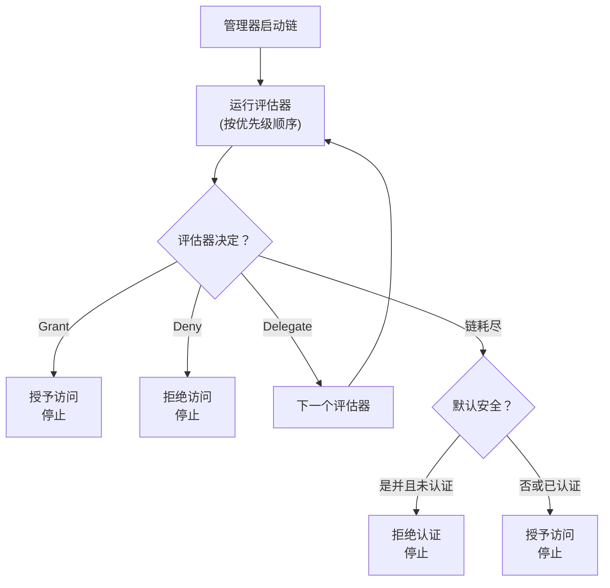

评估链是webforJ安全系统的核心。它是一个优先级顺序的评估器序列，负责检查路由并使用责任链设计模式做出访问决策。理解链的工作原理有助于您创建自定义评估器并排查意外的访问拒绝问题。

## 责任链模式 {#the-chain-of-responsibility-pattern}

评估链使用责任链模式，其中序列中的每个评估器可以处理导航请求或将其传递给下一个评估器。这创建了一个系统，在该系统中，安全逻辑分散在多个专门的评估器中，而不是集中在单个单体检查器中。

当一个路由需要评估时，安全管理器会创建一个链，并从第一个评估器开始。该评估器检查路由并做出以下三种选择之一：

1. **授予访问权限：** 评估器批准该路由并立即返回。不再运行其他评估器。
2. **拒绝访问：** 评估器阻止该路由并立即返回。不再运行其他评估器。
3. **委托：** 评估器不做出决定，并调用 `chain.evaluate()` 将控制权传递给下一个评估器。

这种模式允许评估器专注于特定情况。每个评估器实现 `supports(Class<?> routeClass)` 以指示其处理哪些路由。例如，`AnonymousAccessEvaluator` 仅适用于标记为 `@AnonymousAccess` 的路由，管理器不会为其他路由调用它。

## 如何构建链 {#how-the-chain-is-built}

安全管理器维护注册评估器的列表，每个评估器都有一个相关的优先级。当路由需要评估时，管理器按优先级对评估器进行排序（优先级数字小的在前）并创建一个链。

评估器使用管理器的 `registerEvaluator()` 方法注册：

```java
// 注册内置评估器
securityManager.registerEvaluator(new DenyAllEvaluator(), 0);
securityManager.registerEvaluator(new AnonymousAccessEvaluator(), 1);
securityManager.registerEvaluator(new PermitAllEvaluator(), 2);
securityManager.registerEvaluator(new RolesAllowedEvaluator(), 3);

// 注册自定义评估器
securityManager.registerEvaluator(new SubscriptionEvaluator(), 10);
```

优先级决定评估顺序。低优先级优先运行，给它们提供第一次做出访问决策的机会。这对安全性很重要，因为它允许关键评估器在开放性评估器能够授予访问之前阻止访问。

链是无状态的，并为每个导航请求新创建，因此一个导航的评估不会影响另一个。

## 链执行流程 {#chain-execution-flow}

当链启动时，它从第一个评估器（最低优先级）开始，并按顺序进行：



只要任何评估器授予或拒绝访问，链就会停止。如果所有评估器都委托，链将耗尽并回退到默认安全行为。

## 内置评估器顺序 {#built-in-evaluator-ordering}

四个内置评估器处理标准注释：

| 评估器 | 注释 | 行为 | 链行为 | 典型顺序 |
|-----------|------------|----------|----------------|---------------|
| `DenyAllEvaluator` | `@DenyAll` | 始终阻止访问 | 停止链（终端） | 首先运行 |
| `AnonymousAccessEvaluator` | `@AnonymousAccess` | 允许每个人（认证与否） | 停止链（终端） | 早期运行 |
| `PermitAllEvaluator` | `@PermitAll` | 需要认证，允许所有已认证用户 | 停止链（终端） | 中链运行 |
| `RolesAllowedEvaluator` | `@RolesAllowed` | 需要认证和特定角色 | **继续链**（可组合） | 后期运行 |

:::note
确切的优先级数字在评估器注册期间分配，并在实现之间有所不同。有关具体值，请参见 [Spring Security](/docs/security/getting-started) 或 [自定义实现](/docs/security/architecture/custom-implementation#securityregistrar)。
:::

## 评估器如何委托 {#how-evaluators-delegate}

在调用评估器之前，管理器会调用其 `supports(Class<?> routeClass)` 方法。只有返回 `true` 的评估器才会被调用。这种过滤强迫评估器仅对其设计处理的路由运行。

当评估器被调用时，它可以：
- **做出决定**：返回授予或拒绝以停止链
- **委托**：调用 `chain.evaluate()` 将控制权传递给优先级序列中的下一个评估器

例如，`RolesAllowedEvaluator` 检查用户是否拥有所需的角色。如果是，它调用 `chain.evaluate()` 以允许更高优先级评估器进行进一步检查。这种主动委托使评估器的组合成为可能。

像 `PermitAllEvaluator` 这样的终端评估器在不调用链的情况下做出最终决定，防止进一步的评估。

## 链何时耗尽 {#when-the-chain-exhausts}

如果每个评估器都委托，并且没有一个做出决定，链就会耗尽，没有更多的评估器可以运行。此时，安全系统将根据 `isSecureByDefault()` 配置应用回退：

**默认安全启用**（`isSecureByDefault() == true`）：
- 如果用户已认证：授予访问
- 如果用户未认证：拒绝并要求认证

**默认安全禁用**（`isSecureByDefault() == false`）：
- 无论认证与否都授予访问

没有任何安全注释的路由仍然有明确的行为。启用默认安全时，未注释的路由需要认证。禁用时，未注释的路由是公共的。

## 自定义评估器优先级 {#custom-evaluator-priorities}

创建自定义评估器时，请谨慎选择优先级：

- **0-9**：保留给核心框架评估器。除非您替换内置评估器，否则请避免使用这些优先级。
- **10-99**：推荐用于自定义业务逻辑评估器。这些在核心评估器之后运行，但在通用回退之前。

示例：

```java title="SubscriptionEvaluator.java"
// 自定义订阅访问评估器
@RegisteredEvaluator(priority = 10)
public class SubscriptionEvaluator implements RouteSecurityEvaluator {
  @Override
  public boolean supports(Class<?> routeClass) {
    return routeClass.isAnnotationPresent(RequiresSubscription.class);
  }

  @Override
  public RouteAccessDecision evaluate(Class<?> routeClass,
                                       NavigationContext context,
                                       RouteSecurityContext securityContext,
                                       SecurityEvaluatorChain chain) {
    // 检查用户是否有活跃的订阅
    boolean hasSubscription = checkSubscription(securityContext);

    if (!hasSubscription) {
      return RouteAccessDecision.deny("需要活跃的订阅");
    }

    // 用户有订阅 - 继续链以进行额外检查
    return chain.evaluate(routeClass, context, securityContext);
  }
}
```

这个评估器以优先级 10 运行，在核心评估器之后。如果用户有活跃的订阅，它会委托给链，从而允许与其他评估器的组合。

## 评估器组合 {#evaluator-composition}

大多数内置评估器都是**终端**的，它们做出最终决定并停止链。只有 `RolesAllowedEvaluator` 在授予访问后继续链，从而允许与自定义评估器的组合。

**终端评估器（不能组合）**：
- `@DenyAll`: 始终拒绝，停止链
- `@AnonymousAccess`: 始终授予，停止链
- `@PermitAll`: 授予已认证用户，停止链

**可组合评估器**：
- `@RolesAllowed`: 如果用户有角色，**继续链**以允许进一步检查

### 有效的组合 {#composition-that-works}

您可以将 `@RolesAllowed` 与自定义评估器组合：

```java
@Route("/premium-admin")
@RolesAllowed("ADMIN")  // 检查角色，然后继续链
@RequiresSubscription   // 自定义检查在角色检查后运行
public class PremiumAdminView extends Composite<Div> {
  // 需要 ADMIN 角色和活跃的订阅
}
```

流程：
1. `RolesAllowedEvaluator` 检查用户是否有 `ADMIN` 角色
2. 如果是，调用 `chain.evaluate()` 继续
3. `SubscriptionEvaluator` 检查订阅状态（在链中较晚运行）
4. 如果订阅有效，则授予访问；否则拒绝

### 无效的组合 {#composition-that-does-not-work}

您**不能**将 `@PermitAll` 与其他评估器组合，因为它停止了链：

```java
@Route("/wrong")
@PermitAll           // 立即授予，停止链
@RolesAllowed("ADMIN")  // 从不执行！
public class WrongView extends Composite<Div> {
  // 这授予任何已认证用户访问
  // @RolesAllowed 被忽略
}
```

`PermitAllEvaluator` 首先运行（注册时优先级较低），授予任何已认证用户访问，并返回而不调用 `chain.evaluate()`。`RolesAllowedEvaluator` 从未执行。
