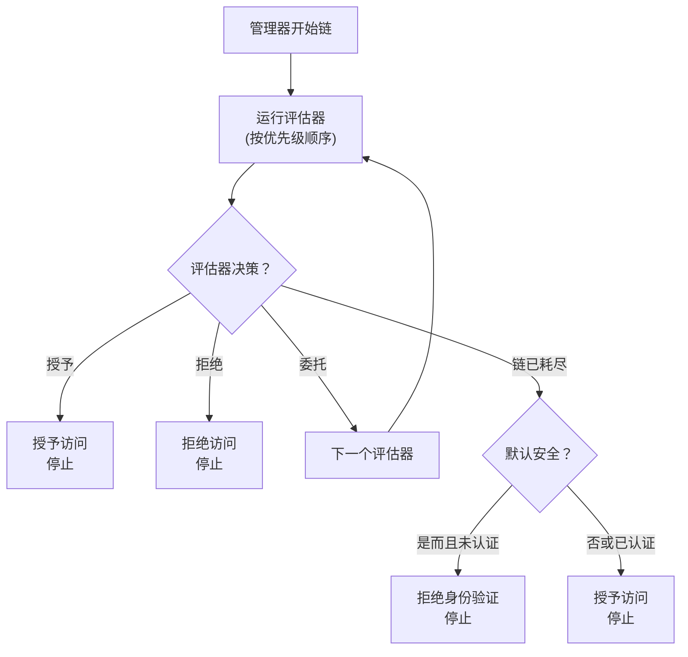

评估器链是webforJ安全系统的核心。它是一个按优先级顺序排列的评估器序列，负责检查路由并利用责任链设计模式做出访问决策。理解这个链条的工作原理有助于您创建自定义评估器和排除意外的访问拒绝问题。

## 责任链模式 {#the-chain-of-responsibility-pattern}

评估器链使用责任链模式，其中序列中的每个评估器可以处理导航请求或将其传递给下一个评估器。这创建了一种系统，其中安全逻辑分布在多个专门的评估器中，而不是集中在单一的单体检查器中。

当路由需要评估时，安全管理器创建一个链并从第一个评估器开始。该评估器检查路由并做出以下三种选择之一：

1. **授予访问：** 评估器批准此路由并立即返回。不会运行进一步的评估器。
2. **拒绝访问：** 评估器阻止此路由并立即返回。不会运行进一步的评估器。
3. **委托：** 评估器不作决策并调用 `chain.evaluate()` 将控制权传递给下一个评估器。

这种模式允许评估器专注于特定的情况。每个评估器实现 `supports(Class<?> routeClass)` 来指示它处理哪些路由。例如，`AnonymousAccessEvaluator` 仅在路由被标记为 `@AnonymousAccess` 时运行，管理器不会在其他路由上调用它。

## 如何构建链条 {#how-the-chain-is-built}

安全管理器维护已注册评估器的列表，每个评估器都有一个相关的优先级。当路由需要评估时，管理器按优先级（先低后高）对评估器进行排序并创建链。

评估器通过管理器的 `registerEvaluator()` 方法进行注册：

```java
// 注册内置评估器
securityManager.registerEvaluator(new DenyAllEvaluator(), 0);
securityManager.registerEvaluator(new AnonymousAccessEvaluator(), 1);
securityManager.registerEvaluator(new PermitAllEvaluator(), 2);
securityManager.registerEvaluator(new RolesAllowedEvaluator(), 3);

// 注册自定义评估器
securityManager.registerEvaluator(new SubscriptionEvaluator(), 10);
```

优先级决定了评估的顺序。较低的优先级优先运行，为它们提供了做出访问决策的首次机会。这对安全性非常重要，因为它允许关键评估器在宽松的评估器授予访问权限之前阻止访问。

该链是无状态的，并为每个导航请求新创建，以便一个导航的评估不会影响另一个。

## 链执行流程 {#chain-execution-flow}

当链条启动时，它从第一个评估器（最低优先级）开始并按顺序进行：


```mermaid
flowchart TD
  Start["管理器开始链"] --> Eval["运行评估器<br/>(按优先级顺序)"]

  Eval --> Check{"评估器决策？"}
  Check -->|授予| Grant["授予访问<br/>停止"]
  Check -->|拒绝| Deny["拒绝访问<br/>停止"]
  Check -->|委托| Next["下一个评估器"]

  Next --> Eval

  Check -->|链已耗尽| Default{"默认安全？"}
  Default -->|是而且未认证| DenyDefault["拒绝身份验证<br/>停止"]
  Default -->|否或已认证| GrantDefault["授予访问<br/>停止"]
```

该链在任一评估器授予或拒绝访问时立即停止。如果所有评估器都委托，则链耗尽并退回到默认的安全行为。

## 内置评估器排序 {#built-in-evaluator-ordering}

四个内置评估器负责处理标准注释：

| 评估器 | 注释 | 行为 | 链行为 |典型顺序 |
|-----------|------------|----------|----------------|---------------|
| `DenyAllEvaluator` | `@DenyAll` | 始终阻止访问 | 停止链（终端） | 第一运行 |
| `AnonymousAccessEvaluator` | `@AnonymousAccess` | 允许所有人（无论是否认证） | 停止链（终端） | 早期运行 |
| `PermitAllEvaluator` | `@PermitAll` | 需要认证，允许所有已认证用户 | 停止链（终端） | 中间链运行 |
| `RolesAllowedEvaluator` | `@RolesAllowed` | 需要认证和特定角色 | **继续链**（可组合） | 后期运行 |

:::note
确切的优先级数字是在评估器注册期间分配的，并在不同实现之间有所不同。有关具体值，请参阅 [Spring Security](/docs/security/getting-started) 或 [自定义实现](/docs/security/architecture/custom-implementation)。
:::

## 评估器如何委托 {#how-evaluators-delegate}

在调用评估器之前，管理器会调用其 `supports(Class<?> routeClass)` 方法。仅返回 `true` 的评估器会被调用。这种过滤迫使评估器只在它们设计处理的路由上运行。

当调用评估器时，它可以：
- **做出决策：** 返回授予或拒绝以停止链
- **委托：** 调用 `chain.evaluate()` 将控制权传递给优先级序列中的下一个评估器

例如，`RolesAllowedEvaluator` 检查用户是否具有所需的角色。如果是，它调用 `chain.evaluate()` 以允许高优先级评估器进行进一步检查。这种主动的委托使评估器合成成为可能。

终端评估器如 `PermitAllEvaluator` 在不调用链的情况下做出最终决策，防止进一步评估。

## 当链耗尽时 {#when-the-chain-exhausts}

如果每个评估器都委托而没有做出决策，则链耗尽，不再有评估器可运行。此时，安全系统根据 `isSecureByDefault()` 配置应用后备：

**默认安全已启用** (`isSecureByDefault() == true`)：
- 如果用户已认证：授予访问
- 如果用户未认证：拒绝并要求身份验证

**默认安全已禁用** (`isSecureByDefault() == false`)：
- 无论是否认证均授予访问

没有任何安全注释的路由仍然具有定义的行为。在启用默认安全的情况下，未注释的路由需要认证。在禁用时，未注释的路由是公开的。

## 自定义评估器优先级 {#custom-evaluator-priorities}

创建自定义评估器时，请仔细选择优先级：

- **0-9**：保留给核心框架评估器。除非您要替换内置评估器，否则请避免使用这些优先级。
- **10-99**：推荐用于自定义业务逻辑评估器。这些在核心评估器之后但在通用后备之前运行。

示例：

```java title="SubscriptionEvaluator.java"
// 用于基于订阅访问的自定义评估器
@RegisteredEvaluator(priority = 10)
public class SubscriptionEvaluator implements RouteSecurityEvaluator {
  @Override
  public boolean supports(Class<?> routeClass) {
    return routeClass.isAnnotationPresent(RequiresSubscription.class);
  }

  @Override
  public RouteAccessDecision evaluate(Class<?> routeClass,
                                       NavigationContext context,
                                       RouteSecurityContext securityContext,
                                       SecurityEvaluatorChain chain) {
    // 检查用户是否拥有有效的订阅
    boolean hasSubscription = checkSubscription(securityContext);

    if (!hasSubscription) {
      return RouteAccessDecision.deny("需要有效的订阅");
    }

    // 用户已拥有订阅 - 继续链以进行额外检查
    return chain.evaluate(routeClass, context, securityContext);
  }
}
```

该评估器以优先级10运行，在核心评估器之后。如果用户具有有效的订阅，它则委托给链，允许与其他评估器组合。

## 评估器组合 {#evaluator-composition}

大多数内置评估器都是 **终端** 的，它们做出最终决策并停止链。只有 `RolesAllowedEvaluator` 在授予访问后继续链，允许与自定义评估器组合。

**终端评估器（不能被组合）：**
- `@DenyAll`：始终拒绝，停止链
- `@AnonymousAccess`：始终授予，停止链
- `@PermitAll`：授予已认证用户，停止链

**可组合评估器：**
- `@RolesAllowed`：如果用户具有角色，**继续链** 以允许进一步检查

### 有效组合 {#composition-that-works}

您可以将 `@RolesAllowed` 与自定义评估器组合：

```java
@Route("/premium-admin")
@RolesAllowed("ADMIN")  // 检查角色，然后继续链
@RequiresSubscription   // 自定义检查在角色检查后运行
public class PremiumAdminView extends Composite<Div> {
  // 需要 ADMIN 角色 AND 有效订阅
}
```

流程：
1. `RolesAllowedEvaluator` 检查用户是否具有 `ADMIN` 角色
2. 如果是，则调用 `chain.evaluate()` 继续
3. `SubscriptionEvaluator` 检查订阅状态（稍后在链中运行）
4. 如果订阅有效，则授予访问；否则拒绝

### 无效组合 {#composition-that-does-not-work}

您 **不能** 将 `@PermitAll` 与其他评估器组合，因为它停止了链：

```java
@Route("/wrong")
@PermitAll           // 立即授予，停止链
@RolesAllowed("ADMIN")  // 永远不会运行！
public class WrongView extends Composite<Div> {
  // 这对任何已认证的用户都授予访问权限
  // @RolesAllowed 被忽略
}
```

`PermitAllEvaluator` 首先运行（以较低优先级注册），授予对任何已认证用户的访问权限，并返回而不调用 `chain.evaluate()`。`RolesAllowedEvaluator` 从未执行。
