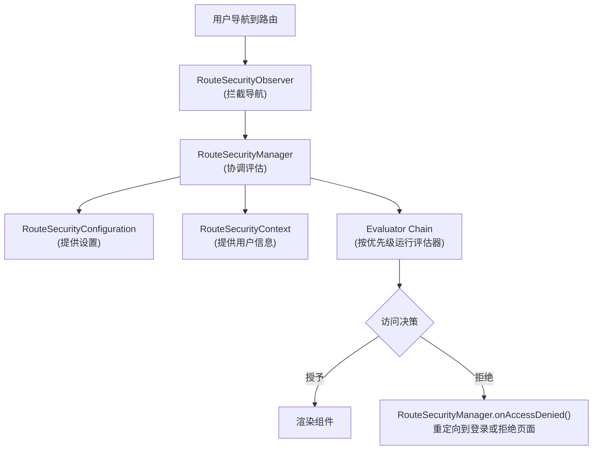

webforJ安全系统建立在核心接口的基础之上，这些接口共同工作以提供基于路由的访问控制。这些接口定义了安全行为的契约，允许不同的实现方式，无论是基于会话的、基于JSON Web令牌（JWT）的、集成LDAP的还是基于数据库的，都可以接入相同的底层框架。

理解这一体系结构有助于你理解像`@RolesAllowed`和`@PermitAll`这样的安全注解是如何被评估的，导航拦截是如何工作的，以及你如何可以为特定需求构建自定义的安全实现。

## 核心接口 {#the-four-core-interfaces}

安全基础建立在关键抽象之上，每个抽象都有特定的责任：

### `RouteSecurityManager` {#routesecuritymanager}

`RouteSecurityManager`是安全系统的中央协调者。它管理安全评估器，协调评估过程，并通过重定向用户到适当的页面来处理访问拒绝。

**责任：**

- 注册和管理优先级的安全评估器
- 在用户导航到路由时协调评估过程
- 通过触发重定向到登录或拒绝访问页面来处理访问拒绝
- 存储和检索用于登录后重定向的预认证位置

```java
public interface RouteSecurityManager {
  RouteAccessDecision evaluate(Class<?> routeClass, NavigationContext context);
  void onAccessDenied(RouteAccessDecision decision, NavigationContext context);
  RouteSecurityContext getSecurityContext();
  RouteSecurityConfiguration getConfiguration();
  void registerEvaluator(RouteSecurityEvaluator evaluator, int priority);
  Optional<Location> consumePreAuthenticationLocation();
}
```

管理器本身不做安全决策，它将任务委托给评估器和配置。它是连接所有安全组件的纽带。

### `RouteSecurityContext` {#routesecuritycontext}

`RouteSecurityContext`提供当前用户的认证状态访问。它可以回答像用户是否已认证、用户的用户名是什么以及用户是否拥有`ADMIN`角色的问题。

**责任：**

- 确定当前用户是否已认证
- 提供用户的主体（通常是他们的用户名或用户对象）
- 检查用户是否拥有特定角色或权限
- 存储和检索自定义安全属性

```java
public interface RouteSecurityContext {
  boolean isAuthenticated();
  Optional<Object> getPrincipal();
  boolean hasRole(String role);
  boolean hasAuthority(String authority);
  Optional<Object> getAttribute(String name);
  void setAttribute(String name, Object value);
}
```

实现方式根据认证系统、HTTP会话存储、从头部解码的JWT令牌、数据库查询、LDAP查找或其他机制而有所不同。

### `RouteSecurityConfiguration` {#routesecurityconfiguration}

`RouteSecurityConfiguration`定义安全行为和重定向位置。它告诉安全系统在需要认证或拒绝访问时应该将用户重定向到哪里。

**责任：**

- 定义安全是否启用
- 指定默认安全行为
- 提供认证页面位置（通常是`/login`）
- 提供访问拒绝页面位置

```java
public interface RouteSecurityConfiguration {
  default boolean isEnabled() { return true; }
  default boolean isSecureByDefault() { return true; }
  default Optional<Location> getAuthenticationLocation() {
    return Optional.of(new Location("/login"));
  }
  default Optional<Location> getDenyLocation() { /* ... */ }
}
```

该接口将安全策略与安全执行分离。你可以更改重定向位置或切换默认安全而无需修改管理器或评估器。

### `RouteSecurityEvaluator` {#routesecurityevaluator}

`RouteSecurityEvaluator`是检查实际安全规则的地方。每个评估器检查一个路由并决定是否授予访问权限、拒绝访问权限或将决定委托给链中的下一个评估器。

**责任：**

- 确定此评估器是否处理给定的路由
- 评估路由类上的安全注解
- 授予访问权限、拒绝访问权限或委托给下一个评估器
- 参与责任链模式

```java
public interface RouteSecurityEvaluator {
  RouteAccessDecision evaluate(Class<?> routeClass,
                                NavigationContext context,
                                RouteSecurityContext securityContext,
                                SecurityEvaluatorChain chain);
  default boolean supports(Class<?> routeClass) { return true; }
}
```

内置评估器处理标准注解，如`@RolesAllowed`、`@PermitAll`、`@DenyAll`和`@AnonymousAccess`。你可以创建自定义评估器以实现特定领域的安全逻辑。

## 接口如何协同工作 {#how-the-interfaces-work-together}

这四个接口在导航过程中协作以强制执行安全规则：


```mermaid
flowchart TB
  User["用户导航到路由"] --> Observer["RouteSecurityObserver<br/>(拦截导航)"]
  Observer --> Manager["RouteSecurityManager<br/>(协调评估)"]

  Manager --> Config["RouteSecurityConfiguration<br/>(提供设置)"]
  Manager --> Context["RouteSecurityContext<br/>(提供用户信息)"]
  Manager --> Chain["Evaluator Chain<br/>(按优先级运行评估器)"]

  Chain --> Decision{"访问决策"}
  Decision -->|"授予"| Render["渲染组件"]
  Decision -->|"拒绝"| Redirect["RouteSecurityManager.onAccessDenied()<br/>重定向到登录或拒绝页面"]
```

当用户导航时，`RouteSecurityObserver`拦截导航并请求`RouteSecurityManager`评估访问。管理器查询`RouteSecurityConfiguration`以获取设置，从`RouteSecurityContext`获取用户信息，按照优先级顺序运行每个`RouteSecurityEvaluator`，直到其中一个做出决定。

## 接口作为契约 {#the-interfaces-as-contracts}

每个接口定义了一个契约，一组安全系统需要回答的问题。**如何**回答这些问题是你的实现选择：

**`RouteSecurityContext`契约：**

- "当前用户是否已认证？" (`isAuthenticated()`)
- "用户是谁？" (`getPrincipal()`)
- "用户是否具有角色X？" (`hasRole()`)

你决定这些信息来自HTTP会话、从头部解码的JWT令牌、数据库查找、LDAP查询或任何其他认证后端的来源。

**`RouteSecurityConfiguration`契约：**

- "安全是否启用？" (`isEnabled()`)
- "路由是否应默认安全？" (`isSecureByDefault()`)
- "未认证用户应该去哪儿？" (`getAuthenticationLocation()`)

你决定如何获取这些值：硬编码的、来自配置文件的、来自环境变量的、来自数据库的或动态计算的。

**`RouteSecurityManager`契约：**

- "该用户应该访问此路由吗？" (`evaluate()`)
- "当访问被拒绝时发生什么？" (`onAccessDenied()`)
- "应该运行哪些评估器？" (`registerEvaluator()`)

你决定认证流程、在哪里存储预认证位置以及如何处理自定义拒绝场景。

基础架构定义了这些契约，但实现是灵活的。不同的系统可以根据特定要求以完全不同的方式实现这些接口。

## `AbstractRouteSecurityManager` 基类 {#the-abstractroutesecuritymanager-base-class}

大多数实现并不直接实现`RouteSecurityManager`。相反，它们扩展`AbstractRouteSecurityManager`，该类提供：

- 评估器注册和基于优先级的排序
- 链执行逻辑
- 处理访问拒绝及自动重定向
- 在HTTP会话中存储预认证位置
- 默认安全的回退行为

基类实现了`RouteSecurityManager`接口，并为评估器管理、访问评估和拒绝处理提供了具体实现。子类只需要提供安全上下文和配置。基类自动处理评估器管理、链执行和拒绝处理。
