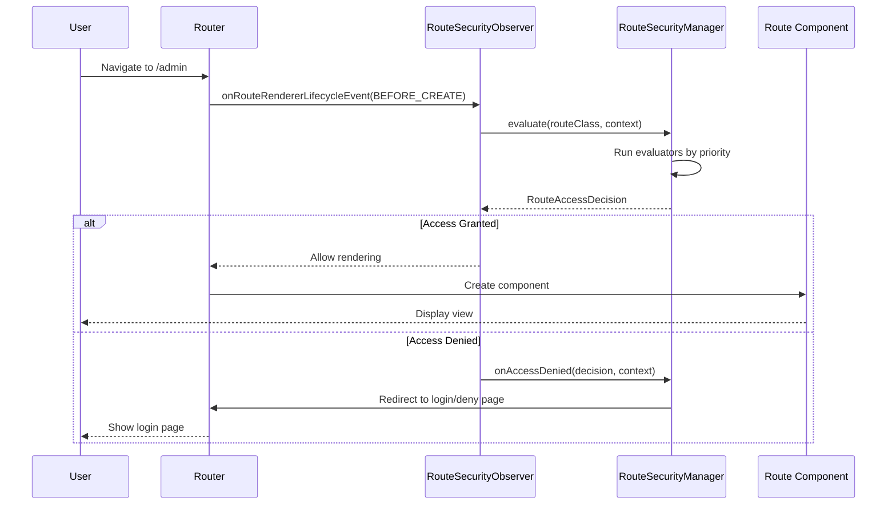

在 webforJ 中，安全性执行在导航期间会自动发生。当用户点击链接或导航到某个路由时，安全系统会拦截导航，评估访问规则，并允许导航继续或将用户重定向到适当的页面。这一拦截对用户是不可见的，并且在您的组件代码中不需要手动的安全检查。

了解导航拦截的工作原理有助于您排除安全问题，并构建与安全系统集成的自定义导航逻辑。

## `RouteSecurityObserver` {#the-routesecurityobserver}

`RouteSecurityObserver` 是一个导航观察者，它挂钩到路由器的生命周期中。它监听导航事件，并在任何组件被渲染之前评估安全规则。

观察者在应用启动期间附加到路由器的渲染器：

```java
// 创建观察者并传入您的安全管理器
RouteSecurityObserver observer = new RouteSecurityObserver(securityManager);

// 将其附加到路由器的渲染器
Router router = Router.getCurrent();
if (router != null) {
  router.getRenderer().addObserver(observer);
}
```

一旦附加，观察者会拦截每个导航请求。观察者位于导航请求和组件渲染之间，当导航开始时，它请求安全管理器评估访问。只有在访问被允许的情况下，组件才能被渲染。

## 导航拦截流程 {#navigation-interception-flow}

当用户导航到某个路由时，以下顺序会发生：



这个流程显示安全评估在任何敏感路由代码执行之前发生。如果访问被拒绝，组件将不会被实例化，防止未经授权的用户触发业务逻辑或访问受保护的数据。

## 拦截点 {#interception-points}

观察者在路由生命周期中的特定点拦截导航：

**在渲染之前** 观察者的 `onRouteRendererLifecycleEvent()` 方法在路由被解析后但在组件被创建之前被调用，并接收 `LifecycleEvent.BEFORE_CREATE` 事件。这是关键的安全检查点。

此时，路由器知道将要渲染哪个路由类，但路由尚未实例化。观察者可以在不执行路由逻辑的情况下评估类上的安全注释。

如果访问被拒绝，观察者将阻止渲染并触发重定向。原始路由从未实例化。

## 评估过程 {#the-evaluation-process}

当观察者拦截导航时，它将评估委托给安全管理器。观察者从导航上下文中检索路由类，并请求管理器评估访问。如果决策允许访问，导航将正常进行。如果决策拒绝访问，观察者将停止传播以防止渲染，并让管理器处理拒绝。

管理器通过以下方式协调评估：

1. 检查配置中是否启用了安全性
2. 获取当前安全上下文（用户信息）
3. 按优先顺序运行评估器链
4. 返回最终的访问决策

观察者根据决策采取行动：如果被允许，导航继续；如果被拒绝，观察者停止传播并让管理器处理拒绝。

## 访问决策是如何做出的 {#how-access-decisions-are-made}

安全管理器创建评估器链，并按优先顺序运行每个评估器。评估器可以做出三种类型的决策：

- **授予访问权限：** 评估器批准导航，路由被渲染。不会再咨询后续评估器。评估器返回表示访问被授予的决策。

- **拒绝访问：** 评估器阻止导航。观察者停止渲染并触发重定向。评估器返回拒绝决策，并可以附加原因消息。拒绝可以是因为缺少身份验证（要求登录）或缺乏授权（权限不足）。

- **委托给下一个评估器：** 评估器不做决策并将控制权传递给链中的下一个评估器。评估器调用链的评估方法，从而推进到优先顺序中的下一个评估器。

大多数评估器只处理带有特定注释的路由。例如，`RolesAllowedEvaluator` 仅评估带有 `@RolesAllowed` 注释的路由。如果注释不存在，它将委托给下一个评估器。

## 处理访问拒绝 {#handling-access-denial}

当访问被拒绝时，管理器的 `onAccessDenied()` 方法根据拒绝类型处理拒绝：

- **需要身份验证：** 用户未登录。重定向到在 `RouteSecurityConfiguration.getAuthenticationLocation()` 中配置的登录页面。

- **访问被拒绝：** 用户已登录但权限不足。重定向到在 `RouteSecurityConfiguration.getDenyLocation()` 中配置的拒绝访问页面。

在重定向之前，管理器将原始请求位置存储在 HTTP 会话中。成功登录后，可以使用管理器的 `consumePreAuthenticationLocation()` 方法来检索该位置，该方法返回存储的位置并从会话中清除。如果存储了位置，应用程序可以导航到该位置；否则，它会导航到默认页面。

## 当安全性被禁用时 {#when-security-is-disabled}

如果 `RouteSecurityConfiguration.isEnabled()` 返回 `false`，则管理器会绕过所有评估，并立即授予对每个路由的访问权限。评估器链不会运行，也不会发生任何安全检查。

这在开发过程中或对于不需要安全性的应用程序是有用的。您可以随时切换安全性，而无需移除注释或注销观察者。

## 与导航生命周期的集成 {#integration-with-navigation-lifecycle}

安全观察者与更广泛的 [导航生命周期](/docs/routing/navigation-lifecycle/overview) 集成，其中多个观察者可以挂钩到导航事件中。安全评估在这个生命周期的早期进行，在导航阻止或组件生命周期事件之前。

如果您实现了自定义导航观察者，请注意安全评估会率先进行。如果访问被拒绝，您的观察者的 `onRouteRendererLifecycleEvent()` 将不会在 `BEFORE_CREATE` 时被调用，因为导航已被停止。
