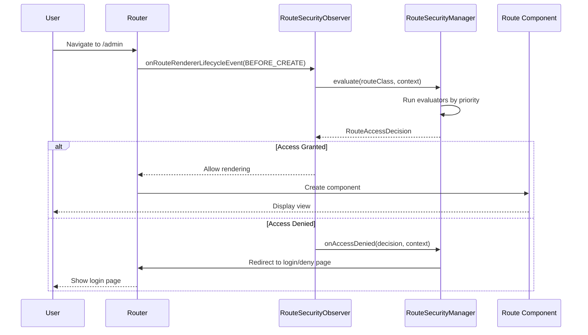

在 webforJ 中，安全性执行在导航过程中是自动进行的。当用户点击链接或导航到某个路由时，安全系统会拦截该导航，评估访问规则，并决定是否允许导航继续或将用户重定向到适当的页面。这种拦截对用户是不可见的，并且在您的组件代码中不需要手动进行安全检查。

理解导航拦截的工作原理可以帮助您排查安全问题并构建与安全系统集成的自定义导航逻辑。

## `RouteSecurityObserver` {#the-routesecurityobserver}

`RouteSecurityObserver` 是一个导航观察者，它连接到路由器的生命周期。它监听导航事件，并在任何组件被渲染之前评估安全规则。

观察者在应用启动期间附加到路由器的渲染器：

```java
// 使用您的安全管理器创建观察者
RouteSecurityObserver observer = new RouteSecurityObserver(securityManager);

// 将其附加到路由器的渲染器
Router router = Router.getCurrent();
if (router != null) {
  router.getRenderer().addObserver(observer);
}
```

一旦附加，观察者就会拦截每个导航请求。观察者处于导航请求和组件渲染之间，当导航开始时，它会请求安全管理器评估访问。只有在访问被授予的情况下，组件才会被渲染。

## 导航拦截流程 {#navigation-interception-flow}

当用户导航到某个路由时，会发生以下顺序：


```mermaid
sequenceDiagram
  participant User
  participant Router
  participant Observer as RouteSecurityObserver
  participant Manager as RouteSecurityManager
  participant Component as Route Component

  User->>Router: Navigate to /admin
  Router->>Observer: onRouteRendererLifecycleEvent(BEFORE_CREATE)
  Observer->>Manager: evaluate(routeClass, context)
  Manager->>Manager: Run evaluators by priority
  Manager-->>Observer: RouteAccessDecision

  alt Access Granted
    Observer-->>Router: Allow rendering
    Router->>Component: Create component
    Component-->>User: Display view
  else Access Denied
    Observer->>Manager: onAccessDenied(decision, context)
    Manager->>Router: Redirect to login/deny page
    Router-->>User: Show login page
  end
```

这个流程显示了安全评估在任何敏感路由代码执行之前发生。如果访问被拒绝，组件将永远不会实例化，防止未经授权的用户触发业务逻辑或访问受保护的数据。

## 拦截点 {#interception-points}

观察者在路由生命周期中的一个特定点拦截导航：

**在渲染之前** 观察者的 `onRouteRendererLifecycleEvent()` 方法会在路由解析后但在组件创建之前被调用，并且事件为 `LifecycleEvent.BEFORE_CREATE`。这是关键的安全检查点。

此时，路由器知道将要渲染的路由类，但路由尚未实例化。观察者可以在不执行路由逻辑的情况下评估类上的安全注解。

如果访问被拒绝，观察者会阻止渲染并触发重定向。原始路由永远不会实例化。

## 评估过程 {#the-evaluation-process}

当观察者拦截导航时，它将评估委托给安全管理器。观察者从导航上下文中检索路由类，并请求管理器评估访问。如果决策授予访问，导航将正常进行。如果决策拒绝访问，观察者会停止传播以防止渲染，并让管理器处理拒绝。

管理器通过以下方式协调评估：

1. 检查配置中安全性是否启用
2. 获取当前安全上下文（用户信息）
3. 按优先顺序运行评估器链
4. 返回最终访问决策

观察者根据决策采取行动：如果授予，则导航继续；如果拒绝，则观察者停止传播并让管理器处理拒绝。

## 访问决策是如何做出的 {#how-access-decisions-are-made}

安全管理器创建一个评估器链，并按照优先顺序运行每个评估器。评估器可以做出三种类型的决策：

- **授予访问：** 评估器批准导航，路由被渲染。不再咨询其他评估器。评估器返回一个指示访问被授予的决策。

- **拒绝访问：** 评估器阻止导航。观察者停止渲染并触发重定向。评估器返回一个拒绝决策，可能附带理由信息。拒绝可能是由于缺乏身份验证（需要登录）或缺乏授权（权限不足）。

- **委托给下一个评估器：** 评估器不做决策，将控制权传递给链中的下一个评估器。评估器调用链的评估方法，优先顺序推进到下一个评估器。

大多数评估器仅处理具有特定注解的路由。例如，`RolesAllowedEvaluator` 仅评估带有 `@RolesAllowed` 注解的路由。如果注解不存在，它会委托给下一个评估器。

## 处理访问拒绝 {#handling-access-denial}

当访问被拒绝时，管理器的 `onAccessDenied()` 方法根据拒绝类型处理拒绝：

- **需要身份验证：** 用户未登录。重定向到在 `RouteSecurityConfiguration.getAuthenticationLocation()` 中配置的登录页面。

- **访问被拒绝：** 用户已登录，但缺乏权限。重定向到在 `RouteSecurityConfiguration.getDenyLocation()` 中配置的访问拒绝页面。

在重定向之前，管理器将最初请求的位置存储在 HTTP 会话中。在成功登录后，可以使用管理器的 `consumePreAuthenticationLocation()` 方法检索该位置，该方法返回存储的位置并将其从会话中清除。如果存储了位置，应用程序可以导航到那里；否则，它导航到默认页面。

## 当安全性被禁用时 {#when-security-is-disabled}

如果 `RouteSecurityConfiguration.isEnabled()` 返回 `false`，管理器将跳过所有评估并立即授予每个路由的访问权限。评估器链永远不会运行，也不会进行安全检查。

这在开发过程中或对于不需要安全性的应用程序非常有用。您可以在不移除注解或注销观察者的情况下开启和关闭安全性。

## 与导航生命周期的集成 {#integration-with-navigation-lifecycle}

安全观察者与更广泛的 [导航生命周期](/docs/routing/navigation-lifecycle/overview) 集成，其中多个观察者可以挂钩到导航事件。安全评估发生在这个生命周期的早期，导航阻止或组件生命周期事件之前。

如果您实现自定义导航观察者，请注意安全评估首先发生。如果访问被拒绝，则您的观察者的 `onRouteRendererLifecycleEvent()` 将不会在 `BEFORE_CREATE` 阶段被调用，因为导航被停止。
