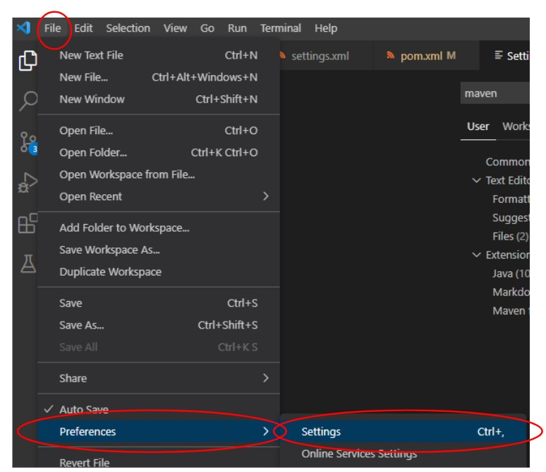
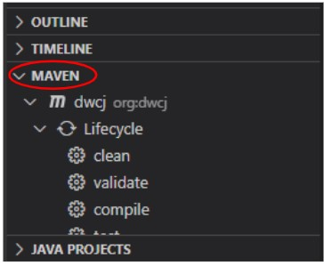
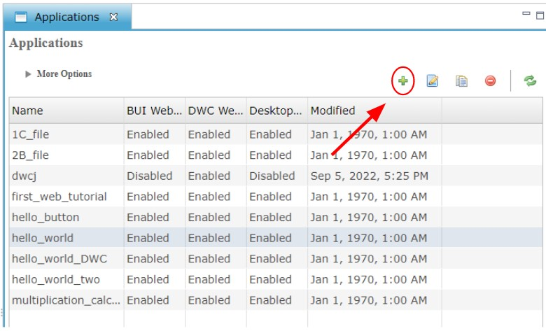

# Contributors

This section of the documentation will cover the steps required not only to 
utilize the DWCJ for application or web development, but also for active
contribution to the engine itself.
 

Installation will be broken down into the following steps:

<!--
Should each of these have their own sections?
The bar to the right of the site has a breakdown of the various
sections, but I could break each of these four up into their own
options on the left bar.
 -->

1. IDE download and configuration (this will only cover VS Code for the
moment)
2. BBj download and installation
3. Downloading DWCJ files and building the .jar file
4. Configuring the application in the Enterprise Manager

## 1) VS Code Setup
This section describes the installation process for the
VS Code editor. Other IDEs, including Eclipse or 
IntelliJ can be used as well. If you already have an IDE
installed, a JDK downloaded and Maven configured, you can
skip to [**Step 2**](#section2).

### Download VS Code for your OS:
You can follow [this link to find the download that's 
right for your system](https://code.visualstudio.com/download).

### Install Java Extension Pack
[This extension pack will come with various tools for Java](https://code.visualstudio.com/docs/java/extensions)
, including a debugging tool, syntax highlighting, and Maven 
interface, which will be used later on.

### Install Java Development Kit

After installing this resource pack, we’ll be prompted to install a JDK.
VS Code should give us the option to do this easily; click the “Download”
option present on the left side of the window, and follow the install 
instructions. 

 

Ensure that **Will be installed on local hard drive** is a selected 
option for the **Set JAVA_HOME variable** menu item during installation.

 

### Download Maven's .cmd file

You can find the required files available 
for [download by following this link](https://maven.apache.org/download.cgi).
Once downloaded, open the zipped folder and prepare to extract them.

### Extract Files

Extract the contents of the .zip folder and note the location you choose.
Once the extraction is complete, navigate to the **mvn.cmd** file via
**apache-maven-X.X.X -> bin**, where the X's represent the current 
release version, and copy the path name. An example path name might be
**C:\apache-maven-3.8.6\bin\mvn.cmd**.

 

### Access VS Code's Settings

To do this, you can click on **File** at the top left of the window,
then click **Preferences**, and then **Settings**. The hotkey shortcut
is **Ctrl** + **,** without the plus.

 

### Configure Maven Executable Path

Finally, after opening the settings, type "**maven**" into the settings search
bar. This will bring up a long list of options. Scroll through these until
you find the "**Maven > Executable: Path**" setting. Once this has been found,
enter the path to the **mvn.cmd** that you extracted in **[this step](#StepE)**. 

 
 
 

## 2) BBj Download and Installation

The following video describes the steps needed download the tool that will install BBj on your machine. Watch from the beginning until the **1:30** mark. 

<iframe width="560" height="315" src="https://www.youtube.com/embed/Ovk8kznQfGs?end=90" title="YouTube video player" frameborder="0" allow="accelerometer; autoplay; clipboard-write; encrypted-media; gyroscope; picture-in-picture" allowfullscreen="allowfullscreen"></iframe>

Once you've downloaded the installer, follow this video's instructions to walk you through the installer options to put BBj on your machine. Follow this 
video from **4:13** to **8:23**.

<iframe width="560" height="315" src="https://www.youtube.com/embed/Ovk8kznQfGs?start=253&end=503" title="YouTube video player" frameborder="0" allow="accelerometer; autoplay; clipboard-write; encrypted-media; gyroscope; picture-in-picture" allowfullscreen="allowfullscreen"></iframe>

 
 
 

## 3) Download/Clone and Package DWCJ

The following steps will explain downloading (or cloning) the files for the 
DWCJ from GitHub. It's assumed that you already have Git and a command 
line tool, such as Git Bash installed. If not, please follow this link to 
set this up:

https://gitforwindows.org/

### Clone DWCJ Github Repo
Navigate to **[this link](https://github.com/DwcJava/engine)**, which should 
take you to the engine section of the DWCJ on GitHub. Clone this folder onto 
your computer - this can be done using the command line and Git, or another 
Git tool.

 

To start, click on the green "**Code**" button and copy the address to your 
clipboard:

 

Once this has been done, navigate to a space on your computer where you'd like
to clone the code to. This can be done in explorer, or using a command line
tool such as GitBash.

 

Clone the code into your chosen folder.

 

You should now have a folder named "**engine**" in the location you chose to
clone the code to. This is where you'll find the files needed to add to the
classpath later on in the tutorial, so make sure you take note of this location
for future use.

 

### Compile and Package Code

Now the code from GitHub must be compiled and packaged. To start this process,
navigate to the "**engine**" folder that was just cloned from GitHub.

 

 

Once the folder has been opened, you should see the various files and folders
open in the panel on the left of your screen. To compile this program, we'll
need to open the Maven window at the bottom of the left panel.

 

Begin the process by running the clean function. If this runs properly,
you should see "**BUILD SUCCESS**" in VS Code's output console. 

 

After a successful clean, we can compile out code using Maven's compile
function as shown below. The output should result in a similar 
"**BUILD SUCCESS**".

 

Finally, package the code into the .jar file that is required in the next
section. We'll do this with the package functionality in Maven, and should
see a final "**BUILD SUCCESS**" message.

 
 
 

## 4) Configuration in the Enterprise Manager

The BBj Enterprise Manager will now be utilized to ensure we can run the DWCJ. 
First, we’ll add the necessary .jar file a custom classpath, and then 
create a web application from which we will launch an instance of a DWCJ app.

### Login to the Enterprise Manager

To start, ensure that your BBjServices client is running. On Windows, we'll
check this by seeing if it's listed in the processes tab at the bottom of
our toolbar. 

 

If this service is not running, you can restart Barista by restarting the 
application. On Windows, hit the Windows key, type "Barista", and select 
the program from the start menu.

 

After ensuring that Barista is running, open the Enterprise Manager by
navigating to 
[**http://localhost:8888/bbjem/emapp**](http://localhost:8888/bbjem/emapp)
in a browser window. This will take you to a login screen, where the
username is ***admin*** and the password is ***admin123***.

 

### Configuring Java Settings

After opening the Enterprise Manager, navigate to the Java Settings tab.
To do so, double click on **BBjServices** on the lefthand toolbar, and
then double click **Java Settings**.

 

On reaching the Java Settings tab, add a new custom classpath. This can
be done by using the **Classpath** tab at the botton of the screen.

 

To add a new custom classpath, use the green "**+**" button near the
middle of your Enterprise Manger window. Name your classpath something like
"**DWCJ**".

Note that two classpaths need to be added: BBj's default classpath as well
as the .jar file that was packaged in **[this step](#packageSection)**.

 

The first classpath to add is BBj's default classpath. This can be done by
selecting **Existing Classpath**, which will populate a list of the various
classpaths already configured in the Enterprise Manager. Select
**bbj_default** and press **Add**.

 

Select the same green "**+**" button on the right side of the acreen again.
This time select "**Jar File(s)**". Navigate to the location you cloned the
DWCJ code into. The folder will be called "**engine**". From there, select
the "**target**" folder, and from there the "**lib**" folder. Inside this 
folder, you should see the "**dwcj-X.XXX.jar**" file, with the X's replaced
by numeric values. The path may look similar to 
"**C:\engine\target\lib**". Select the .jar file and then click the "**Open**"
button.

 

Once this is done, save your work by clikcing the save button near the 
top left of the Enterprise Manager window.

 

### Create our DWCJ Application

The DWCJ application needs to be added into the Enterprise Manager. 
To do this, start by navigating to the Applications option on the left
sidebar. Do this by double clicking the "**Web**" option, then double click
"**App Deployment**", and finally "**Applications**". 

 

This should display a list of applications. Create a new application using the
"**+**" button in the panel.

 

Give your application a name - "**dwcj**" will be used for this example. The
program file will be dwcj.bbj - don't worry if you're unfamiliar with the 
.bbj extension. The working directory will be the location where the files
from GitHub were cloned, inside of the "**\bbj**" folder. The pathname may look
something like "**C:\engine\bbj\\**". Select the dwcj classpath that was 
created in the **[classpath section](#classpathSection)** in the Classpath
field. Finally, check the "**DWC Web App Enabled**" box. 

 

To complete the configuration needed in the Enterprise Manager, save your 
application using the save button towards the top left of your window. 

 

After saving, click on the "**Launch in Browser**" button at the top right
of the Enterprise Manager window. 

 

This will launch your application in a new, discrete browser window. You
may want to copy the URL from this window and paste it into a browser.
If you've successfully followed this guide, you should see the following
welcome screen, unless additional configuration steps have been taken 
in the DWCJ code.

 

**Congratulations!** You’ve successfully installed and launched the DWCJ. 
From here, feel free to explore the sample applications that are provided.