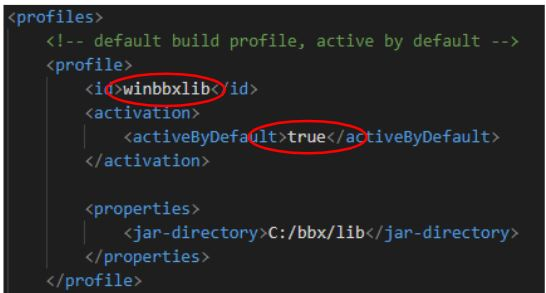
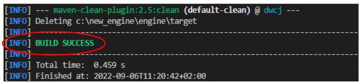
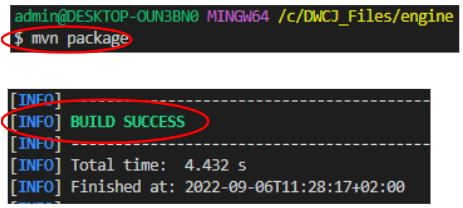

# Contributors

This section of the documentation will cover the steps required not only to 
utilize the DWCJ for application or web development, but also for active
contribution to the engine itself.

**NOTE:** This walkthrough will cover installation on a Windows system - installation
steps may vary for Mac/Linux OS devices.
<br/>

Installation will be broken down into the following steps:

1. Java and Maven download and configuration
2. BBj download and installation
3. Downloading DWCJ files and building the .jar file
4. Configuring the application in the Enterprise Manager


## 1) Java and Maven Download and Configuration
<!-- This section describes the installation process for Java and Maven, both of which
will be required for development of applications and the engine itself. If you already
have Java and Maven downloaded, please skip to [**Step 2**](#section2). If you also have 
BBj installed on your system, please skip to [**Step 3**](#section3).

### Download Java for OS:
Begin by installing <b>Java OpenJDK17</b> on your computer. You’ll want to select the version that matches your OS. 
A list of versions can be found [by following this link](https://adoptium.net/temurin/releases/).

### Configure the Java Installation
After selecting the correct version, follow the installation instructions. Note that you’ll want to 
set the JAVA_HOME variable. On Windows, this can be done by selecting the “Will be installed on local hard drive” 
option for the “Set JAVA_HOME variable” option during installation.


With this step completed, Java will be installed on your system.

<br/>

### Install Maven

Next we’ll install Maven in order to allow the creation of a .jar file from the changes made to the engine. 
Make sure you take note of the location in which you install Maven, as this path will be needed in the next step. 
Go to [this link and select the correct download for your OS](https://maven.apache.org/download.cgi).

<br/>

### Configure Environment Variables for Maven

After Maven has been installed, various environment variables will need to be set to ensure Maven is used 
properly. This guide will walk through how to do this in Windows. Start by searching “Environment” from 
the start menu and select **“Edit the system environment variables”**


Once the System Properties window appears, select the **“Environment Variables”** button from the bottom right:


This window will allow us to create two new user variables, and to edit the path system variable. Select the **“New”** button
in the top portion of the window. 


A window will pop up with two fields, one for a variable name, and one for a variable value. 
For the name, enter **“MAVEN_HOME”**, and for the value, enter the path you installed your Maven files at. 
An example path might be **“C:\apache-maven-3.8.6”**. Hit okay to confirm.


To finish configuring environment variables, click on the **“Path”** entry in the **“System Variables"** section. 
Then, select the **“Edit”** option. This will bring up a dialog window with the various Paths your system will check.


This will open a dialog window which will allow you to add a path to the list. Select **“New”**, and add the path to your 
Maven binary (this should be in the folder you downloaded from the Maven website).


To confirm both of these steps have been completed, open your preferred command line tool, and enter the following command:
**java -–version && mvn–version**

This should display the versions of both Java and Maven installed on your computer if the above steps were successfully completed:


<a name='section2'></a>
<br/>
<br/>
<br/> -->

In order to use the DWCJ, you must first have Java and Maven installed and properly configured. If you already
have Java and Maven downloaded, please skip to [**Step 2**](#section2). If you also have 
BBj installed on your system, please skip to [**Step 3**](#section3).

### Java

<b>Java OpenJDK17</b> can be found [by following this link](https://adoptium.net/temurin/releases/). It is recommended 
to allow the installation to handle setting the JAVA_HOME variable during installation, where applicable.

### Maven

Maven should also be downloaded, and can be found [at this link](https://maven.apache.org/download.cgi). It is 
recommended to configure your system environment variables with Maven - a guide for installation and configuration 
for Windows users can be found [here](https://phoenixnap.com/kb/install-maven-windows).

<a name='section2'></a>

## 2) BBj Download and Installation

<b>While following this step, be sure to install BBj version 22.14 or newer </b><br/><br/>

The following video describes the steps needed download the tool that will install BBj on your machine. Watch from the beginning until the **1:30** mark. 

<iframe width="560" height="315" src="https://www.youtube.com/embed/Ovk8kznQfGs?end=90" title="YouTube video player" frameborder="0" allow="accelerometer; autoplay; clipboard-write; encrypted-media; gyroscope; picture-in-picture" allowfullscreen="allowfullscreen"></iframe>

Once you've downloaded the installer, follow this video's instructions to walk you through the installer options to put BBj on your machine. Follow this 
video from **4:13** to **8:23**.

<iframe width="560" height="315" src="https://www.youtube.com/embed/Ovk8kznQfGs?start=253&end=503" title="YouTube video player" frameborder="0" allow="accelerometer; autoplay; clipboard-write; encrypted-media; gyroscope; picture-in-picture" allowfullscreen="allowfullscreen"></iframe>

<br/>
<br/>
<br/>


Once BBj has been installed, navigate to the location of your installation and into the lib folder with your chosen command line tool. An example of this location would be `C:\bbx\lib`. Once there, execute the following three lines to install the BBj dependencies required to run the engine:

```bash

mvn install:install-file "-Dfile=BBjStartup.jar" "-DgroupId=com.basis.lib" "-DartifactId=BBjStartup" "-Dversion=22.14" "-Dpackaging=jar"
mvn install:install-file "-Dfile=BBj.jar" "-DgroupId=com.basis.lib" "-DartifactId=BBj" "-Dversion=22.14" "-Dpackaging=jar"
mvn install:install-file "-Dfile=BBjUtil.jar" "-DgroupId=com.basis.lib" "-DartifactId=BBjUtil" "-Dversion=22.14" "-Dpackaging=jar"

```

After running these commands, make sure to perform an "install" using Maven in the engine directory.

<a name='section3'></a>

## 3) Download/Clone and Package DWCJ

The following steps will explain downloading (or cloning) the files for the 
DWCJ from GitHub. **We’ll assume that you already have Git and a command line tool, 
such as Git Bash installed. If not, [please follow this link to set this up.](https://gitforwindows.org/)**


This tutorial will use Microsoft’s VS Code as the development IDE. Other IDEs may be used, 
and may come with other features or functionality. **VS Code can be [downloaded free of charge from this link.](https://code.visualstudio.com/Download)**


### Clone DWCJ Github Repo
Navigate to **[this link](https://github.com/DwcJava/engine)**, which should 
take you to the engine section of the DWCJ on GitHub. Clone this folder onto 
your computer - this can be done using the command line and Git, or another 
Git tool.

<br/>

To start, click on the green "**Code**" button and copy the address to your 
clipboard:


<br/>

Once this has been done, navigate to a space on your computer where you'd like
to clone the code to. This can be done in explorer, or using a command line
tool such as GitBash.


<br/>

Clone the code into your chosen folder.


<br/>

You should now have a folder named "**engine**" in the location you chose to
clone the code to. This is where you'll find the files needed to add to the
classpath later on in the tutorial, so make sure you take note of this location
for future use.

<br/>

### Compile and Package Code

Now the code from GitHub must be compiled and packaged. To start this process,
navigate to the "**engine**" folder that was just cloned from GitHub.


<br/>


<br/>

Once the folder has been opened, you should see the various files and folders 
open in the panel on the left of your screen. First, navigate to the pom.xml
file and open this in your editor. 


<br/>

Notice the various profiles listed in this file, which specify default directories 
based on your operating system and BBj installation configuration. **It may be 
necessary to change the default profile depending on which system and BBj 
naming convention you are operating with. Alternatively, you can change the 
profile you use by passing it to the maven command with the -P flag, such as 
“-P winbbjlib”.**


<br/>

Now Maven will be used to package the engine and create a .jar file. Begin the process 
by running **“mvn clean”** in the engine directory - this can be done from any CLI, but this 
tutorial will use a VS Code bash terminal.


<br/>

If this runs properly, you should see **“BUILD SUCCESS”** in VS Code’s output console:


<br/>

Finally, we’ll package the code into a .jar file we can use. We’ll do this by running 
**“mvn package”** from the command line in the engine directory. If this runs correctly, 
a final **“BUILD SUCCESS”** message should display:



<br/>

After completing these steps, you should have a .jar file that you can use in the BASIS 
enterprise manager. The version of the .jar file will differ as releases are pushed to 
Github. This file should be found in “engine>target>lib”, as shown below:


<a name='packageSection'></a>
<br/>
<br/>
<br/>

## 4) Configuration in the Enterprise Manager

The BBj Enterprise Manager will now be utilized to ensure we can run the DWCJ. 
First, we’ll add the necessary .jar file a custom classpath, and then 
create a web application from which we will launch an instance of a DWCJ app.

### Login to the Enterprise Manager

To start, ensure that your BBjServices client is running. On Windows, we'll
check this by seeing if it's listed in the processes tab at the bottom of
our toolbar. 


<br/>

**NOTE**: If this service isn’t running, you can restart BBj by restarting the 
application. On Windows, we’ll hit the Windows key, type “Admin” and select 
the program from the start menu:


<br/>

Select **“Start/Stop the BBjServices”**


<br/>

Then select **“Restart BBjServices”**


<br/>

After ensuring that Barista is running, open the Enterprise Manager by
navigating to 
[**http://localhost:8888/bbjem/emapp**](http://localhost:8888/bbjem/emapp)
in a browser window. This will take you to a login screen, where the
username is ***admin*** and the password is ***admin123***.


<br/>


<a name='classpathSection'></a>

### Configuring Java Settings

After opening the Enterprise Manager, navigate to the Java Settings tab.
To do so, double click on **BBjServices** on the lefthand toolbar, and
then double click **Java Settings**.


<br/>

On reaching the Java Settings tab, add a new custom classpath. This can
be done by using the **Classpath** tab at the botton of the screen.


<br/>

To add a new custom classpath, use the green "**+**" button near the
middle of your Enterprise Manger window. Name your classpath something like
"**DWCJ**".

Note that two classpaths need to be added: BBj's default classpath as well
as the .jar file that was packaged in **[this step](#packageSection)**.


<br/>

The first classpath to add is BBj's default classpath. This can be done by
selecting **Existing Classpath**, which will populate a list of the various
classpaths already configured in the Enterprise Manager. Select
**bbj_default** and press **Add**.


<br/>

Select the same green "**+**" button on the right side of the acreen again.
This time select "**Jar File(s)**". Navigate to the location you cloned the
DWCJ code into. The folder will be called "**engine**". From there, select
the "**target**" folder, and from there the "**lib**" folder. Inside this 
folder, you should see the "**dwcj-X.XXX.jar**" file, with the X's replaced
by numeric values. The path may look similar to 
"**C:\engine\target\lib**". Select the .jar file and then click the "**Open**"
button.


<br/>

Once this is done, save your work by clikcing the save button near the 
top left of the Enterprise Manager window.


<br/>

### Create our DWCJ Application

The DWCJ application needs to be added into the Enterprise Manager. 
To do this, start by navigating to the Applications option on the left
sidebar. Do this by double clicking the "**Web**" option, then double click
"**App Deployment**", and finally "**Applications**". 


<br/>

This should display a list of applications. Create a new application using the
"**+**" button in the panel.


<br/>

Give your application a name - "**dwcj**" will be used for this example. The
program file will be dwcj.bbj - don't worry if you're unfamiliar with the 
.bbj extension. The working directory will be the location where the files
from GitHub were cloned, inside of the "**\bbj**" folder. The pathname may look
something like "**C:\engine\bbj\\**". Select the dwcj classpath that was 
created in the **[classpath section](#classpathSection)** in the Classpath
field. Finally, check the "**DWC Web App Enabled**" box. 


<br/>

To complete the configuration needed in the Enterprise Manager, save your 
application using the save button towards the top left of your window. 


<br/>

After saving, click on the "**Launch in Browser**" button at the top right
of the Enterprise Manager window. 


<br/>

This will launch your application in a new, discrete browser window. You
may want to copy the URL from this window and paste it into a browser.
If you've successfully followed this guide, you should see the following
welcome screen, unless additional configuration steps have been taken 
in the DWCJ code.


<br/>

**Congratulations!** You’ve successfully installed and launched the DWCJ. 
From here, feel free to explore the sample applications that are provided.

<b>Continue to the next section </b> to learn how to create your first application, 
and how to configure the DWCJ with various debug and default class options.