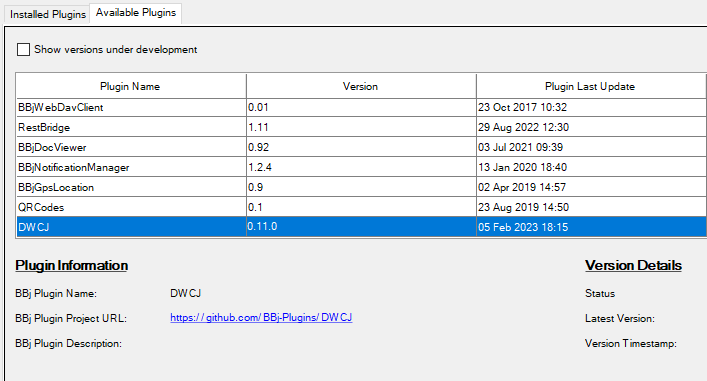

# Local Installation

This section of the documentation will cover the steps required only for 
users who wish to use the DWCJ for web and/or application development with a local
BBJ instance on their machine. This installation will not allow users to contribute 
to the DWCJ implementation code itself.
<br/>

:::info
This walkthrough will cover installation on a Windows system - installation
steps may vary for Mac/Linux OS devices.
:::
<br/>

Installation will be broken down into the following steps:


1. Java and Maven download and configuration
2. BBj download and installation
3. Using the BBj Plugin Manager to create your application
4. Launching your application


## 1) Java and Maven Download and Configuration

In order to use the DWCJ, you must first have Java and Maven installed and properly configured. If you already
have Java and Maven downloaded, please skip to [**Step 2**](#section2). If you also have 
BBj installed on your system, please skip to [**Step 3**](#section3).

### Java

Java **OpenJDK17** can be found [by following this link](https://adoptium.net/temurin/releases/). It is recommended 
to allow the installation to handle setting the JAVA_HOME variable during installation, where applicable.

### Maven

Maven should also be downloaded, and can be found [at this link](https://maven.apache.org/download.cgi). It is 
recommended to configure your system environment variables with Maven - a guide for installation and configuration 
for Windows users can be found [here](https://phoenixnap.com/kb/install-maven-windows).


<a name='section2'></a>

## 2) BBj Download and Installation

<b>While following this step, be sure to install BBj version 22.14 or newer </b><br/><br/>

[This video](https://www.youtube.com/watch?v=Ovk8kznQfGs&ab_channel=BBxCluesbyBASISEurope) can help with the installation of BBj if you need assistance with setup.

<a name='section3'></a>

## 3) Install and Configure the DWCJ Plugin

Once BBj has been installed, we can access the Plugin Manager in order to install tools needed to configure the DWCJ. To start, type "Plugin Manager" into the start menu or Finder. 


After the plugin manager has been opened, navigate to the "Available Plugins" tab towards the top.


On this page, select the DWCJ entry, and click "Install".



Once this has been done, you should be able to switch back to the "Installed Plugins" tab, and see the DWCJ entry listed there.

Now that the plugin has been installed, navigate to the DWCJ plugin folder wherever bbx has been installed. An example filepath
might be `C:\bbx\plugins\DWCJ`. From this directory, open the `cli-modules` directory. Once there, run the `enable_remote_install.bbj` program.


:::tip
If you have not set BBj as the default method of opening files with a .bbj extension, you may need to do this in order to run the program. The 
needed program is `BBj.exe`, which can be found in the `bin` folder of your `bbx` installation.
:::


## 4) Clone the Repository

Once BBj and the required DWCJ plugin are installed and configured, we can clone the "Hello World" repository from the DWCJ Github page. This project comes with the necessary tools to run your first DWCJ program!

To begin, navigate to the [HelloWorldJava repository](https://github.com/DwcJava/HelloWorldJava) and clone the project to your machine.


<!-- :::info
You can also opt to use the GitHub Codespace without cloning the project on your local machine, and do all of your development on the cloud!
::: -->

Once the project is cloned onto your machine, you can open it with your preferred IDE. Within your IDE, navigate to the pom.xml file that comes with the project. Within this file are various tags that can be modified to install your application to your own desired specifications. A detailed guide for these tags can [be found at this link](https://github.com/DwcJava/dwcj-install-maven-plugin).

:::tip
For first time users, it is recommended to use the default settings and avoid changing the pom.xml that comes with the project.
:::

Proceed to open the folder in your preferred terminal, and run the following command:

```
mvn install
```

This will run the installation plugin which will do the work of setting your project up for you.

:::info
If the above command does not work, check to make sure that your environment variables have been sufficiently edited to run Maven globally.
:::

Once this process has been completed, you should be able to navigate top the following URL and see your program running:

`http://localhost:8888/webapp/hworld`
