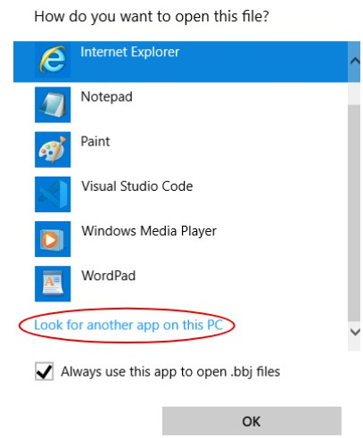
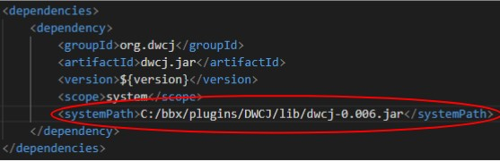

# Users

This section of the documentation will cover the steps required only for 
users who wish to use the DWCJ for web and/or application development.
This installation will not allow users to contribute to the DWCJ implementation
code itself.
 

Installation will be broken down into the following steps:

<!--
Should each of these have their own sections?
The bar to the right of the site has a breakdown of the various
sections, but I could break each of these four up into their own
options on the left bar.
 -->

1. IDE download and configuration (this will only cover VS Code for the
moment)
2. BBj download and installation
3. Downloading DWCJ files and building the .jar file
4. Configuring the application in the Enterprise Manager

## 1) VS Code Setup
This section describes the installation process for the
VS Code editor. Other IDEs, including Eclipse or 
IntelliJ can be used as well. If you already have an IDE
installed, a JDK downloaded and Maven configured, you can
skip to [**Step 2**](#section2).

### Download VS Code for your OS:
You can follow [this link to find the download that's 
right for your system](https://code.visualstudio.com/download).

### Install Java Extension Pack
[This extension pack will come with various tools for Java](https://code.visualstudio.com/docs/java/extensions)
, including a debugging tool, syntax highlighting, and Maven 
interface, which will be used later on.

### Install Java Development Kit

After installing this resource pack, we’ll be prompted to install a JDK.
VS Code should give us the option to do this easily; click the “Download”
option present on the left side of the window, and follow the install 
instructions. 

 

Ensure that **"Will be installed on local hard drive"** is a selected 
option for the **Set JAVA_HOME variable** menu item during installation.

 

## 2) BBj Download and Installation

The following video describes the steps needed download the tool that will install BBj on your machine. Watch from the beginning until the **1:30** mark. 

<iframe width="560" height="315" src="https://www.youtube.com/embed/Ovk8kznQfGs?end=90" title="YouTube video player" frameborder="0" allow="accelerometer; autoplay; clipboard-write; encrypted-media; gyroscope; picture-in-picture" allowfullscreen="allowfullscreen"></iframe>

Once you've downloaded the installer, follow this video's instructions to walk you through the installer options to put BBj on your machine. Follow this 
video from **4:13** to **8:23**.

<iframe width="560" height="315" src="https://www.youtube.com/embed/Ovk8kznQfGs?start=253&end=503" title="YouTube video player" frameborder="0" allow="accelerometer; autoplay; clipboard-write; encrypted-media; gyroscope; picture-in-picture" allowfullscreen="allowfullscreen"></iframe>

 
 
 

## 3) Using the BBj Plugin Manager

Once BBj has been installed, we can use the BBj Plugin Manager to give us
access to the DWCJ and start development on our project.

### Launch the BBj Plugin Manager

Begin by navigating to the bbx folder you installed in the previous step. An 
example path would be **C:\bbx\plugins**. 

 

From here, navigate to and open the plugins folder.

 

In this folder, you should see a .bbj file named **"PluginManagerLauncher.bbj"**.
In order to launch this application, we'll need to tell the system which program
to launch it with. 

 

Double click on the file, at which point you'll be prompted to choose a program
to open the file. Select **"More apps**

 

Then select **Look for another app on this PC**, at which point we can navigate
to the correct folder and select BBj, which will allow us to run the 
Plugin Manager

 

Navigate to the bbx folder you created during BBj installation, and open the
bin folder, where you should find the BBj application. A sample path will 
look something like **"C:/bbx/bin"**. Select the BBj application, which
will open the Plugin Manager.

 

Once this is complete, you should see the Plugin Manager window open. It 
should look something like the screenshot below:

 

### Create a DWCJ application deployment

From this window, first click the **"Available Plugins** tab near the 
top left corner of the window. This will open a menu with many more available
plugins. Check the **"Show versions under development"** checkbox in order to
show the DWCJ entry.

 

Scroll down through the various selections until you find the DWCJ entry in
the list. Select this entry, and then click the **"Install"** button at the
bottom right of the Plugin Manager window.

 

After the DWCJ plugin has been installed, click on the **"Installed Plugins"**
tab once again, which should now display the DWCJ among the list of other 
installed plugins. Select the DWCJ from the list, and click **"Configure"**
towards the top right of the window.

 

This will open the configuration window. Here, we'll create a new configuration
to begin an instance of the DWCJ. Select the **"+"** button below the 
**"Configurations"** field as shown in the screenshot below

 

Give your configuration a name, and then click the **"New Project"** button
under the **"DWCJ Projects"** window.

 

This will open a window which will allow the selection of a project template.
Select **"HelloWorldJava"** from the template list. You'll also be prompted
to select the location of the project. This walkthrough will use a new folder,
though this isn't overtly necessary. We'll name the new folder **"dwcj_app"**.

 

Once this folder is created, click on the new folder (or the existing folder
you've chosen to create your project inside of), and then click the select
button at the bottom right of the window.

 

You should now see your configuration listed on the left side of the window,
with two file paths listed under the DWCJ Projects window. It should look
similar to the screenshot below.

 

## 4) Opening Your Project in an IDE

Now that the files we need have been created, the project can be opened in 
an editor or IDE. Visual Studio code will be used for this walkthrough.

### Navigating to your files in your IDE

Click on **"File"** at the top left of the VS Code window, and select the
**"Open Folder..."** menu option. This will open an explorer window.

 

Select the folder where the DWCJ files were initialized in the previous step.
An example path would be **"C:/dwcj_app/"**. Once you've navigated to the
correct folder, click on the **"Select Folder"** button.

 

### Updating the <systemPath\> Setting

The following steps may not be necessary for all users, but for those using
VS Code, it's important to specify where the DWCJ .jar file is located. Locate
the .jar inside **"bbx/plugins/DWCJ/lib"**.

An example file path would be **"C:/bbx/plugins/DWCJ/lib/dwcj-0.006.jar"**

*Note: The version name (0.006) may change as future builds are 
released.*

 

Once you have found the location of the DWCJ .jar file, change the **"<systemPath\>"**
setting in the **"pom.xml"** file. Replace the ${dwcj-lib} variable with the
pathname. It should look similar to the screenshot below.

 

## 5) Launching Your DWCJ "Hello World" Application

After updating your pom.xml file, you should be ready to launch the built-in
Hello World DWCJ application

### Launch your application from the Plugin Manager

Navigate back to the Plugin Manager, and select the DWCJ from the installed
plugins list, and click **"Configure"**. 

 

After opening the configuration menu, you can launch your application! Click on
the **Launch** button.

 

If configured correctly, a welcome window should appear, and you should be able
to launch your sample application!

**Congratulations!** You're not ready for development in the DWCJ!