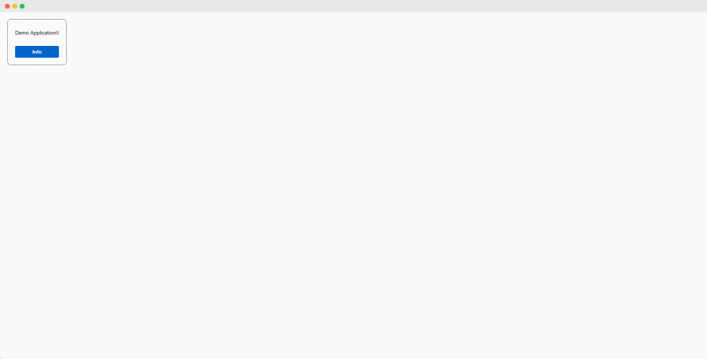

This first step lays the foundation for the customer management app by creating a simple, interactive interface. This demonstrates how to set up a basic webforJ app, with a single button that opens a dialog when clicked. It’s a straightforward implementation that introduces key components and gives you a feel for how webforJ works.

This step leverages the base app class provided by webforJ to define the structure and behavior of the app. Following through to later steps will transition to a more advanced setup using routing to manage multiple screens, introduced in [Scaling with Routing and Composites](./scaling-with-routing-and-composites).

By the end of this step, you’ll have a functioning app that demonstrates basic interaction with components and event handling in webforJ. To run the app:

- Go to the `1-step-1` directory
- Run the `mvn jetty:run` command



## Creating a webforJ app

In webforJ, an `App` represents the central hub for defining and managing your project. Every webforJ app starts by creating one class that extends the foundational `App` class, which serves as the core framework to:

- Manage the app lifecycle, including initialization and termination.
- Handle routing and navigation if enabled.
- Define the app’s theme, locale, and other overall configurations.
- Provide essential utilities for interacting with the environment and components.

### Extending the `App` class

For this step, a class called `DemoApplication.java` is created, and extends the `App` class.

```java title="DemoApplication.java"
public class DemoApplication extends App {
  @Override
  public void run() {
    // Core app logic will go here
  }
}
```

:::tip Key Configuration Properties

In this demo app, the `webforj.conf` file is configured with the following two essential properties:

- **`webforj.entry`**: Specifies the fully qualified name of the class extending `App` that acts as the main entry point for your project. For this tutorial, set it to `com.webforj.demos.DemoApplication` to avoid ambiguity during initialization.
  ```hocon
  webforj.entry = com.webforj.demos.DemoApplication
  ```
- **`webforj.debug`**: Enables debug mode for detailed logs and error visibility during development. Make sure this is set to `true` while working on this tutorial:
  ```hocon
  webforj.debug = true
  ```

For more details on additional configuration options, see the [Configuration Guide](../../configuration/overview).
:::

### Overriding the `run()` method

After ensuring correct configuration for the project, the `run()` method in your `App` class is overridden.

The `run()` method is the core of your app in webforJ. It defines what happens after the app is initialized and is the main entry point for your app's features. By overriding the `run()` method, you can implement the logic that creates and manages your app's user interface and behavior.

:::tip Using routing
When implementing routing within an app, overriding the `run()` method is unnecessary, as the framework automatically handles the initialization of routes and the creation of the initial `Frame`. The `run()` method is invoked after the base route is resolved, ensuring that the app's navigation system is fully initialized before any logic is executed. This tutorial will go further into depth on implementing routing in [step 3](scaling-with-routing-and-composites). More information is also available in the [Routing Article](../../routing/overview).
:::

```java title="DemoApplication.java"
public class DemoApplication extends App {
  @Override
  public void run() throws WebforjException {
    // App logic
  }
}
```

## Adding components

In webforJ, components are the building blocks of your app’s user interface. These components represent discrete pieces of your app's UI, such as buttons, text fields, dialogs, or tables.

You can think of a UI as a tree of components, with a `Frame` serving as the root. Each component added to the `Frame` becomes a branch or leaf in this tree, contributing to the overall structure and behavior of your app.

:::tip Component catalog
See [this page](../../components/overview) for a list of the various components available in webforJ.
:::

### App `Frame`

The `Frame` class in webforJ represents a non-nestable, top-level window in your app. A `Frame` typically acts as the main containers for UI components, making it an essential building block for constructing the user interface. Every app starts with at least one `Frame`, and you can add components such as buttons, dialogs, or forms to these frames.

A `Frame` within the `run()` method is created in this step - later on, components will be added here.

```java title="DemoApplication.java"
public class DemoApplication extends App {
  @Override
  public void run() throws WebforjException {
    Frame mainFrame = new Frame();
  }
}
```

### Server and client side components

Each server-side component in webforJ has a matching client-side web component. Server-side components handle logic and backend interactions, while client-side components like `dwc-button` and `dwc-dialog` manage frontend rendering and styling.

:::tip Composite components

Alongside the core components provided by webforJ, you can design custom composite components by grouping multiple elements into a single reusable unit. This concept will be covered in this step of the tutorial. More information is available in the [Composite Article](../../building-ui/composite-components)
:::

Components need to be added to a container class that implements the <JavadocLink type="foundation" location="com/webforj/concern/HasComponents" code='true' >HasComponents</JavadocLink> interface. The `Frame` is one such class - for this step, add a `Paragraph` and a `Button` to the `Frame`, which will render in the UI in the browser:

```java title="DemoApplication.java"
public class DemoApplication extends App {
  Paragraph demo = new Paragraph("Demo Application!");
  Button btn = new Button("Info");

  @Override
  public void run() throws WebforjException {
    Frame mainFrame = new Frame();
    btn.setTheme(ButtonTheme.PRIMARY)
        .addClickListener(e -> showMessageDialog("This is a demo!", "Info"));
    mainFrame.add(demo, btn);
  }
}
```

Running this should give you a simple styled button enabling a message popping up saying "This is a demo!"

## Styling with CSS

Styling in webforJ gives you complete flexibility to design your app’s appearance. While the framework supports a cohesive design and style out of the box, it doesn't enforce a specific styling approach, allowing you to apply custom styles that align with your app’s requirements.

With webforJ, you can dynamically apply class names to components for conditional or interactive styling, use CSS for a consistent and scalable design system, and inject entire inline or external stylesheets.

### Adding CSS classes to components

You can dynamically add or remove class names to components using the `addClassName()` and `removeClassName()` methods. These methods allow you to control the component’s styles based on your app's logic. Add the `mainFrame` class name to the `Frame` created in the previous steps by including the following code in the `run()` method:

```java
mainFrame.addClassName("mainFrame");
```

### Attaching CSS files

To style your app, you can include CSS files in your project either by using asset annotations or by utilizing the webforJ <JavadocLink type="foundation" location="com/webforj/Page" >asset API</JavadocLink> at runtime. [See this article](../../styling/getting-started#using-custom-css) for more information. 

For instance, The @StyleSheet annotation is used to include styles from the resources/static directory. It automatically generates a URL for the specified file and injects it into the DOM, ensuring the styles are applied to your app. Note that files outside the static directory aren't accessible.

```java title="DemoApplication.java"
@StyleSheet("ws://styles/library.css")
public class DemoApplication extends App {
  @Override
  public void run() {
    // App logic here
  }
}
```
:::tip Web server URLs
To ensure static files are accessible, they should be placed in the resources/static folder. To include a static file, you can construct its URL using the web server protocol.
:::

### Sample CSS code

A CSS file is used in your project at `resources > static > css > demoApplication.css`, and the following CSS is used to apply some basic styling to the app.

```css
.mainFrame {
  display: inline-grid;
  gap: 20px;
  margin: 20px;
  padding: 20px;
  border: 1px dashed;
  border-radius: 10px;
}
```

Once this is done, the following annotation should be added to your `App` class:

```java title="DemoApplication.java"
@StyleSheet("ws://css/demoApplication.css")
@AppTitle("Demo Step 1")
public class DemoApplication extends App {
```

The CSS styles are applied to the main `Frame` and provide structure by arranging components with a [grid layout](https://developer.mozilla.org/en-US/docs/Web/CSS/CSS_grid_layout), and adding margin, padding, and border styles to make the UI visually organized.
