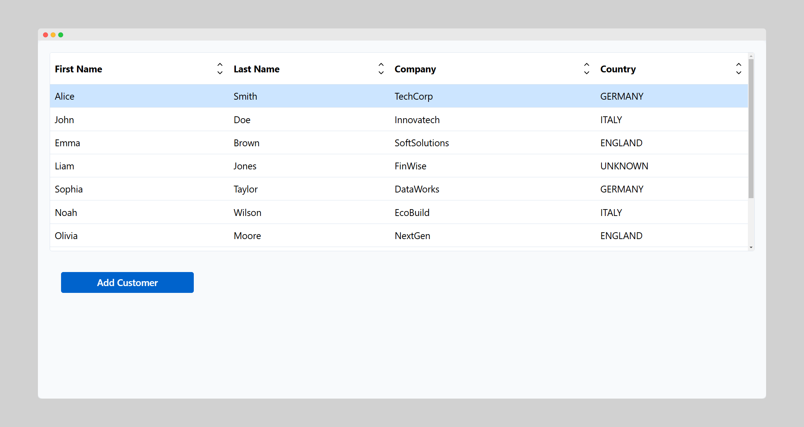
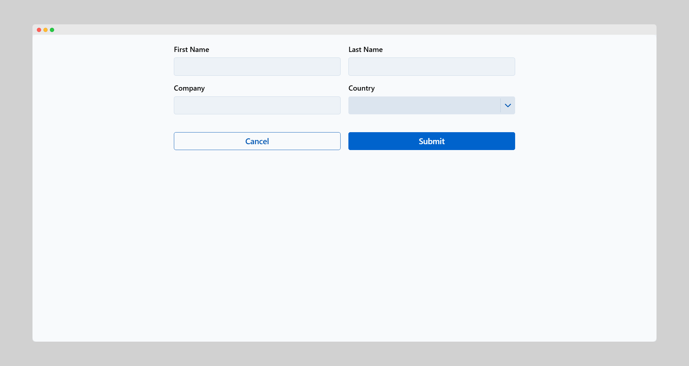

This step focuses on implementing routing to enhance the scalability and organization of the app structure. To achieve this, the app will be updated to handle multiple views, allowing navigation between different functionalities such as editing and creating customer entries. It will outline creating views for these functionalities, using components like `Composite` to build modular and reusable layouts.

The app created in the [previous step](./working-with-data) will have a routing setup that supports multiple views, enabling users to manage customer data more effectively while maintaining a clean and scalable codebase.


<br />



## Routing

[Routing](../../routing/overview) is the mechanism that allows your app to manage navigation between different views or pages. Instead of keeping all logic and behavior in a single location, routing enables you to break your app into smaller, focused component. 

At its core, routing connects specific URLs to the views or components that handle those URLs. When a user interacts with your app—such as clicking a button or entering a URL directly in their browser—the router resolves the URL to the appropriate view, initializes it, and displays it on the screen. This approach makes it easy to manage navigation and maintain the app's state.

This step focuses on changing the `App` class, creating files for the views, and configuring routes to enable smooth navigation between different parts of your app.

Instead of placing all logic within the `run()` method of `App`, views like `DemoView` and `FormView` are implemented as separate classes. This approach more closely aligns with standard Java practices.

- **DemoView**: Handles displaying the table and navigating to `FormView`.
- **FormView**: Manages adding and editing customer data.

### Changing the `App` class

To enable routing in your app, update the `App` class with the `@Routify` annotation. This tells webforJ to activate routing and scan specified packages for route-enabled views.

```java title="DemoApplication.java" {1}
@Routify(packages = "com.webforj.demos.views", debug = true)
public class DemoApplication extends App {  
}
```

- **`packages`**: Specifies which packages are scanned for views that define routes.
- **`debug`**: Enables debugging mode for easier troubleshooting during development.

### Creating files for the views and configuring routes

Once routing has been enabled, separate Java files for each view the app will contain are created, in this case, `DemoView.java` and `FormView.java`. Unique routes are assigned to these views using the `@Route` annotation. This ensures that each view is accessible through a specific URL.

When the `@Route` annotation has no value above a class with one of these suffixes, webforJ automatically assigns the class's name without the suffix as the route. For example, `DemoView` will map the route `/demo` by default. Since in this case `DemoView` is supposed to be the default route tho you will assign it a route.

The `/` route serves as the default entry point for your app. Assigning this route to a view ensures that it's the first page users see when accessing the app. In most cases, a dashboard or summary view is assigned to `/`.

```java title="DemoView.java" {1}
@Route("/")
@FrameTitle("Demo")
public class DemoView extends Composite<Div> {
  // DemoView logic
}
```

:::info 
More information regarding the different route types is available [here](../../routing/defining-routes).
:::

For the `FormView` the route `customer/:id?` uses an optional parameter `id` to determine the mode of the `FormView`. 

- **Add Mode**: When `id` isn't provided, `FormView` initializes with a blank form for adding new customer data.
- **Edit Mode**: When `id` is provided, `FormView` fetches the corresponding customer’s data using `Service` and pre-fills the form, allowing edits to be made to the existing entry.

```java title="FormView.java" {1}
@Route("customer/:id?")
@FrameTitle("Customer Form")
public class FormView extends Composite<Div> implements DidEnterObserver {
  // FormView logic
}
```

:::info 
More information regarding the different ways to implement those route patterns is available [here](../../routing/route-patterns).
:::

## Using `Composite` components to display pages

Composite components in webforJ, such as `Composite<Div>`, allow you to encapsulate UI logic and structure within a reusable container. By extending `Composite`, you limit the methods and data exposed to the rest of the app, ensuring cleaner code and better encapsulation.

For example, `DemoView` extends `Composite<Div>` instead of directly extending `Div`:

```java title="DemoView.java"
public class DemoView extends Composite<Div> {
  private Table<Customer> table = new Table<>();
  private Button add = new Button("Add Customer", ButtonTheme.PRIMARY);  

  public DemoView() {
    setupLayout();
  }

  private void setupLayout() {
    FlexLayout layout = FlexLayout.create(table, add)
        .vertical().contentAlign().center().build().setPadding("var(--dwc-space-l)");
    getBoundComponent().add(layout);
  }
}
```

## Connecting the routes

After configuring routing and setting up views, connect the views and data using event listeners and service methods. The first step is to add one or more
UI elements to navigate from one view to the other.

### Button navigation

The `Button` component triggers a navigation event to transition from one view to another using the `Router` class. For example:

```java title="DemoView.java"
private Button add = new Button("Add Customer", ButtonTheme.PRIMARY,
  e -> Router.getCurrent().navigate(FormView.class));
```

:::info
The Router class uses the given class to resolve the route and build an URL to navigate to. All browser navigation is then handled so that history management
and view initialization is of no concern.
For more details on navigation, see the [Route Navigation Article](../../routing/route-navigation).
:::

### Table editing

In addition to navigation via button click, many apps also allow for navigation to other parts of an app when a `Table` is double clicked. The following changes are made to allow users to double-click an item in the table to navigate to a form pre-filled with the item's details.

Once the details have been edited on the appropriate screen, the changes are saved, and the `Table` is updated to display the changed data from the selected item.

To facilitate this navigation, item clicks in the table are handled by the `TableItemClickEvent<Customer>` listener. The event contains the `id` of the clicked customer, which it passes to the `FormView` by utilizing the `navigate()` method with a `ParametersBag`:

```java title="DemoView.java" 
private void editCustomer(TableItemClickEvent<Customer> e) {
  Router.getCurrent().navigate(FormView.class,
    ParametersBag.of("id=" + e.getItemKey()));
}
```

### Handling initialization with `onDidEnter`

The `onDidEnter` method in webforJ is part of the routing lifecycle and is triggered when a view becomes active. 

When the `Router` navigates to a view, `onDidEnter` is triggered as part of the lifecycle to:
- **Load Data**: Initialize or fetch data required for the view based on route parameters.
- **Set Up the View**: Update UI elements dynamically based on the context.
- **React to State Changes**: Perform actions that depend on the view being active, such as resetting forms or highlighting components.

The `onDidEnter` method in `FormView` checks for the presence of an `id` parameter in the route and adjusts the form's behavior accordingly:

- **Edit Mode**: If an `id` is provided, the method fetches the corresponding customer’s data using `Service` and pre-fills the form fields. The `Submit` button is configured to update the existing entry.
- **Add Mode**: If no `id` is present, the form remains blank, and the `Submit` button is configured to create a new customer.

```java
@Override
  public void onDidEnter(DidEnterEvent event, ParametersBag parameters) {
    parameters.get("id").ifPresentOrElse(id -> {
      customer = Service.getCurrent().getCustomerByKey(UUID.fromString(id));
      firstName.setValue(customer.getFirstName());
      lastName.setValue(customer.getLastName());
      company.setValue(customer.getCompany());
      country.selectKey(customer.getCountry());
      submit.addClickListener(e -> submit("edit"));
    }, () -> submit.addClickListener(e -> submit("add")));
  }
```


### Submitting data 

When finished editing the data, it's necessary to submit it to the service handling the repository. Therefore the 
`Service` class that has been already set up in the previous step of this tutorial
now needs to be enhanced with additional methods, allowing users to add and edit customers. 

The snippet below shows how to accomplish this:

```java title="Service.java"
public void addCustomer(Customer newCustomer) {
  data.add(newCustomer);
  repository.commit(newCustomer);
}

public void editCustomer(Customer editedCustomer) {
  repository.commit(editedCustomer);
}
```

### Using `commit()`

The `commit()` method in the `Repository` class keeps the app’s data and UI in sync. It provides a mechanism to refresh the data stored in the `Repository`, ensuring the latest state is reflected in the app.

This method can be used in two ways:

1) **Refreshing all data:**
  Calling `commit()` without arguments reloads all entities from the repository's underlying data source, such as a database or a service class.

2) **Refreshing a single entity:**
  Calling `commit(T entity)` reloads a specific entity, ensuring its state matches the latest data source changes.

Call `commit()` when data in the `Repository` changes, such as after adding or modifying entities in the data source.

```java
// Refresh all customer data in the repository
customerRepository.commit();

// Refresh a single customer entity
Customer updatedCustomer = ...; // Updated from an external source
customerRepository.commit(updatedCustomer);

```

With these changes, the following goals have been achieved:

  1. Implemented routing and set it up so future views can be integrated with little effort.
  2. Removed UI implementations out of the `App` and into a separate view.
  3. Added an additional view to manipulate the data that's displayed in the customer table.

With the modification of the customer details and routing accomplished, the next step will focus on
implementing data binding and using it to facilitate validation.