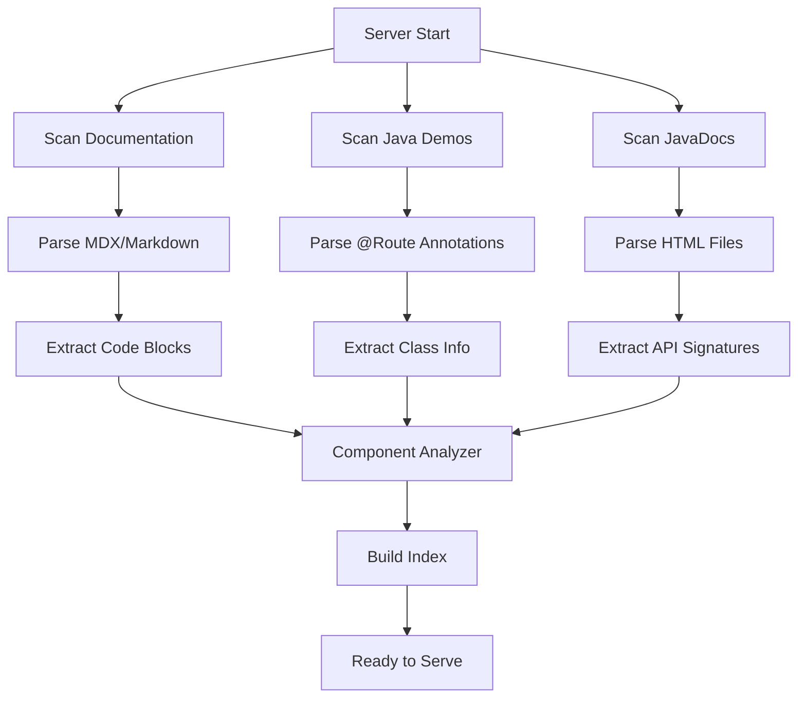

# WebforJ Documentation MCP Server

This MCP (Model Context Protocol) server provides structured access to webforJ documentation, component metadata, and code samples. It's designed to help AI assistants understand and work with webforJ components.

## Table of Contents

- [Overview](#overview)
- [Features](#features)
- [How MCP Works](#how-mcp-works)
- [Installation](#installation)
- [Deployment Options](#deployment-options)
  - [Local Development](#local-development)
  - [Local Claude CLI](#local-claude-cli)
  - [Local Claude Desktop](#local-claude-desktop)
  - [Hosted Gateway Server](#hosted-gateway-server)
  - [Production Deployment](#production-deployment)
- [Indexing Process](#indexing-process)
- [Available Resources](#available-resources)
- [Troubleshooting](#troubleshooting)
- [Contributing](#contributing)

## Overview

The MCP server indexes and provides access to:
- **Documentation**: All MDX/Markdown files from the docs
- **Demo Code**: Java examples from the samples directory
- **Component Metadata**: Properties, methods, and events extracted from docs
- **JavaDoc Integration**: API signatures from webforJ JavaDocs (when available)

**Important**: MCP servers communicate via stdio (standard input/output), not HTTP. For web access, use the Gateway Server option.

## Features

- **Component Discovery**: Browse all webforJ components with metadata
- **Documentation Access**: Read documentation content with extracted code samples  
- **Demo Integration**: Access live demo URLs and source code
- **JavaDoc Integration**: Extracts accurate API signatures from webforJ JavaDocs
- **Search Capabilities**: Search components by name or description
- **Auto-indexing**: Rebuilds index when files change

## How MCP Works

MCP (Model Context Protocol) servers communicate via stdio (standard input/output), not HTTP. They're designed to be launched by AI assistants or MCP clients, which communicate with them through structured JSON messages over stdin/stdout.

**This means:**
- No web interface or HTTP port
- No direct browser access
- Communication only through MCP-compatible clients
- The server waits for commands on stdin and responds on stdout

## Installation

### Prerequisites

- Node.js 18+ installed
- npm or yarn package manager
- Java 17+ (for running demos and Maven commands)
- Git (for cloning the repository)

### Step 1: Clone and Navigate

```bash
git clone https://github.com/webforj/webforj-documentation.git
cd webforj-documentation/mcp-server
```

### Step 2: Install Dependencies

```bash
npm install
```

### Step 3: Build the Server

```bash
npm run build
```

This compiles TypeScript files to JavaScript in the `dist/` directory.

### Step 4: Optional - Enable JavaDoc Integration

JavaDoc integration provides accurate API signatures and method documentation. While optional, it significantly improves code generation accuracy.

```bash
# From the webforj-documentation root directory (not mcp-server)
cd ..

# Try the automated script first
./mcp-server/scripts/download-javadocs.sh

# If that fails, try manual Maven commands
mvn dependency:copy -Dartifact=com.webforj:webforj-foundation:25.01:jar:javadoc -DoutputDirectory=target/javadocs
mvn dependency:copy -Dartifact=com.webforj:webforj-data:25.01:jar:javadoc -DoutputDirectory=target/javadocs

# Return to mcp-server directory
cd mcp-server
```

**Note**: JavaDocs may not be available for all versions. The server works without them but with reduced API accuracy.

## Deployment Options

### Local Development

For testing and development, run the MCP server directly:

```bash
# Development mode with auto-reload
npm run dev

# Production mode
npm start
```

The server listens on stdio - use the test script to verify:

```bash
node test-mcp.js
```

### Local Claude CLI

Use the MCP server with Claude CLI (claude.ai/code) for enhanced webforJ assistance directly from your terminal.

#### Prerequisites

- Claude CLI installed
- MCP server built (`npm run build` completed)

#### Setup

Add the MCP server to your Claude CLI configuration:

```bash
claude mcp add webforj-docs node <path-to-repo>/webforj-documentation/mcp-server/dist/index.js
```

Replace `<path-to-repo>` with your actual path to the webforj-documentation repository.

#### Verification

After adding the MCP server, you can verify it's working in Claude CLI:
- Start a new Claude session
- Ask questions like "What webforJ components are available?"
- The assistant should have access to component metadata and documentation

### Local Claude Desktop

Configure Claude Desktop to use your local MCP server for enhanced webforJ assistance.

#### Prerequisites

- Claude Desktop app installed
- MCP server built (`npm run build` completed)

#### Automatic Setup (Recommended)

1. **Download JavaDocs** (optional but recommended):
   ```bash
   cd /path/to/webforj-documentation
   ./mcp-server/scripts/download-javadocs.sh
   ```

2. **Run the setup script**:
   ```bash
   cd mcp-server
   npm run setup:claude
   ```

3. **Restart Claude Desktop** completely (quit and reopen)

#### Manual Setup

1. **Find your configuration file**:
   - macOS: `~/Library/Application Support/Claude/claude_desktop_config.json`
   - Windows: `%APPDATA%\Claude\claude_desktop_config.json`
   - Linux: `~/.config/Claude/claude_desktop_config.json`

2. **Edit the configuration**:
   ```json
   {
     "mcpServers": {
       "webforj-docs": {
         "command": "node",
         "args": ["/absolute/path/to/webforj-documentation/mcp-server/dist/index.js"],
         "env": {
           "NODE_ENV": "development"
         }
       }
     }
   }
   ```

3. **Save and restart Claude Desktop**

#### Verification

In Claude, test the connection:
- "What webforJ components are available?"
- "Show me how to use the Button component"
- "Search for form validation examples"

### Hosted Gateway Server

For web applications or shared access, use the HTTP gateway that bridges MCP over HTTP.

#### Start the Gateway

```bash
# Build first
npm run build

# Start gateway server
npm run gateway
# or for development:
npm run gateway:dev
```

The gateway runs on port 3001 by default.

#### Gateway API

**Create Session**:
```bash
curl -X POST http://localhost:3001/api/v1/sessions \
  -H "X-API-Key: demo-api-key"
```

**Send MCP Request**:
```bash
curl -X POST http://localhost:3001/api/v1/sessions/{sessionId}/request \
  -H "X-API-Key: demo-api-key" \
  -H "Content-Type: application/json" \
  -d '{
    "jsonrpc": "2.0",
    "method": "resources/list",
    "params": {},
    "id": 1
  }'
```

#### Test with Web Client

Open `examples/gateway-client.html` in a browser for an interactive demo.

### Production Deployment

#### Docker Deployment

The easiest way to deploy the MCP server in production:

1. **Create a Dockerfile**:
   ```dockerfile
   FROM node:20-alpine
   WORKDIR /app
   
   # Copy package files
   COPY package*.json ./
   RUN npm ci --production
   
   # Copy built application
   COPY dist/ ./dist/
   COPY config/ ./config/
   
   # Copy documentation and JavaDocs if available
   COPY --from=docs /docs/docs ./docs
   COPY --from=docs /target/javadocs-extracted ./javadocs
   
   # Security: Run as non-root
   USER node
   
   # For gateway deployment
   EXPOSE 3001
   
   # Health check
   HEALTHCHECK CMD node -e "process.exit(0)"
   
   # Default: stdio MCP server
   CMD ["node", "dist/index.js"]
   # For gateway: CMD ["node", "dist/gateway.js"]
   ```

2. **Build and run**:
   ```bash
   docker build -t webforj-mcp .
   
   # For stdio MCP server
   docker run -i webforj-mcp
   
   # For gateway server
   docker run -p 3001:3001 -e API_KEYS=key1,key2 webforj-mcp node dist/gateway.js
   ```

#### Systemd Service (Linux)

For production Linux servers:

Create `/etc/systemd/system/webforj-mcp.service`:

```ini
[Unit]
Description=WebforJ MCP Server
After=network.target

[Service]
Type=simple
User=webforj
WorkingDirectory=/path/to/webforj-documentation/mcp-server
ExecStart=/usr/bin/node dist/index.js
Restart=always
Environment="NODE_ENV=production"

[Install]
WantedBy=multi-user.target
```

Enable and start:

```bash
sudo systemctl enable webforj-mcp
sudo systemctl start webforj-mcp
```

For the gateway server, create `/etc/systemd/system/webforj-mcp-gateway.service`:

```ini
[Unit]
Description=WebforJ MCP Gateway Server
After=network.target

[Service]
Type=simple
User=webforj
WorkingDirectory=/path/to/webforj-documentation/mcp-server
ExecStart=/usr/bin/node dist/gateway.js
Restart=always
Environment="NODE_ENV=production"
Environment="PORT=3001"
Environment="API_KEYS=key1,key2,key3"

[Install]
WantedBy=multi-user.target
```

## Indexing Process

The MCP server builds an index of all documentation and code on startup. Understanding this process helps optimize performance and troubleshoot issues.

### What Gets Indexed

1. **Documentation Files** (`docs/docs/**/*.{md,mdx}`):
   - Component descriptions
   - Code examples in markdown
   - API references
   - Component relationships

2. **Java Demo Files** (`src/main/java/com/webforj/samples/**/*.java`):
   - Route annotations (`@Route`)
   - Class structures
   - Method implementations
   - Comments and descriptions

3. **JavaDoc HTML** (when available):
   - Method signatures
   - Parameter types
   - Return values
   - Class hierarchies

### Index Building Process



### Index Structure

The index contains:

```typescript
{
  components: Map<string, {
    name: string
    displayName: string
    description: string
    javadocUrl: string
    demos: DemoMetadata[]
    properties: PropertyMetadata[]
    events: EventMetadata[]
    methods: MethodMetadata[]
  }>,
  documents: Map<string, {
    path: string
    title: string
    content: string
    codeBlocks: CodeBlock[]
    componentRefs: string[]
  }>,
  demos: Map<string, {
    name: string
    route: string
    title: string
    sourceFiles: string[]
  }>
}
```

### Performance Optimization

1. **First Start**: Initial indexing takes 5-10 seconds depending on content size
2. **Caching**: Consider implementing cache persistence (not enabled by default)
3. **Selective Indexing**: Use file patterns in `config/default.json` to exclude unnecessary files

### Manual Index Rebuild

Use the `rebuild_index` tool:

```json
{
  "jsonrpc": "2.0",
  "method": "tools/call",
  "params": {
    "name": "rebuild_index",
    "arguments": {}
  },
  "id": 1
}
```

### Troubleshooting Index Issues

1. **Missing Components**: Check file patterns in configuration
2. **Slow Indexing**: Reduce scanned directories or implement caching
3. **Parse Errors**: Check console output for specific file errors
4. **Memory Issues**: Increase Node.js heap size with `--max-old-space-size=4096`

## Available Resources

- `webforj://components` - List all components with metadata
- `webforj://component/{name}` - Get specific component details
- `webforj://demos` - List all interactive demos
- `webforj://docs` - List all documentation pages

## Available Tools

- `search_components` - Search components by query
- `get_component_code` - Get source code for a demo
- `rebuild_index` - Manually rebuild the index

## Architecture

```
┌─────────────────┐     ┌─────────────────┐
│                 │     │                 │
│  Jetty Server   │     │   MCP Server    │
│   (port 8080)   │     │  (port 3001)    │
│                 │     │                 │
│  - Docs (HTML)  │     │  - Component    │
│  - Java Demos   │     │    Metadata     │
│  - Static Assets│     │  - Search API   │
│                 │     │  - Code Index   │
└─────────────────┘     └─────────────────┘
         ↓                       ↓
    Web Browsers            AI Assistants
```

The MCP server reads the same source files but provides structured access optimized for AI consumption.

## Adding Custom Context

To add additional context files (tutorials, patterns, etc.) that aren't part of the main documentation:

1. Create the context directory:

```bash
mkdir -p mcp-context
```

2. Add a `manifest.json`:

```json
{
  "version": "1.0",
  "include": [
    {
      "path": "tutorials/**/*.md",
      "type": "tutorial"
    }
  ]
}
```

3. Add your content files and the MCP server will automatically include them.

## JavaDoc Integration

The MCP server automatically includes accurate API information from webforJ JavaDocs when available. This dramatically improves the accuracy of AI-generated code.

### How It Works

1. **Maven Integration**: The build process downloads JavaDoc JARs for webforJ components
2. **Automatic Parsing**: The MCP server extracts method signatures, parameters, and return types
3. **Enhanced Metadata**: Component information includes both documentation and actual API details

### Building with JavaDocs

To enable JavaDoc integration, run the full Maven build:

```bash
mvn clean prepare-package
```

This will:
- Download JavaDoc JARs from Maven Central
- Extract them to `target/javadocs-extracted/`
- Make API information available to the MCP server

### Benefits

With JavaDoc integration enabled:
- AI assistants get accurate method signatures
- Parameter types and return types are correct
- Available methods and properties are comprehensive
- Code generation is much more reliable

If JavaDocs aren't available (development mode), the server falls back to documentation-only scanning with a warning message.

### When to Rebuild JavaDocs

You should rebuild JavaDocs when:
- First setting up the MCP server
- Upgrading the webforJ version in `pom.xml`
- After significant changes to the documentation

The JavaDoc data is cached, so you don't need to rebuild for every documentation change.

## Troubleshooting

### Server won't start

- Check if the process is running: `ps aux | grep webforj-mcp`
- Verify Node.js version: `node --version` (requires 18+)
- Check logs: `npm run dev` for detailed output

### Index not updating

- Manually rebuild: Use the `rebuild_index` tool
- Check file permissions on documentation directories
- Verify paths in `config/default.json`

### Production issues

- Ensure `NODE_ENV=production` is set
- MCP uses stdio communication, not network ports
- Verify production URLs in configuration

### JavaDoc parsing issues

- Check if `target/javadocs-extracted/` exists and contains HTML files
- Verify Maven build completed successfully: `mvn clean prepare-package`
- Look for "JavaDoc scanning failed" messages in server logs
- The server works without JavaDocs but with reduced accuracy

## Contributing

1. Make changes in `src/`
2. Run `npm run build` to compile TypeScript
3. Test with `npm run dev`
4. Submit PR with tests if applicable